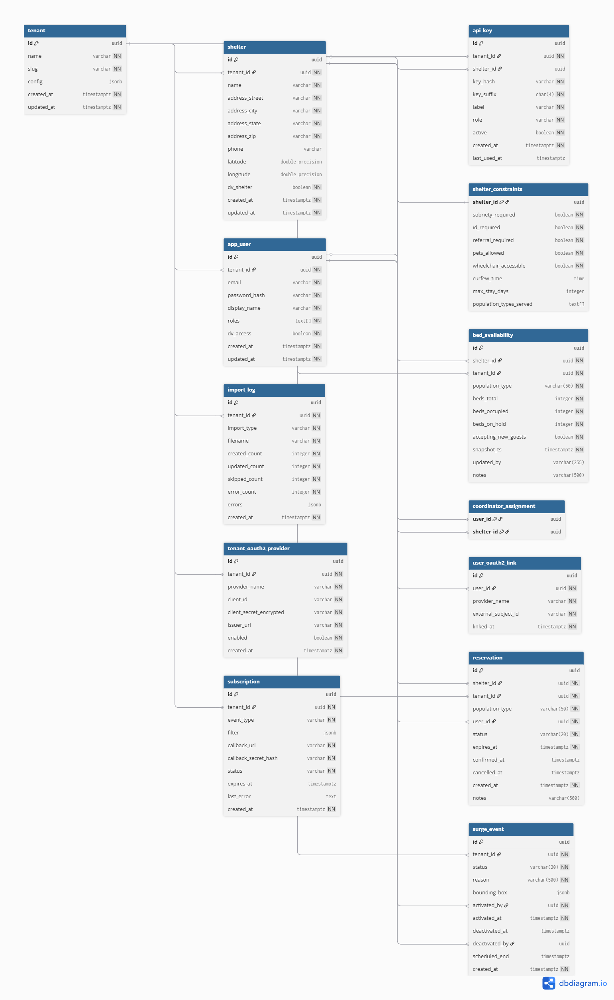

# Finding A Bed Tonight

[](https://github.com/ccradle/finding-a-bed-tonight/actions/workflows/ci.yml)
[](LICENSE)
[](https://openjdk.org/projects/jdk/21/)
[](https://spring.io/projects/spring-boot)

Open-source emergency shelter bed availability platform. Matches homeless individuals and families to available shelter beds in real time.

**[View the Demo Walkthrough](https://ccradle.github.io/findABed/demo/index.html)** — 17 annotated screenshots of every key view. No running instance required. Also available offline: clone the [docs repo](https://github.com/ccradle/findABed) and open `demo/index.html`.

---

## Problem Statement & Business Value

### The Problem

A family of five is sitting in a parking lot at midnight. A social worker has 30 minutes before the family stops cooperating. Right now, that social worker is making phone calls — to shelters that may be closed, full, or unable to serve that family's specific needs. There is no shared system for real-time shelter bed availability in most US communities.

Commercial software does not serve this space because there is no profit motive. Homeless services operate on tight grants with no margin for per-seat licensing. The result: social workers keep personal spreadsheets, shelter coordinators answer midnight phone calls, and families wait in parking lots while the system fails them.

### The Goal

An open-source platform that matches homeless individuals and families to available shelter beds in real time. Reduce the time from crisis call to bed placement from 2 hours to 20 minutes. Three deployment tiers (Lite, Standard, Full) ensure any community — from a rural volunteer-run CoC to a metro area with 50 shelters — can adopt the platform at a cost they can sustain.

### Business Value

| Stakeholder | Value |
|---|---|
| **Families/individuals in crisis** | Faster placement, fewer nights unsheltered |
| **Social workers/outreach teams** | Reduced cognitive load, real-time availability instead of phone calls |
| **Shelter coordinators** | 3-tap bed count updates, automated reporting |
| **City/county governments** | Data-driven resource allocation, HUD reporting |
| **Foundations/funders** | Measurable impact metrics, cost-effective open-source model |

### How It Fits Together

```
┌──────────────────────────────────────────────────────────────────┐
│                     PWA (React + Vite)                            │
│  Coordinator · Outreach Worker · CoC Admin                       │
└─────────────────────────┬────────────────────────────────────────┘
                          │ REST API (/api/v1)
                          ▼
┌──────────────────────────────────────────────────────────────────┐
│              Spring Boot 3.4 (Modular Monolith)                  │
│                                                                  │
│  ┌──────────┐ ┌──────────┐ ┌──────────┐ ┌──────────────┐       │
│  │  tenant   │ │   auth   │ │ shelter  │ │  dataimport  │       │
│  └──────────┘ └──────────┘ └──────────┘ └──────────────┘       │
│  ┌──────────────┐ ┌──────────────┐ ┌──────────────┐            │
│  │ availability  │ │ reservation  │ │    surge     │            │
│  └──────────────┘ └──────────────┘ └──────────────┘            │
│  ┌──────────────┐ ┌──────────────┐                              │
│  │ subscription  │ │ observability │                             │
│  └──────────────┘ └──────────────┘                              │
│  ┌─────────────────── shared kernel ───────────────────────┐     │
│  │ config · cache · event · security · web                 │     │
│  └─────────────────────────────────────────────────────────┘     │
└──────┬──────────────┬───────────────────┬────────────────────────┘
       │              │                   │
  ┌────▼────┐   ┌─────▼─────┐      ┌─────▼─────┐
  │PostgreSQL│   │   Redis   │      │   Kafka   │
  │  16 +RLS │   │ (Std/Full)│      │  (Full)   │
  └─────────┘   └───────────┘      └───────────┘
```

---

## Architecture

The backend is a Spring Boot 3.4 modular monolith. Each bounded context lives in its own top-level package under `org.fabt.*` with enforced boundaries (15 ArchUnit rules). A shared kernel provides cross-cutting infrastructure (security filters, caching, event bus, JDBC configuration).

Three deployment tiers allow the same codebase to serve communities of vastly different size and budget:

---

## Deployment Tiers

| Tier | Infrastructure | Target | Cost |
|---|---|---|---|
| **Lite** | PostgreSQL only | Rural counties, volunteer-run CoCs | $15-30/mo |
| **Standard** | PostgreSQL + Redis | Mid-size CoCs, city IT departments | $30-75/mo |
| **Full** | PostgreSQL + Redis + Kafka | Metro areas, multi-service agencies | $100+/mo |

---

## Tech Stack

| Layer | Technology |
|---|---|
| Backend | Java 21, Spring Boot 3.4, Spring MVC, Spring Data JDBC |
| Database | PostgreSQL 16, Flyway (19 migrations), Row Level Security (DV shelters) |
| Cache | Caffeine L1 / + Redis L2 (Standard/Full) |
| Events | Spring Events (Lite) / Kafka (Full) |
| Auth | JWT + OAuth2/OIDC + API Keys (hybrid) |
| Frontend | React 19, Vite, TypeScript, Workbox PWA, react-intl (EN/ES) |
| Testing | JUnit 5, Testcontainers, ArchUnit (143 tests), Playwright (30 UI tests), Karate (36 API tests), Gatling (performance) |
| Infra | Docker, GitHub Actions CI/CD + E2E pipeline, Terraform (3 tiers) |

---

## Module Boundaries

The backend is a **modular monolith** — not a flat package-by-layer structure. Each module owns its own `api/`, `domain/`, `repository/`, and `service/` packages. Cross-module access is prohibited and enforced at build time by ArchUnit tests.

**Modules:**

| Module | Package | Responsibility |
|---|---|---|
| `tenant` | `org.fabt.tenant` | CoC tenant CRUD, configuration, multi-tenancy |
| `auth` | `org.fabt.auth` | JWT login/refresh, user CRUD, API key management, OAuth2 linking |
| `shelter` | `org.fabt.shelter` | Shelter profiles, constraints, capacities, HSDS export, coordinator assignments |
| `availability` | `org.fabt.availability` | Real-time bed availability snapshots, bed search queries, data freshness |
| `reservation` | `org.fabt.reservation` | Soft-hold bed reservations: create, confirm, cancel, auto-expire |
| `surge` | `org.fabt.surge` | White Flag / emergency surge events: activation, deactivation, overflow capacity, auto-expiry |
| `dataimport` | `org.fabt.dataimport` | HSDS JSON import, 211 CSV import (fuzzy matching), import audit log |
| `observability` | `org.fabt.observability` | Structured JSON logging, Micrometer metrics, health probes, data freshness, i18n |
| `subscription` | `org.fabt.subscription` | Webhook subscriptions, HMAC-SHA256 event delivery, MCP-ready |

**Shared kernel:** `org.fabt.shared` — config, cache (`CacheService`, `CacheNames`), event (`EventBus`, `DomainEvent`), security (`JwtAuthenticationFilter`, `ApiKeyAuthenticationFilter`, `SecurityConfig`), web (`TenantContext`, `GlobalExceptionHandler`).

**ArchUnit enforcement:** 17 architecture tests verify that modules do not access each other's `domain`, `repository`, or `service` packages. Only `api` and `shared` packages are accessible across module boundaries.

---

## MCP-Ready API Design

The REST API is designed for future AI agent consumption via the Model Context Protocol (MCP). Six design requirements (REQ-MCP-1 through REQ-MCP-6) are satisfied in Phase 1:

1. **Atomic, single-purpose endpoints** — each endpoint does exactly one thing; maps 1:1 to a future MCP tool
2. **Machine-readable error responses** — structured error bodies with context for agent reasoning
3. **Semantic OpenAPI descriptions** — endpoint descriptions written for AI model consumption
4. **Stable UUID identifiers** — all primary keys are UUIDs, forming predictable resource URIs
5. **Structured domain events** — self-describing events on Kafka topics (Full tier)
6. **Stateless query path** — no session state, cookies, or server-side context; every query is self-contained

Phase 2 will add an MCP server as a thin wrapper around the REST API, enabling natural language bed search, proactive availability alerting, and conversational CoC reporting. See [MCP-BRIEFING.md](https://github.com/ccradle/findABed/blob/main/MCP-BRIEFING.md) in the docs repo for the full decision record.

---

## Database Schema

19 Flyway migrations (V1–V19 + V8.1):

| Migration | Description |
|---|---|
| V1 | `tenant` — CoC tenant registration |
| V2 | `app_user` — users with roles and DV access flag |
| V3 | `api_key` — shelter-scoped and org-level API keys |
| V4 | `shelter` — shelter profiles |
| V5 | `shelter_constraints` — accessibility, pets, sobriety requirements |
| V6 | `shelter_capacity` — bed counts by population type |
| V7 | `coordinator_assignment` — shelter-to-coordinator mapping |
| V8 | Row Level Security policies — DV shelter protection |
| V8.1 | RLS fix for empty string tenant context |
| V9 | `import_log` — HSDS data import audit trail |
| V10 | `tenant_oauth2_provider`, `user_oauth2_link` — OAuth2 account linking |
| V11 | `subscription` — webhook subscriptions for event-driven notifications |
| V12 | `bed_availability` — append-only bed availability snapshots |
| V13 | RLS for `bed_availability` — inherits DV-shelter access control |
| V14 | `reservation` — soft-hold bed reservations with status lifecycle |
| V15 | RLS for `reservation` — inherits DV-shelter access control |
| V16 | `fabt_app` restricted role — NOSUPERUSER, DML-only for RLS enforcement |
| V17 | `surge_event` — White Flag / emergency surge lifecycle |
| V18 | `overflow_beds` column on `bed_availability` — temporary surge capacity |
| V19 | RLS for `surge_event` — tenant-scoped access |

### Entity Relationship Diagram



### Documentation

| Document | Description |
|---|---|
| [docs/schema.dbml](docs/schema.dbml) | DBML source — paste into [dbdiagram.io](https://dbdiagram.io) to edit |
| [docs/erd.png](docs/erd.png) | ERD image (above) exported from dbdiagram.io |
| [docs/asyncapi.yaml](docs/asyncapi.yaml) | AsyncAPI 3.0 spec — EventBus contract for all 3 deployment tiers |
| [docs/architecture.drawio](docs/architecture.drawio) | Architecture diagram — includes observability stack, NOAA API. Open in [draw.io](https://app.diagrams.net) |
| [docs/runbook.md](docs/runbook.md) | Operational runbook — monitor investigation, Grafana panels, Prometheus queries, management port production security |

---

## OpenSpec Workflow

Specifications and planning artifacts live in the companion [docs repo (ccradle/findABed)](https://github.com/ccradle/findABed). All features are spec-driven: proposal, design, specs, tasks, implementation, verification.

New to OpenSpec? See [https://openspec.dev](https://openspec.dev) and [https://github.com/Fission-AI/OpenSpec](https://github.com/Fission-AI/OpenSpec).

---

## Prerequisites

- **Java:** 21+ (OpenJDK or Eclipse Temurin)
- **Maven:** 3.9+
- **Docker:** Latest version (required for PostgreSQL and Testcontainers — engine 29.x+ on Windows requires `api.version=1.44` config)
- **Node.js:** 20+ (for frontend)

---

## Starting the Stack

### Quick start (recommended)

```bash
git clone https://github.com/ccradle/finding-a-bed-tonight.git
cd finding-a-bed-tonight

# Start everything: PostgreSQL, backend, seed data, frontend
./dev-start.sh

# Stop everything
./dev-start.sh stop

# Backend only (no frontend)
./dev-start.sh backend
```

The script starts PostgreSQL via Docker Compose, builds and launches the backend (with Flyway migrations), loads seed data (10 shelters, 3 users, 1 tenant), and starts the frontend dev server.

### Manual start

```bash
# 1. Start PostgreSQL
docker compose up -d postgres

# 2. Load seed data
docker compose exec -T postgres psql -U fabt -d fabt < infra/scripts/seed-data.sql

# 3. Start backend
cd backend && mvn spring-boot:run

# 4. Start frontend (separate terminal)
cd frontend && npm install && npm run dev
```

### Verify the stack

```bash
# Health check
curl http://localhost:8080/actuator/health/liveness

# Swagger UI
open http://localhost:8080/api/v1/docs

# Frontend
open http://localhost:5173
```

---

## UI Sanity Check

After starting the stack, open **http://localhost:5173** in your browser.

### Login

Use one of the seed data accounts:

| Role | Email | Password | What you'll see |
|------|-------|----------|----------------|
| **Platform Admin** | `admin@dev.fabt.org` | `admin123` | Admin panel (tenant/user management) |
| **CoC Admin** | `cocadmin@dev.fabt.org` | `admin123` | Coordinator dashboard (5 assigned shelters) |
| **Outreach Worker** | `outreach@dev.fabt.org` | `admin123` | Bed search with live availability |

**Tenant slug:** `dev-coc`

### What to verify

1. **Login page** loads with email/password form and tenant slug field
2. **Outreach search** — shelters show beds available (green) and full (red), freshness badges (FRESH/AGING/STALE), "Hold This Bed" buttons
3. **Hold a bed** — click "Hold This Bed" on an available bed, see the reservations panel with countdown timer, confirm or cancel the hold
4. **Coordinator dashboard** — expand a shelter, update occupied/on-hold counts, see availability refresh
5. **Active holds indicator** — coordinator sees which beds are held by outreach workers
6. **Language selector** — switch to Español → UI text changes to Spanish
7. **Offline banner** — toggle airplane mode → yellow "You are offline" banner appears

### API verification (via curl)

```bash
# Login as outreach worker
TOKEN=$(curl -s -X POST http://localhost:8080/api/v1/auth/login \
  -H "Content-Type: application/json" \
  -d '{"tenantSlug": "dev-coc", "email": "outreach@dev.fabt.org", "password": "admin123"}' \
  | python3 -c "import sys,json; print(json.load(sys.stdin)['accessToken'])")

# List shelters with availability summary (each result wraps shelter + availabilitySummary)
curl -s http://localhost:8080/api/v1/shelters \
  -H "Authorization: Bearer $TOKEN" | python3 -m json.tool

# List shelters with pagination (page 0, 5 per page)
curl -s "http://localhost:8080/api/v1/shelters?page=0&size=5" \
  -H "Authorization: Bearer $TOKEN" | python3 -m json.tool

# Search for beds (ranked results with availability)
curl -s -X POST http://localhost:8080/api/v1/queries/beds \
  -H "Authorization: Bearer $TOKEN" \
  -H "Content-Type: application/json" \
  -d '{"populationType": "SINGLE_ADULT", "limit": 5}' | python3 -m json.tool

# Hold a bed
curl -s -X POST http://localhost:8080/api/v1/reservations \
  -H "Authorization: Bearer $TOKEN" \
  -H "Content-Type: application/json" \
  -d '{"shelterId": "d0000000-0000-0000-0000-000000000001", "populationType": "SINGLE_ADULT"}' \
  | python3 -m json.tool

# List my active holds
curl -s http://localhost:8080/api/v1/reservations \
  -H "Authorization: Bearer $TOKEN" | python3 -m json.tool

# Shelter detail with availability
curl -s http://localhost:8080/api/v1/shelters/d0000000-0000-0000-0000-000000000001 \
  -H "Authorization: Bearer $TOKEN" | python3 -m json.tool

# Health check (no auth needed)
curl -s http://localhost:8080/actuator/health | python3 -m json.tool
```

---

## Running Tests

```bash
cd backend

# Run all 143 backend tests
mvn test

# Run E2E tests (requires dev-start.sh stack running)
cd ../e2e/playwright && npx playwright test    # 30 UI tests
cd ../e2e/karate && mvn test                   # 36 API tests (32 + 4 @observability)
cd ../e2e/gatling && mvn verify -Pperf         # Gatling performance simulations

# Run a specific test class
mvn test -Dtest=ReservationIntegrationTest

# Run a specific test method
mvn test -Dtest="AvailabilityIntegrationTest#test_createSnapshot_appendOnly_preservesPreviousSnapshot"
```

**Docker is required.** Tests use Testcontainers to start a PostgreSQL 16 container automatically.

### Test Breakdown

| Test Class | Tests | What It Covers |
|---|---|---|
| `ApplicationTest` | 1 | Spring context loads successfully |
| `ArchitectureTest` | 17 | ArchUnit module boundary enforcement (9 modules) |
| `TenantIntegrationTest` | 8 | Tenant CRUD, config defaults, config update |
| `AuthIntegrationTest` | 7 | JWT login, refresh, wrong password/email/tenant |
| `ApiKeyAuthTest` | 6 | API key auth, rotation, deactivation, role resolution |
| `DvAccessRlsTest` | 3 | PostgreSQL RLS for DV shelter data protection |
| `RoleBasedAccessTest` | 10 | 4-role access control (PLATFORM_ADMIN, COC_ADMIN, COORDINATOR, OUTREACH_WORKER) |
| `OAuth2ProviderTest` | 6 | OAuth2 provider CRUD, public endpoint, tenant leakage prevention |
| `OAuth2AccountLinkTest` | 4 | Account linking, rejection of unknown emails, JWT identity |
| `ShelterIntegrationTest` | 11 | Shelter CRUD, constraints, HSDS export, coordinator assignment, pagination |
| `ImportIntegrationTest` | 7 | HSDS import, 211 CSV import, fuzzy matching, duplicate detection |
| `ObservabilityIntegrationTest` | 6 | Health endpoints, i18n error responses, error structure |
| `SubscriptionIntegrationTest` | 5 | Webhook subscription CRUD, error validation |
| `AvailabilityIntegrationTest` | 10 | Availability snapshots, bed search, ranking, data freshness, events |
| `ReservationIntegrationTest` | 10 | Reservation lifecycle, concurrency, expiry, creator-only access, events |
| `SurgeIntegrationTest` | 8 | Surge activation/deactivation, 409, 403, auto-expiry, overflow, search flag |
| **Backend Total** | **119** | |
| | | |
| **E2E: Playwright** | **30** | **UI tests (Chromium, Page Object Model)** |
| `auth.spec.ts` | 4 | Login per role, failed login |
| `outreach-search.spec.ts` | 10 | Results, filters, modal, hold/cancel, language, freshness |
| `coordinator-dashboard.spec.ts` | 5 | Load, expand, update, save, hold indicator |
| `admin-panel.spec.ts` | 5 | Tabs, create user, shelter list, API key reveal, surge tab |
| `offline-behavior.spec.ts` | 3 | Offline banner, stale cache, queue replay |
| | | |
| **E2E: Karate** | **32** | **API contract tests (feature files)** |
| `auth/login.feature` | 5 | JWT login, refresh, invalid, no-auth 401, API key |
| `shelters/shelter-crud.feature` | 6 | Create, update, list, filter, HSDS, outreach 403 |
| `availability/availability.feature` | 6 | PATCH snapshot, bed search, filters, outreach 403, detail |
| `dv-access/dv-access-control.feature` | 5 | DV canary: bed search, list, 404, HSDS 404, COC_ADMIN |
| `reservations/*.feature` | 4 | Lifecycle, cancel, auth, concurrency |
| `surge/surge-lifecycle.feature` | 4 | Activate, deactivate, list, outreach 403 |
| `webhooks/subscription-crud.feature` | 2 | Create + list, delete |
| | | |
| **Grand Total** | **209+** | |

---

## Observability

The platform includes custom Micrometer metrics, OpenTelemetry tracing, operational monitors, and optional Grafana dashboards.

### Metrics

Custom metrics exposed via `/actuator/prometheus`:

| Metric | Type | Description |
|--------|------|-------------|
| `fabt.bed.search.count` | Counter | Bed search queries (tag: populationType) |
| `fabt.bed.search.duration` | Timer | Bed search latency |
| `fabt.availability.update.count` | Counter | Availability snapshots created |
| `fabt.reservation.count` | Counter | Reservation state transitions (tag: status) |
| `fabt.surge.active` | Gauge | 1 if surge active, 0 if not |
| `fabt.shelter.stale.count` | Gauge | Shelters with no update in 8+ hours |
| `fabt.dv.canary.pass` | Gauge | 1 if DV canary passes, 0 if fails |
| `fabt.webhook.delivery.count` | Counter | Webhook delivery attempts (tag: status) |

### Operational Monitors

Three `@Scheduled` monitors run inside the application:

1. **Stale shelter detection** (every 5min) — logs WARNING for shelters with no snapshot in 8+ hours
2. **DV canary check** (every 15min) — logs CRITICAL if a DV shelter leaks into non-DV search results
3. **Temperature/surge gap** (every 1hr) — logs WARNING if temperature <32°F with no active surge

See [docs/runbook.md](docs/runbook.md) for investigation and response procedures.

### Tracing

OpenTelemetry tracing is disabled by default (sampling probability 0.0). Enable via tenant config:

```bash
curl -X PUT http://localhost:8080/api/v1/tenants/<id>/observability \
  -H "Content-Type: application/json" \
  -d '{"tracing_enabled": true, "prometheus_enabled": true}'
```

### Optional Grafana + Prometheus Stack

```bash
# Recommended: use dev-start.sh (handles management port + health checks)
./dev-start.sh --observability

# Or manually with docker compose
docker compose --profile observability up -d
```

- **Grafana:** http://localhost:3000 (admin/admin) — FABT Operations dashboard pre-loaded
- **Prometheus:** http://localhost:9090
- **Jaeger:** http://localhost:16686
- **Management port:** http://localhost:9091/actuator/prometheus (unauthenticated, dev only)

### Management Port Security

The `/actuator/prometheus` endpoint on the main port (`:8080`) requires authentication. When `--observability` is used, actuator endpoints are also served on a **separate management port** (`:9091`) without auth, allowing Prometheus to scrape.

**Production:** Bind the management port to `127.0.0.1` and firewall it to the monitoring network only. Do not expose publicly. See [docs/runbook.md](docs/runbook.md) for full production security guidance.

---

## REST API Reference

All endpoints are under `/api/v1`. Authentication is via JWT Bearer token (from `/auth/login`) or API key (via `X-API-Key` header) unless noted otherwise.

### Authentication

| Method | Path | Auth | Description |
|---|---|---|---|
| `POST` | `/api/v1/auth/login` | None | Authenticate with email/password/tenantSlug, returns JWT |
| `POST` | `/api/v1/auth/refresh` | None | Refresh an access token using a refresh token |

### Tenants

| Method | Path | Auth | Description |
|---|---|---|---|
| `POST` | `/api/v1/tenants` | PLATFORM_ADMIN | Create a new tenant (CoC) |
| `GET` | `/api/v1/tenants` | PLATFORM_ADMIN | List all tenants |
| `GET` | `/api/v1/tenants/{id}` | PLATFORM_ADMIN | Get tenant by ID |
| `PUT` | `/api/v1/tenants/{id}` | PLATFORM_ADMIN | Update tenant name |
| `GET` | `/api/v1/tenants/{id}/config` | COC_ADMIN+ | Get tenant configuration |
| `PUT` | `/api/v1/tenants/{id}/config` | COC_ADMIN+ | Update tenant configuration (incl. hold_duration_minutes) |
| `GET` | `/api/v1/tenants/{id}/observability` | PLATFORM_ADMIN | Get observability settings (prometheus, tracing, thresholds) |
| `PUT` | `/api/v1/tenants/{id}/observability` | PLATFORM_ADMIN | Update observability settings at runtime |

### Monitoring

| Method | Path | Auth | Description |
|---|---|---|---|
| `GET` | `/api/v1/monitoring/temperature` | Any authenticated | Cached NOAA temperature, station ID, threshold, surge gap status |

### OAuth2 Providers

| Method | Path | Auth | Description |
|---|---|---|---|
| `POST` | `/api/v1/tenants/{id}/oauth2-providers` | COC_ADMIN+ | Add OAuth2 provider (Google, Microsoft, etc.) |
| `GET` | `/api/v1/tenants/{id}/oauth2-providers` | COC_ADMIN+ | List all providers for tenant |
| `PUT` | `/api/v1/tenants/{id}/oauth2-providers/{pid}` | COC_ADMIN+ | Update provider config |
| `DELETE` | `/api/v1/tenants/{id}/oauth2-providers/{pid}` | COC_ADMIN+ | Remove provider |
| `GET` | `/api/v1/tenants/{slug}/oauth2-providers/public` | None | List enabled providers (login page) |

### Users

| Method | Path | Auth | Description |
|---|---|---|---|
| `POST` | `/api/v1/users` | COC_ADMIN+ | Create user (dvAccess defaults false) |
| `GET` | `/api/v1/users` | COC_ADMIN+ | List users in tenant |
| `GET` | `/api/v1/users/{id}` | COC_ADMIN+ | Get user by ID |
| `PUT` | `/api/v1/users/{id}` | COC_ADMIN+ | Update user (roles, dvAccess) |

### API Keys

| Method | Path | Auth | Description |
|---|---|---|---|
| `POST` | `/api/v1/api-keys` | COC_ADMIN+ | Create API key (plaintext returned once) |
| `GET` | `/api/v1/api-keys` | COC_ADMIN+ | List keys (suffix only, no secrets) |
| `DELETE` | `/api/v1/api-keys/{id}` | COC_ADMIN+ | Deactivate key |
| `POST` | `/api/v1/api-keys/{id}/rotate` | COC_ADMIN+ | Rotate key |

### Shelters

| Method | Path | Auth | Description |
|---|---|---|---|
| `POST` | `/api/v1/shelters` | COC_ADMIN+ | Create shelter with constraints + capacities |
| `GET` | `/api/v1/shelters` | Any authenticated | List shelters with availability summary (optional pagination: `?page=0&size=20`) |
| `GET` | `/api/v1/shelters/{id}` | Any authenticated | Shelter detail with constraints, capacities, and live availability |
| `GET` | `/api/v1/shelters/{id}?format=hsds` | Any authenticated | HSDS 3.0 export with fabt: extensions |
| `PUT` | `/api/v1/shelters/{id}` | COORDINATOR+ | Update shelter (coordinators must be assigned) |
| `PATCH` | `/api/v1/shelters/{id}/availability` | COORDINATOR+ | Submit availability snapshot (append-only, cache invalidation, event publish) |
| `POST` | `/api/v1/shelters/{id}/coordinators` | COC_ADMIN+ | Assign coordinator to shelter |
| `DELETE` | `/api/v1/shelters/{id}/coordinators/{uid}` | COC_ADMIN+ | Unassign coordinator |

### Bed Search

| Method | Path | Auth | Description |
|---|---|---|---|
| `POST` | `/api/v1/queries/beds` | Any authenticated | Search beds with filters (populationType, constraints, location, limit). Ranked results with availability, data freshness, and held bed counts |

### Surge Events

| Method | Path | Auth | Description |
|---|---|---|---|
| `POST` | `/api/v1/surge-events` | COC_ADMIN+ | Activate a White Flag / emergency surge event |
| `GET` | `/api/v1/surge-events` | Any authenticated | List surge events (active + historical) |
| `GET` | `/api/v1/surge-events/{id}` | Any authenticated | Surge event detail |
| `PATCH` | `/api/v1/surge-events/{id}/deactivate` | COC_ADMIN+ | End an active surge |

### Reservations

| Method | Path | Auth | Description |
|---|---|---|---|
| `POST` | `/api/v1/reservations` | OUTREACH_WORKER+ | Create soft-hold reservation (configurable hold duration, default 45 min) |
| `GET` | `/api/v1/reservations` | OUTREACH_WORKER+ | List active (HELD) reservations for current user |
| `PATCH` | `/api/v1/reservations/{id}/confirm` | OUTREACH_WORKER+ | Confirm arrival — converts hold to occupancy |
| `PATCH` | `/api/v1/reservations/{id}/cancel` | OUTREACH_WORKER+ | Cancel hold — releases bed |

### Data Import

| Method | Path | Auth | Description |
|---|---|---|---|
| `POST` | `/api/v1/import/hsds` | COC_ADMIN+ | Import HSDS 3.0 JSON (multipart file) |
| `POST` | `/api/v1/import/211` | COC_ADMIN+ | Import 211 CSV with fuzzy column matching |
| `GET` | `/api/v1/import/211/preview` | COC_ADMIN+ | Preview column mapping for 211 CSV |
| `GET` | `/api/v1/import/history` | COC_ADMIN+ | Import audit log |

### Webhook Subscriptions

| Method | Path | Auth | Description |
|---|---|---|---|
| `POST` | `/api/v1/subscriptions` | Any authenticated | Subscribe to events (HMAC webhook delivery) |
| `GET` | `/api/v1/subscriptions` | Any authenticated | List subscriptions for tenant |
| `DELETE` | `/api/v1/subscriptions/{id}` | Any authenticated | Cancel subscription |

---

## Domain Glossary

**CoC (Continuum of Care)** — HUD-defined regional body coordinating homeless services. Each CoC has a unique ID (e.g., NC-507 for Wake County). Maps to a tenant in the platform.

**Tenant** — A CoC or administrative boundary served by a single platform deployment. Multi-tenant design allows one deployment to serve multiple CoCs.

**DV Shelter (Domestic Violence)** — Shelter serving DV survivors. Location and existence protected by PostgreSQL Row Level Security. Never exposed through public queries.

**HSDS (Human Services Data Specification)** — Open Referral standard (v3.0) for describing social services. FABT extends HSDS with bed availability objects.

**Surge Event / White Flag** — Emergency activation when weather or crisis requires expanded shelter capacity. CoC-admin triggered, broadcast to all outreach workers.

**PIT Count (Point-in-Time)** — Annual HUD-mandated count of sheltered and unsheltered homeless individuals.

**Bed Availability** — Real-time count of open beds by population type at a shelter. Append-only snapshots, never updated in place. `beds_available` is derived: `beds_total - beds_occupied - beds_on_hold`.

**Reservation (Soft-Hold)** — Temporary claim on a bed during transport. Lifecycle: HELD → CONFIRMED (client arrived) | CANCELLED (released) | EXPIRED (timed out). Default hold duration: 45 minutes, configurable per tenant.

**Population Type** — Category of individuals a shelter serves: `SINGLE_ADULT`, `FAMILY_WITH_CHILDREN`, `WOMEN_ONLY`, `VETERAN`, `YOUTH_18_24`, `YOUTH_UNDER_18`, `DV_SURVIVOR`.

**Outreach Worker** — Frontline staff who connects homeless individuals to services. Primary user of the bed search and reservation interfaces.

**Coordinator** — Shelter staff responsible for updating bed counts and managing shelter profile.

**Opaque Referral** — Privacy-preserving DV shelter referral that does not reveal the shelter's location or existence to unauthorized users.

**MCP (Model Context Protocol)** — Open standard by Anthropic for AI agent integration. Platform is MCP-ready for Phase 2 natural language interface.

---

## Project Structure

```
finding-a-bed-tonight/
├── README.md
├── CONTRIBUTING.md
├── LICENSE                                            # Apache 2.0
├── dev-start.sh                                       # One-command dev stack (--observability for monitoring stack)
├── docker-compose.yml                                 # PostgreSQL, Redis, Kafka + observability profile
├── prometheus.yml                                     # Prometheus scrape config (targets management port :9091)
├── otel-collector-config.yaml                         # OTel Collector pipeline: OTLP → Jaeger
│
├── backend/                                           # Spring Boot 3.4 modular monolith
│   ├── pom.xml                                        # Maven build + OWASP dependency-check plugin
│   ├── owasp-suppressions.xml                         # CVE suppression file with review dates
│   └── src/
│       ├── main/java/org/fabt/
│       │   ├── Application.java                       # Entry point (@EnableScheduling)
│       │   ├── tenant/                                # Tenant module — CRUD, config, multi-tenancy
│       │   │   ├── api/TenantController.java
│       │   │   ├── domain/Tenant.java
│       │   │   ├── repository/TenantRepository.java
│       │   │   └── service/TenantService.java
│       │   ├── auth/                                  # Auth module — JWT, API keys, OAuth2, users
│       │   │   ├── api/AuthController.java            # Login, refresh
│       │   │   ├── api/UserController.java            # User CRUD
│       │   │   ├── api/ApiKeyController.java          # API key CRUD + rotate
│       │   │   ├── domain/User.java
│       │   │   ├── domain/ApiKey.java
│       │   │   ├── service/JwtService.java
│       │   │   ├── service/ApiKeyService.java         # SHA-256 hash, validate, rotate
│       │   │   └── service/PasswordService.java
│       │   ├── shelter/                               # Shelter module — CRUD, constraints, HSDS
│       │   │   ├── api/ShelterController.java         # CRUD + availability enrichment + pagination
│       │   │   ├── api/ShelterDetailResponse.java     # Shelter + constraints + capacities + availability
│       │   │   ├── api/ShelterListResponse.java       # Shelter + availabilitySummary
│       │   │   ├── domain/Shelter.java
│       │   │   ├── domain/ShelterConstraints.java     # Persistable<UUID> for FK-as-PK
│       │   │   ├── domain/PopulationType.java         # 7 population type enum values
│       │   │   ├── repository/ShelterRepository.java
│       │   │   ├── repository/ShelterCapacityRepository.java  # JdbcTemplate, composite PK
│       │   │   ├── repository/CoordinatorAssignmentRepository.java
│       │   │   └── service/ShelterService.java
│       │   ├── availability/                          # Availability module — snapshots, bed search
│       │   │   ├── api/AvailabilityController.java    # PATCH /shelters/{id}/availability
│       │   │   ├── api/BedSearchController.java       # POST /queries/beds
│       │   │   ├── domain/BedAvailability.java        # Append-only snapshot entity
│       │   │   ├── domain/BedSearchRequest.java       # Filter body (populationType, constraints, location)
│       │   │   ├── domain/BedSearchResult.java        # Ranked result with availability + freshness
│       │   │   ├── repository/BedAvailabilityRepository.java  # DISTINCT ON, ON CONFLICT DO NOTHING
│       │   │   ├── service/AvailabilityService.java   # createSnapshot, cache evict, event publish
│       │   │   └── service/BedSearchService.java      # Cache-aside, ranking, constraint filtering
│       │   ├── reservation/                           # Reservation module — soft-hold lifecycle
│       │   ├── surge/                                 # Surge module — White Flag activation, overflow
│       │   │   ├── api/ReservationController.java     # Create, confirm, cancel, list
│       │   │   ├── api/ReservationResponse.java       # Includes remainingSeconds for countdown
│       │   │   ├── domain/Reservation.java            # HELD → CONFIRMED/CANCELLED/EXPIRED
│       │   │   ├── domain/ReservationStatus.java
│       │   │   ├── repository/ReservationRepository.java  # Optimistic locking (WHERE status='HELD')
│       │   │   ├── service/ReservationService.java    # Lifecycle + availability snapshot integration
│       │   │   ├── service/ReservationExpiryService.java  # @Scheduled 30s polling (Lite tier)
│       │   │   └── service/RedisReservationExpiryService.java  # @Profile("standard","full") placeholder
│       │   ├── dataimport/                            # Import module — HSDS, 211 CSV
│       │   │   ├── api/ImportController.java
│       │   │   └── service/HsdsImportAdapter.java
│       │   ├── subscription/                          # Webhook subscription module
│       │   │   ├── api/SubscriptionController.java
│       │   │   └── service/SubscriptionService.java   # HMAC-SHA256 delivery, retry
│       │   ├── observability/                         # Metrics, monitors, tracing, health, i18n
│       │   │   ├── api/MonitoringController.java      # GET /monitoring/temperature (cached NOAA status)
│       │   │   ├── ObservabilityMetrics.java           # Micrometer gauges + counter/timer factories
│       │   │   ├── ObservabilityConfigService.java     # Runtime config from tenant JSONB (cached)
│       │   │   ├── OperationalMonitorService.java      # 3 @Scheduled monitors (stale, DV canary, temp)
│       │   │   ├── NoaaClient.java                    # NOAA Weather API + Resilience4J circuit breaker
│       │   │   ├── ManagementSecurityConfig.java       # permitAll on management port (dev only)
│       │   │   ├── TracingSamplerConfig.java           # Runtime tracing toggle
│       │   │   ├── DataAgeResponseAdvice.java         # Enriches responses with data_age_seconds
│       │   │   ├── DataFreshness.java                 # FRESH/AGING/STALE/UNKNOWN enum
│       │   │   └── TenantMdcFilter.java               # Tenant context in structured logs
│       │   └── shared/                                # Shared kernel — cross-cutting infrastructure
│       │       ├── cache/CacheService.java            # Interface: get, put, evict
│       │       ├── cache/CacheNames.java              # SHELTER_PROFILE, SHELTER_AVAILABILITY, etc.
│       │       ├── cache/CaffeineCacheService.java    # @Profile("lite") — L1 only
│       │       ├── cache/TieredCacheService.java      # @Profile("standard","full") — L1+L2
│       │       ├── event/EventBus.java                # Interface: publish(DomainEvent)
│       │       ├── event/DomainEvent.java             # Self-describing event record (REQ-MCP-5)
│       │       ├── event/SpringEventBus.java          # @Profile("lite","standard")
│       │       ├── event/KafkaEventBus.java           # @Profile("full")
│       │       ├── security/SecurityConfig.java       # URL-level + method-level security
│       │       ├── security/JwtAuthenticationFilter.java
│       │       ├── security/ApiKeyAuthenticationFilter.java
│       │       └── web/TenantContext.java             # ThreadLocal tenant + dvAccess
│       ├── main/resources/
│       │   ├── application.yml                        # Base config (port 8080, OTel, Resilience4J)
│       │   ├── application-observability.yml          # Management port 9091 (for dev Prometheus scrape)
│       │   ├── db/migration/                          # 19 Flyway migrations (V1–V19 + V8.1)
│       │   ├── logback-spring.xml                     # Structured JSON logging (Logstash encoder)
│       │   └── messages/                              # i18n error messages (EN, ES)
│       └── test/java/org/fabt/                        # 143 tests (unit + integration)
│           ├── BaseIntegrationTest.java               # Singleton Testcontainers PostgreSQL
│           ├── TestAuthHelper.java                    # Per-role JWT helper for tests
│           ├── ArchitectureTest.java                  # 15 ArchUnit module boundary rules
│           ├── availability/AvailabilityIntegrationTest.java  # 10 tests
│           ├── surge/SurgeIntegrationTest.java         # 8 tests
│           ├── availability/TestEventListener.java    # Captures DomainEvents for assertions
│           ├── reservation/ReservationIntegrationTest.java    # 10 tests
│           ├── shelter/ShelterIntegrationTest.java     # 11 tests
│           ├── observability/ObservabilityMetricsTest.java   # 10 unit tests (SimpleMeterRegistry)
│           ├── observability/OperationalMonitorServiceTest.java  # 9 unit tests (mocked monitors)
│           ├── observability/MetricsIntegrationTest.java  # 5 tests (@AutoConfigureObservability)
│           └── ...                                    # auth (37), dataimport (7), observability (6), etc.
│
├── frontend/                                          # React 19 + Vite + TypeScript PWA
│   ├── package.json
│   ├── vite.config.ts                                 # PWA manifest, workbox, API proxy to :8080
│   └── src/
│       ├── App.tsx                                    # Router, IntlProvider, AuthProvider
│       ├── auth/                                      # AuthContext, AuthGuard, useAuth
│       ├── pages/
│       │   ├── LoginPage.tsx                          # Tenant slug + email/password login
│       │   ├── OutreachSearch.tsx                     # Bed search, hold buttons, reservations panel
│       │   ├── CoordinatorDashboard.tsx               # Availability update, hold indicators
│       │   ├── AdminPanel.tsx                         # Users, shelters, API keys, subscriptions, observability
│       │   ├── ShelterForm.tsx                        # Create shelter with constraints + capacity
│       │   ├── HsdsImportPage.tsx                     # HSDS JSON file upload
│       │   └── TwoOneOneImportPage.tsx                # 211 CSV import with column mapping
│       ├── components/
│       │   ├── Layout.tsx                             # Nav, locale selector, offline banner
│       │   └── DataAge.tsx                            # Freshness indicator (green/yellow/red dot)
│       ├── services/
│       │   ├── api.ts                                 # HTTP client with JWT refresh + 401 retry
│       │   └── offlineQueue.ts                        # IndexedDB queue, replay on reconnect
│       ├── hooks/useOnlineStatus.ts                   # navigator.onLine listener
│       └── i18n/
│           ├── en.json                                # English (100+ keys)
│           └── es.json                                # Spanish (100+ keys)
│
├── e2e/                                               # End-to-end test suites
│   ├── playwright/                                    # UI tests (30 tests, Chromium)
│   │   ├── package.json                               # @playwright/test + TypeScript
│   │   ├── playwright.config.ts                       # baseURL, workers, retries, HTML reporter
│   │   ├── fixtures/auth.fixture.ts                   # Per-role storageState (admin, cocadmin, outreach)
│   │   ├── pages/                                     # Page Object Model
│   │   │   ├── LoginPage.ts                           # Tenant slug, email, password, submit
│   │   │   ├── OutreachSearchPage.ts                  # Filters, results, detail modal
│   │   │   ├── CoordinatorDashboardPage.ts            # Shelter cards, steppers, save
│   │   │   └── AdminPanelPage.ts                      # Tabs, forms, tables
│   │   └── tests/
│   │       ├── auth.spec.ts                           # 4 tests — login per role + failed login
│   │       ├── outreach-search.spec.ts                # 5 tests — filters, modal, results
│   │       ├── coordinator-dashboard.spec.ts          # 4 tests — expand, update, save
│   │       ├── admin-panel.spec.ts                    # 5 tests — tabs, create user, API key reveal
│   │       └── observability.spec.ts                  # 4 tests — config toggle, threshold, temp display
│   ├── karate/                                        # API tests (36 scenarios, JUnit 5 runner)
│       ├── pom.xml                                    # Standalone Maven project, Karate 1.4.1
│       └── src/test/java/
│           ├── KarateRunnerTest.java                  # JUnit 5 entry point
│           ├── ObservabilityRunnerTest.java            # @observability tag runner (sequential)
│           ├── karate-config.js                       # baseUrl, jaegerBaseUrl, grafanaBaseUrl, tokens
│           ├── common/auth.feature                    # Reusable login helper (@ignore)
│           ├── observability/                         # @observability-tagged features (optional)
│           │   ├── get-prometheus.feature             # Helper: fetch + parse Prometheus metrics (@ignore)
│           │   ├── get-traces.feature                 # Helper: fetch Jaeger traces (@ignore)
│           │   ├── metrics-polling.feature            # Counter increment verification
│           │   ├── trace-e2e.feature                  # OTel trace verification via Jaeger API
│           │   └── grafana-health.feature             # Grafana health + dashboard presence
│           └── features/
│               ├── auth/login.feature                 # 5 scenarios — JWT, refresh, 401, API key
│               ├── shelters/shelter-crud.feature       # 6 scenarios — CRUD, HSDS, filters, 403
│               ├── availability/availability.feature   # 6 scenarios — PATCH, search, detail, 403
│               ├── dv-access/dv-access-control.feature # 5 scenarios — DV canary blocking gate
│               ├── reservations/*.feature              # 4 scenarios — lifecycle, cancel, auth, concurrency
│               ├── surge/surge-lifecycle.feature        # 4 scenarios — activate, deactivate, list, 403
│               └── webhooks/subscription-crud.feature  # 2 scenarios — create, delete
│   └── gatling/                                       # Performance tests (Gatling 3.x, Scala)
│       ├── pom.xml                                    # Standalone Maven project, `perf` profile
│       └── src/test/scala/fabt/
│           ├── FabtSimulation.scala                   # Base class — HTTP protocol, JWT acquisition
│           ├── BedSearchSimulation.scala              # 50 VU ramp, 4 payload variants, SLO assertions
│           ├── AvailabilityUpdateSimulation.scala      # Multi-shelter + same-shelter stress
│           └── SurgeLoadSimulation.scala              # Stub (requires surge-mode — implemented)
│
├── docs/
│   ├── schema.dbml                                    # Database schema (V1–V19, DBML format)
│   ├── erd.png                                        # Entity relationship diagram (from dbdiagram.io)
│   ├── asyncapi.yaml                                  # EventBus contract (AsyncAPI 3.0, x-security)
│   ├── architecture.drawio                            # Architecture diagram (draw.io) — includes observability stack
│   └── runbook.md                                     # Operational runbook (monitors, thresholds, Grafana, security)
│
├── grafana/                                           # Optional Grafana provisioning (observability profile)
│   ├── dashboards/fabt-operations.json                # FABT Operations dashboard (9 panels)
│   └── provisioning/
│       ├── dashboards/dashboard-provider.yaml          # Auto-load dashboards from /var/lib/grafana/dashboards
│       └── datasources/fabt-datasources.yaml          # Prometheus datasource (http://prometheus:9090)
│
├── infra/
│   ├── docker/                                        # Dockerfiles (backend, frontend, nginx)
│   ├── scripts/
│   │   └── seed-data.sql                              # 10 shelters, 3 users, 13 availability snapshots
│   └── terraform/
│       ├── bootstrap/main.tf                          # S3 state + DynamoDB lock (deletion protected)
│       └── modules/
│           ├── network/main.tf                        # VPC, subnets (no public IP auto-assign)
│           ├── postgres/main.tf                       # RDS PostgreSQL 16 (private, encrypted)
│           └── app/main.tf                            # ECS Fargate, ALB (TLS 1.2+), Secrets Manager
│
└── .github/workflows/
    ├── ci.yml                                         # Backend test + OWASP check, frontend build, Docker push
    └── e2e-tests.yml                                  # Playwright + Karate against dev stack, HTML reports
```

---

## Project Status

### Completed: Platform Foundation (archived)

- [x] Modular monolith backend (Java 21, Spring Boot 3.4, 6 modules, ArchUnit boundaries)
- [x] 12 Flyway migrations, PostgreSQL 16, Row Level Security for DV shelters
- [x] 3 deployment profiles (Lite / Standard / Full) with CacheService + EventBus abstractions
- [x] Multi-tenant auth: JWT + API keys + OAuth2 provider management, 4 roles, dual-layer security
- [x] Shelter module: CRUD, constraints, capacities, HSDS 3.0 export, coordinator assignments
- [x] Data import: HSDS JSON, 211 CSV (fuzzy column matching), audit log
- [x] Observability: structured JSON logging, Micrometer metrics, health probes, data freshness, i18n (EN/ES)
- [x] Webhook subscriptions: CRUD, HMAC-SHA256 delivery, event matching
- [x] React PWA: outreach search, coordinator dashboard, admin panel, offline queue, service worker
- [x] MCP-ready: @Operation on all endpoints, structured errors, self-describing events
- [x] CI/CD (GitHub Actions), Docker, Terraform (3 tiers), seed data, dev-start.sh

### Completed: Bed Availability (archived)

- [x] Append-only bed availability snapshots (V12-V13 migrations)
- [x] Bed search endpoint (POST /api/v1/queries/beds) with ranked results, constraint filters
- [x] Coordinator availability update (PATCH /api/v1/shelters/{id}/availability)
- [x] Data freshness (data_age_seconds from snapshot_ts, FRESH/AGING/STALE/UNKNOWN)
- [x] Shelter detail + list enriched with live availability data
- [x] Cache-aside pattern with synchronous invalidation on update
- [x] availability.updated events published to EventBus
- [x] Frontend: bed search with availability badges, freshness indicators, coordinator availability form

### Completed: Reservation System (pending archive)

- [x] Soft-hold bed reservations (V14-V15 migrations, HELD → CONFIRMED/CANCELLED/EXPIRED)
- [x] Reservation API: create hold, confirm arrival, cancel, list active
- [x] Availability integration: holds adjust beds_on_hold/beds_occupied via snapshots
- [x] Configurable hold duration per tenant (default 45 min, read from tenant config JSONB)
- [x] Dual-tier auto-expiry: @Scheduled polling (Lite) + Redis TTL placeholder (Standard/Full)
- [x] 4 domain events: reservation.created, confirmed, cancelled, expired
- [x] Frontend: "Hold This Bed" buttons, countdown timer, confirm/cancel flow, coordinator hold indicator

### Completed: E2E Test Automation + Hardening

- [x] Playwright UI tests: 30 tests (login, search, dashboard, admin, offline, reservations, language, freshness, surge, observability)
- [x] Karate API tests: 36 scenarios (auth, shelters, availability, search, subscriptions, DV canary, reservations, surge, observability)
- [x] Gatling performance suite: BedSearch (50 VU), AvailabilityUpdate (multi/same-shelter), SurgeLoad (stub)
- [x] RLS enforcement: JDBC connection interceptor (`set_config`), restricted `fabt_app` DB role, DV canary gate
- [x] CI pipeline: dv-canary blocking gate, e2e-tests job, performance-tests main-only job

### Completed: Surge Mode

- [x] Surge event lifecycle (ACTIVE → DEACTIVATED/EXPIRED) with auto-expiry
- [x] Surge API: activate, deactivate, list, detail (4 endpoints)
- [x] Overflow capacity: coordinators report temporary beds during surges
- [x] Bed search: surgeActive flag + overflowBeds per population type
- [x] Event publishing: surge.activated + surge.deactivated with affected_shelter_count
- [x] Frontend: surge banner, admin Surge tab (activate/deactivate/history), overflow field

### Completed: Operational Monitoring

- [x] Custom Micrometer metrics: 10 domain metrics (bed search, availability, reservation, surge, webhook, DV canary, stale shelter, temperature gap)
- [x] OpenTelemetry tracing: micrometer-tracing-bridge-otel, OTLP exporter, runtime toggle via tenant config JSONB
- [x] 3 @Scheduled monitors: stale shelter (5min), DV canary (15min), temperature/surge gap (1hr, KRDU default)
- [x] Resilience4J circuit breakers: NOAA API + webhook delivery, metrics bridged to Micrometer
- [x] Runtime config: ObservabilityConfigService reads tenant JSONB, 60s cache refresh, admin API endpoints
- [x] Admin UI: Observability tab — Prometheus/tracing toggles, monitor intervals, temperature threshold, live temp display + warning banner
- [x] Temperature status API: GET /api/v1/monitoring/temperature (cached NOAA reading, configurable threshold)
- [x] Management port security: /actuator/prometheus behind auth on :8080, permitAll on :9091 only when management port active
- [x] Grafana dashboard: 10 panels (search rate, latency, availability, reservations, stale count, DV canary, surge, temp gap, webhooks, circuit breakers)
- [x] Docker Compose observability profile: Prometheus, Grafana, Jaeger, OTel Collector (optional, `--profile observability`)
- [x] dev-start.sh --observability: management port 9091, Grafana health wait, observability URLs in output
- [x] 24 new backend tests: ObservabilityMetricsTest (10), OperationalMonitorServiceTest (9), MetricsIntegrationTest (5)
- [x] 4 Playwright tests: observability tab config, threshold persistence, temperature display
- [x] 5 Karate @observability features: metrics polling, trace e2e, Grafana health
- [x] Auth fixture fix: JWT expiry check prevents stale token reuse across test runs
- [x] Docs: operational runbook, architecture diagram updated, DBML tenant config schema

### Planned: Remaining Phase 1 Capabilities

| Change | Description | Status |
|--------|-------------|--------|
| **oauth2-redirect-flow** | Browser OAuth2 redirect/callback with Keycloak, dynamic provider registration | Specced (27 tasks) |
| **dv-opaque-referral** | Privacy-preserving DV shelter referral with human-in-the-loop confirmation | Not specced |
| **hmis-bridge** | Async push adapter to HMIS vendors, circuit breaker isolated | Not specced |
| **coc-analytics** | Aggregate anonymized metrics, unmet demand reporting, HUD grant support | Not specced |

---

## Troubleshooting

### Testcontainers "Could not find valid Docker environment"

**Symptom:** Tests fail at startup with `Could not find a valid Docker environment`.

**Root cause:** Docker Engine 29+ raised the minimum Docker API version. Testcontainers requires explicit API version configuration.

**Fix:** Ensure `src/test/resources/docker-java.properties` contains:

```properties
api.version=1.44
```

This file is already included in the repository. If you still see the error, verify Docker is running:

```bash
docker info
```

### Spring Data JDBC "UpdateRoot" on new entity save

**Symptom:** Saving a new entity throws an exception about `UpdateRoot` or attempts an UPDATE instead of INSERT.

**Root cause:** Spring Data JDBC uses `isNew()` based on whether the entity ID is `null`. If you set the ID before saving, Spring Data JDBC assumes it is an existing entity and issues an UPDATE.

**Fix:** Leave the entity ID `null` and let the database generate it via `gen_random_uuid()`. The Flyway migrations define `id UUID DEFAULT gen_random_uuid()` on all tables.

### PostgreSQL JSONB "column is of type jsonb but expression is of type character varying"

**Symptom:** Saving an entity with a JSONB column fails with a PostgreSQL type mismatch error.

**Root cause:** Spring Data JDBC sends JSON strings as `varchar` by default. PostgreSQL requires explicit JSONB type casting.

**Fix:** The codebase uses a `JsonString` wrapper type with custom `WritingConverter` and `ReadingConverter` registered in `JdbcConfig.java`. If you add a new JSONB column, wrap it with `JsonString` in the domain entity.

### Spring Data JDBC "UpdateRoot" on FK-as-PK entity

**Symptom:** Saving a new entity whose `@Id` is a foreign key (e.g., `ShelterConstraints.shelterId`) throws `IncorrectUpdateSemanticsDataAccessException: Id not found in database`.

**Root cause:** The `@Id` field is always non-null before `save()` (it's a FK reference, not auto-generated), so `isNew()` returns `false` and Spring Data JDBC issues UPDATE instead of INSERT.

**Fix:** Implement `Persistable<UUID>` with a `@Transient boolean isNew = true` flag. Call `markNotNew()` when loading an existing entity for update. See `ShelterConstraints.java` for the canonical pattern.

### Application fails to start with "relation does not exist"

**Symptom:** `mvn spring-boot:run` fails with `relation "tenant" does not exist` or similar.

**Root cause:** No PostgreSQL instance is running or the Flyway migrations have not been applied.

**Fix:** Use `./dev-start.sh` which handles PostgreSQL startup and seed data automatically. For manual setup:

```bash
docker compose up -d postgres
cd backend && mvn spring-boot:run
```

Flyway will apply all migrations automatically on application startup.

---

## Contributing

See [CONTRIBUTING.md](CONTRIBUTING.md) for setup instructions, architecture overview, and pull request guidelines. Project specifications, proposals, and designs live in the [docs repo](https://github.com/ccradle/findABed).

---

## License

[Apache License 2.0](LICENSE)
