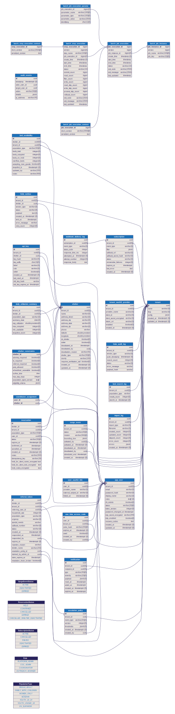

# For Developers — Finding A Bed Tonight

> This document contains the full technical reference for the FABT platform.
> For non-technical audiences, see the main [README](../README.md) which links to
> audience-specific pages for [Cities](FOR-CITIES.md), [CoC Administrators](FOR-COC-ADMINS.md),
> [Shelter Coordinators](FOR-COORDINATORS.md), and [Funders](FOR-FUNDERS.md).

---

## Architecture

The backend is a Spring Boot 4.0 modular monolith with virtual threads. Each bounded context lives in its own top-level package under `org.fabt.*` with enforced boundaries (22 ArchUnit rules). A shared kernel provides cross-cutting infrastructure (security filters, caching, event bus, JDBC configuration).

Three deployment tiers allow the same codebase to serve communities of vastly different size and budget:

---

## Deployment Tiers

| Tier | Infrastructure | Target | Cost |
|---|---|---|---|
| **Lite** | PostgreSQL only | Rural counties, volunteer-run CoCs | $15-30/mo |
| **Standard** | PostgreSQL + Redis | Mid-size CoCs, city IT departments | $30-75/mo |
| **Full** | PostgreSQL + Redis + Kafka | Metro areas, multi-service agencies | $100+/mo |

---

## Tech Stack

| Layer | Technology |
|---|---|
| Backend | Java 25, Spring Boot 4.0, Spring MVC, Spring Data JDBC, Virtual Threads |
| Database | PostgreSQL 16, Flyway (49 migrations), Row Level Security (DV shelters + notifications) |
| Cache | Caffeine L1 / + Redis L2 (Standard/Full) |
| Events | Spring Events (Lite) / Kafka (Full) |
| Auth | JWT + OAuth2/OIDC + API Keys (hybrid) |
| Frontend | React 19, Vite, TypeScript, Workbox PWA (injectManifest), react-intl (EN/ES), CSS custom properties design tokens |
| Testing | JUnit 5, Testcontainers, ArchUnit (619 tests), Playwright (348 UI tests), Vitest (42 unit tests), Karate (82 API scenarios), Gatling (8 simulations) |
| Infra | Docker, GitHub Actions CI/CD + E2E pipeline, Terraform (3 tiers) |

---

## Module Boundaries

The backend is a **modular monolith** — not a flat package-by-layer structure. Each module owns its own `api/`, `domain/`, `repository/`, and `service/` packages. Cross-module access is prohibited and enforced at build time by ArchUnit tests.

**Modules:**

| Module | Package | Responsibility |
|---|---|---|
| `tenant` | `org.fabt.tenant` | CoC tenant CRUD, configuration, multi-tenancy |
| `auth` | `org.fabt.auth` | JWT login/refresh, user CRUD, API key management, OAuth2 linking |
| `shelter` | `org.fabt.shelter` | Shelter profiles, constraints, capacities, HSDS export, coordinator assignments |
| `availability` | `org.fabt.availability` | Real-time bed availability snapshots, bed search queries, data freshness |
| `reservation` | `org.fabt.reservation` | Soft-hold bed reservations: create, confirm, cancel, auto-expire |
| `surge` | `org.fabt.surge` | White Flag / emergency surge events: activation, deactivation, overflow capacity, auto-expiry |
| `dataimport` | `org.fabt.dataimport` | HSDS JSON import, 211 CSV import (fuzzy matching), CsvSanitizer (CWE-1236), MIME validation, import audit log |
| `observability` | `org.fabt.observability` | Structured JSON logging, Micrometer metrics, health probes, data freshness, i18n |
| `subscription` | `org.fabt.subscription` | Webhook subscriptions, HMAC-SHA256 event delivery, MCP-ready |
| `referral` | `org.fabt.referral` | DV opaque referral tokens: create, accept, reject, expire, warm handoff |
| `hmis` | `org.fabt.hmis` | HMIS bridge: async push to vendors (Clarity/WellSky/ClientTrack), outbox pattern, DV aggregation |
| `analytics` | `org.fabt.analytics` | CoC analytics: utilization trends, demand signals, HIC/PIT export, Spring Batch jobs, separate connection pool |

**Shared kernel:** `org.fabt.shared` — config, cache (`CacheService`, `CacheNames`), event (`EventBus`, `DomainEvent`), security (`JwtAuthenticationFilter`, `ApiKeyAuthenticationFilter`, `SecurityConfig`), web (`TenantContext`, `GlobalExceptionHandler`).

**ArchUnit enforcement:** 22 architecture tests verify that modules do not access each other's `domain`, `repository`, or `service` packages. Only `api` and `shared` packages are accessible across module boundaries.

---

## MCP-Ready API Design

The REST API is designed for future AI agent consumption via the Model Context Protocol (MCP). Six design requirements (REQ-MCP-1 through REQ-MCP-6) are satisfied in Phase 1:

1. **Atomic, single-purpose endpoints** — each endpoint does exactly one thing; maps 1:1 to a future MCP tool
2. **Machine-readable error responses** — structured error bodies with context for agent reasoning
3. **Semantic OpenAPI descriptions** — endpoint descriptions written for AI model consumption
4. **Stable UUID identifiers** — all primary keys are UUIDs, forming predictable resource URIs
5. **Structured domain events** — self-describing events on Kafka topics (Full tier)
6. **Stateless query path** — no session state, cookies, or server-side context; every query is self-contained

Phase 2 will add an MCP server as a thin wrapper around the REST API, enabling natural language bed search, proactive availability alerting, and conversational CoC reporting. See [MCP-BRIEFING.md](https://github.com/ccradle/findABed/blob/main/MCP-BRIEFING.md) in the docs repo for the full decision record.

---

## Database Schema

49 Flyway migrations (V1–V52, with V8.1 and gaps at V40–V43):

| Migration | Description |
|---|---|
| V1 | `tenant` — CoC tenant registration |
| V2 | `app_user` — users with roles and DV access flag |
| V3 | `api_key` — shelter-scoped and org-level API keys |
| V4 | `shelter` — shelter profiles |
| V5 | `shelter_constraints` — accessibility, pets, sobriety requirements |
| V6 | `shelter_capacity` — bed counts by population type (dropped in V20) |
| V7 | `coordinator_assignment` — shelter-to-coordinator mapping |
| V8 | Row Level Security policies — DV shelter protection |
| V8.1 | RLS fix for empty string tenant context |
| V9 | `import_log` — HSDS data import audit trail |
| V10 | `tenant_oauth2_provider`, `user_oauth2_link` — OAuth2 account linking |
| V11 | `subscription` — webhook subscriptions for event-driven notifications |
| V12 | `bed_availability` — append-only bed availability snapshots |
| V13 | RLS for `bed_availability` — inherits DV-shelter access control |
| V14 | `reservation` — soft-hold bed reservations with status lifecycle |
| V15 | RLS for `reservation` — inherits DV-shelter access control |
| V16 | `fabt_app` restricted role — NOSUPERUSER, DML-only for RLS enforcement |
| V17 | `surge_event` — White Flag / emergency surge lifecycle |
| V18 | `overflow_beds` column on `bed_availability` — temporary surge capacity |
| V19 | RLS for `surge_event` — tenant-scoped access |
| V20 | Drop `shelter_capacity` — migrate data to `bed_availability`, single source of truth |
| V21 | `referral_token` — DV opaque referral tokens (zero PII, hard-delete purge, RLS) |
| V22 | `hmis_outbox` + `hmis_audit_log` — async push outbox and audit trail for HMIS bridge |
| V23 | `bed_search_log` + `daily_utilization_summary` — analytics demand logging and pre-aggregation. BRIN index on `bed_availability.snapshot_ts` |
| V24 | Spring Batch schema (6 tables, 3 sequences) — job/step execution history for batch jobs |
| V25 | Composite index on `bed_availability(tenant_id, shelter_id, population_type, snapshot_ts DESC)` — lateral join skip-scan optimization |
| V26 | Spring Batch 6.0 sequence rename (`BATCH_JOB_SEQ` → `BATCH_JOB_INSTANCE_SEQ`) |
| V27 | `password_changed_at` column on `app_user` — tracks last password change for JWT invalidation |
| V28 | `status` + `token_version` columns on `app_user` — user deactivation and JWT invalidation |
| V29 | `audit_events` — audit trail for admin actions (user management, shelter DV changes) |
| V30 | `idempotency_key` on `reservation` — deduplication for offline queue replay (nullable VARCHAR(36)) |

### Entity Relationship Diagram



### Documentation

| Document | Description |
|---|---|
| [docs/schema.dbml](schema.dbml) | DBML source — paste into [dbdiagram.io](https://dbdiagram.io) to edit |
| [docs/erd.svg](erd.svg) | ERD diagram generated from schema.dbml via @softwaretechnik/dbml-renderer |
| [docs/asyncapi.yaml](asyncapi.yaml) | AsyncAPI 3.0 spec — EventBus contract for all 3 deployment tiers |
| [docs/architecture.drawio](architecture.drawio) | Architecture diagram — includes observability stack, NOAA API. Open in [draw.io](https://app.diagrams.net) |
| [docs/runbook.md](runbook.md) | Operational runbook — monitor investigation, Grafana panels, Prometheus queries, management port production security |

---

## Recent Changes

### Notification Deep-Linking (Issue #106 — Phases 1-4)

User-clicks-notification → land on the specific item requiring action, with focus on the right element. Implemented as a four-phase rollout. Foundational mechanism is the `useDeepLink` hook (`frontend/src/hooks/useDeepLink.ts`) — an explicit finite state machine `idle → resolving → awaiting-confirm → expanding → awaiting-target → done | stale` with a 5-second `awaiting-target` deadline so stuck states are impossible by construction.

**URL pattern convention** for new notification types:

- `/coordinator?referralId=X` — coordinator-routed referral deep-link
- `/admin#dvEscalations?referralId=X` — admin-queue routed (hash-embedded query because the admin panel uses the hash for tab selection per design D1)
- `/coordinator?shelterId=X` / `/admin?shelterId=X` — shelter deep-link routed by role
- `/outreach/my-holds?reservationId=X` — outreach hold deep-link

Role-aware routing is built into `getNavigationPath(notification, userRoles)` in `frontend/src/components/notificationMessages.ts`. **New pages adding deep-link support MUST consume the `useDeepLink` hook rather than re-implement state machines or idempotency guards.** Provide four host callbacks: `resolveTarget`, `needsUnsavedConfirm`, `expand`, `isTargetReady`. The hook owns intent-equality idempotency, cancellation via AbortController, the 5s timeout, and the stale fallback. Hosts own DOM/UI side effects via a single `useEffect` keyed on `dlState.kind` transitions (gate with a `lastHandledDlKindRef` if your effect dep array also includes data that updates independently — see Phase 2 H-1 fix in `DvEscalationsTab.tsx` and the same pattern in `MyPastHoldsPage.tsx`).

**Phase 4 metrics** (Priya's differentiator):

- `fabt.notification.deeplink.click.count{type, role, outcome}` — counter, incremented on every deep-link terminal state. `type` is the intent shape (`referral-deeplink`, `shelter-deeplink`, `reservation-deeplink`, `admin-escalation-deeplink`); `role` is server-derived from the JWT; `outcome` is `success` / `stale` / `offline`. Click-through rate = `success/total`. POST `/api/v1/metrics/notification-deeplink-click` from host effects.
- `fabt.notification.time_to_action.seconds{type}` — histogram with p50/p95/p99 percentile buckets. Measured server-side in `NotificationPersistenceService.markActed` as `Duration.between(notification.createdAt, Instant.now())`. **Primary success metric** — target median < 30s; baseline coordinator self-report 2-5 min. Renders in the `Notification → Action Latency by Type` panel on the FABT DV Referrals dashboard.
- `fabt.notification.stale_referral.count{type, role}` — counter, mirror of the click counter when `outcome=stale` so the Grafana stale-rate panel doesn't need a divisor.

### DV Referral Expiry Fix (v0.31.2)

`@Transactional` on `expireTokens()` and `purgeTerminalTokens()` caused DV referral tokens to remain PENDING indefinitely. Root cause: `@Transactional` eagerly acquires a JDBC connection before `runWithContext()` sets dvAccess=true. See Troubleshooting section for the full pattern rule.

### Color System & Dark Mode (v0.21.0)

CSS custom property color tokens with automatic dark mode (`prefers-color-scheme: dark`). Architecture follows the **Radix/Carbon split pattern**:

- `color.primary` — button fills, solid backgrounds (white text on them)
- `color.primaryText` — links, labels, inline colored text (readable on dark bg)
- `color.primaryLight` — active nav bg, selection (primaryText on it)

In light mode these converge (same value). In dark mode they diverge (Carbon Blue-60 for fills, Blue-40 for text).

**For new components:** Import `{ color } from '../theme/colors'` and use semantic tokens. Never hardcode hex values. See `colors.ts` header comment for usage guide.

Dark mode values sourced from Carbon Design System (Blue-60/40, Green-40, Red-40, Yellow-30) — proven accessible at scale. All token pairs verified via axe-core automated scans in both modes.

### Shelter Edit (v0.20.0)

Shelters can now be edited from both the Admin Shelters tab and the Coordinator dashboard. DV shelter changes have tiered safeguards:

- **Operational fields** (phone, curfew, max stay) — editable by COORDINATOR+
- **Structural fields** (name, address) — editable by COC_ADMIN+, read-only for coordinators
- **DV flag** — COC_ADMIN+ only. Changing dvShelter from true→false requires a confirmation dialog. All DV flag and DV address changes are audit-logged via `audit_events` (V29)
- **RLS enforcement** — writing `dv_shelter=true` requires `dvAccess=true` on the session (PostgreSQL RLS policy)

**Demo flow:** A 211 CSV import → shelter edit lifecycle demonstrates realistic CoC onboarding. See `e2e/fixtures/nc-211-sample.csv` for the demo data file.

---

## OpenSpec Workflow

Specifications and planning artifacts live in the companion [docs repo (ccradle/findABed)](https://github.com/ccradle/findABed). All features are spec-driven: proposal, design, specs, tasks, implementation, verification.

New to OpenSpec? See [https://openspec.dev](https://openspec.dev) and [https://github.com/Fission-AI/OpenSpec](https://github.com/Fission-AI/OpenSpec).

---

## Prerequisites

- **Java:** 25+ (OpenJDK or Eclipse Temurin)
- **Maven:** 3.9+
- **Docker Desktop:** Must be **running** before starting the stack (required for PostgreSQL via Docker Compose and for Testcontainers in tests — engine 29.x+ on Windows requires `api.version=1.44` config)
- **Node.js:** 20+ (for frontend)

---

## Starting the Stack

### Quick start (recommended)

```bash
git clone https://github.com/ccradle/finding-a-bed-tonight.git
cd finding-a-bed-tonight

# macOS/Linux: make script executable (one-time)
chmod +x dev-start.sh

# Start everything: PostgreSQL, backend, seed data, frontend
./dev-start.sh

# Stop everything
./dev-start.sh stop

# Backend only (no frontend)
./dev-start.sh backend

# Reset seed data before loading (use when shelter structure changes)
./dev-start.sh --fresh
```

The script starts PostgreSQL via Docker Compose, builds and launches the backend (with Flyway migrations), loads seed data (13 shelters, 3 users, 1 tenant), and starts the frontend dev server. Use `--fresh` when shelter structure has changed — it runs `infra/scripts/seed-reset.sql` before loading seed data, clearing old shelters that would otherwise persist via `ON CONFLICT DO NOTHING`.

### Manual start

```bash
# 1. Start PostgreSQL
docker compose up -d postgres

# 2. Load seed data
docker compose exec -T postgres psql -U fabt -d fabt < infra/scripts/seed-data.sql

# 3. Start backend
cd backend && mvn spring-boot:run

# 4. Start frontend (separate terminal)
cd frontend && npm install && npm run dev
```

### Verify the stack

```bash
# Health check
curl http://localhost:8080/actuator/health/liveness

# Swagger UI (no auth required to browse API docs)
open http://localhost:8080/api/v1/docs

# Frontend
open http://localhost:5173
```

---

## UI Sanity Check

After starting the stack, open **http://localhost:5173** in your browser.

### Login

Use one of the seed data accounts:

| Role | Email | Password | What you'll see |
|------|-------|----------|----------------|
| **Platform Admin** | `admin@dev.fabt.org` | `admin123` | Admin panel (tenant/user management) |
| **CoC Admin** | `cocadmin@dev.fabt.org` | `admin123` | Coordinator dashboard (5 assigned shelters) |
| **Outreach Worker** | `outreach@dev.fabt.org` | `admin123` | Bed search with live availability |
| **DV Outreach Worker** | `dv-outreach@dev.fabt.org` | `admin123` | Bed search with DV shelters visible (addresses redacted) |

**Tenant slug:** `dev-coc`

### What to verify

1. **Login page** loads with email/password form and tenant slug field
2. **Outreach search** — shelters show beds available (green) and full (red), freshness badges (FRESH/AGING/STALE), "Hold This Bed" buttons
3. **Hold a bed** — click "Hold This Bed" on an available bed, see the reservations panel with countdown timer, confirm or cancel the hold
4. **Coordinator dashboard** — expand a shelter, update occupied/on-hold counts, see availability refresh
5. **Active holds indicator** — coordinator sees which beds are held by outreach workers
6. **Language selector** — switch to Español → UI text changes to Spanish
7. **Offline banner** — toggle airplane mode → yellow "You are offline" banner appears

### API verification (via curl)

```bash
# Login as outreach worker
TOKEN=$(curl -s -X POST http://localhost:8080/api/v1/auth/login \
  -H "Content-Type: application/json" \
  -d '{"tenantSlug": "dev-coc", "email": "outreach@dev.fabt.org", "password": "admin123"}' \
  | python3 -c "import sys,json; print(json.load(sys.stdin)['accessToken'])")

# List shelters with availability summary (each result wraps shelter + availabilitySummary)
curl -s http://localhost:8080/api/v1/shelters \
  -H "Authorization: Bearer $TOKEN" | python3 -m json.tool

# List shelters with pagination (page 0, 5 per page)
curl -s "http://localhost:8080/api/v1/shelters?page=0&size=5" \
  -H "Authorization: Bearer $TOKEN" | python3 -m json.tool

# Search for beds (ranked results with availability)
curl -s -X POST http://localhost:8080/api/v1/queries/beds \
  -H "Authorization: Bearer $TOKEN" \
  -H "Content-Type: application/json" \
  -d '{"populationType": "SINGLE_ADULT", "limit": 5}' | python3 -m json.tool

# Hold a bed
curl -s -X POST http://localhost:8080/api/v1/reservations \
  -H "Authorization: Bearer $TOKEN" \
  -H "Content-Type: application/json" \
  -d '{"shelterId": "d0000000-0000-0000-0000-000000000001", "populationType": "SINGLE_ADULT"}' \
  | python3 -m json.tool

# List my active holds
curl -s http://localhost:8080/api/v1/reservations \
  -H "Authorization: Bearer $TOKEN" | python3 -m json.tool

# Shelter detail with availability
curl -s http://localhost:8080/api/v1/shelters/d0000000-0000-0000-0000-000000000001 \
  -H "Authorization: Bearer $TOKEN" | python3 -m json.tool

# Health check (no auth needed)
curl -s http://localhost:8080/actuator/health | python3 -m json.tool
```

---

## Running Tests

```bash
cd backend

# Run all 425 backend tests
mvn test

# Run E2E tests (requires dev-start.sh stack running)
cd ../e2e/playwright && BASE_URL=http://localhost:8081 npx playwright test    # 339 UI tests (run through nginx)
cd ../e2e/karate && mvn test                   # 82 API scenarios across 29 features
cd ../e2e/gatling && mvn gatling:test           # Gatling performance simulations

# Run E2E tests through nginx proxy (catches proxy-specific bugs like SSE buffering)
# Requires: ./dev-start.sh --nginx --observability
cd ../e2e/playwright && npx playwright test --project=nginx

# Run a specific test class
mvn test -Dtest=ReservationIntegrationTest

# Run a specific test method
mvn test -Dtest="AvailabilityIntegrationTest#test_createSnapshot_appendOnly_preservesPreviousSnapshot"
```

**Docker is required.** Tests use Testcontainers to start a PostgreSQL 16 container automatically.

### Testing with nginx proxy

The dev stack normally uses Vite's dev server (port 5173) which has a built-in proxy. Production uses an nginx container. Proxy behavior differs — SSE streaming, header handling, caching, and timeouts can behave differently through nginx. The v0.22.1 SSE buffering bug was invisible in dev because Vite handles streaming correctly.

**When to use `--nginx` mode:**
- Before any release — run Playwright through nginx to catch proxy-specific bugs
- After any change to `infra/docker/nginx.conf` — verify behavior through the real proxy
- When debugging SSE, WebSocket, or streaming behavior
- When testing security headers (CSP, HSTS) that are set at the nginx layer

**When NOT to use it:**
- Active frontend development — use default Vite mode for hot module replacement

**Commands:**
```bash
./dev-start.sh --nginx --observability    # Build frontend, start nginx on :8081
./dev-start.sh --nginx --no-build         # Restart nginx without rebuilding
npx playwright test --project=nginx       # Run E2E through nginx proxy
```

**CORS:** When running through nginx (`:8081`), the backend must allow `http://localhost:8081` as a CORS origin. `dev-start.sh` sets this automatically via `FABT_CORS_ALLOWED_ORIGINS=http://localhost:5173,http://localhost:8081`. If running the backend manually without `dev-start.sh`, export this variable or you'll get 403 errors on browser requests through nginx. This is the same issue that affects the Oracle demo (`feedback_nginx_cors_dev`).

**Playwright BASE_URL:** Always use `BASE_URL=http://localhost:8081` when running Playwright with `--nginx`. Without it, Playwright defaults to Vite's `:5173` and bypasses the nginx proxy entirely, missing proxy-specific bugs. The `feedback_check_ports_before_assuming` memory captures this as a critical lesson.

**Future:** Consider adding the nginx Playwright profile to CI as a weekly or pre-release job.

### SSE Architecture

Real-time notifications use Server-Sent Events (SSE) via Spring Boot `SseEmitter` + `@microsoft/fetch-event-source`.

**Server (`NotificationService`):**
- `SseEmitter(-1L)` — no server-side timeout. Dead connections detected by 20-second heartbeat failures.
- Named heartbeat events (not SSE comments) with `id:` — advances `Last-Event-ID` for accurate reconnect replay.
- Bounded replay buffer (100 events / 5 minutes, tenant-filtered) for `Last-Event-ID` catchup.
- Sends `refresh` event when gap is too large (client does single bulk refetch).
- `@PreDestroy` graceful shutdown closes all emitters.
- Micrometer metrics: `sse.connections.active`, `sse.reconnections.total`, `sse.event.delivery.duration`, `sse.send.failures.total`.

**Client (`useNotifications` hook):**
- `@microsoft/fetch-event-source` with `Authorization` header (not query-param token).
- Exponential backoff with jitter on reconnect (1s → 30s max).
- `openWhenHidden: false` — auto-close when tab backgrounded, reconnect on visible.
- No full-refetch on reconnect — server replays via `Last-Event-ID`. Only `refresh` event triggers bulk refetch.

**Caching:** Workbox `NetworkFirst` for all API routes (5-second timeout, falls back to cache). Changed from `StaleWhileRevalidate` to prevent stale data after writes.

**Monitoring:** Grafana FABT Operations dashboard has SSE health panels. A sawtooth pattern in `sse.connections.active` indicates a timeout/reconnect loop (the v0.22.1 bug pattern).

### Test Breakdown

| Test Class | Tests | What It Covers |
|---|---|---|
| `ApplicationTest` | 1 | Spring context loads successfully |
| `ArchitectureTest` | 21 | ArchUnit module boundary enforcement (12 modules) |
| `TenantIntegrationTest` | 8 | Tenant CRUD, config defaults, config update |
| `AuthIntegrationTest` | 7 | JWT login, refresh, wrong password/email/tenant |
| `ApiKeyAuthTest` | 6 | API key auth, rotation, deactivation, role resolution |
| `DvAccessRlsTest` | 3 | PostgreSQL RLS for DV shelter data protection |
| `RoleBasedAccessTest` | 10 | 4-role access control (PLATFORM_ADMIN, COC_ADMIN, COORDINATOR, OUTREACH_WORKER) |
| `OAuth2ProviderTest` | 6 | OAuth2 provider CRUD, public endpoint, tenant leakage prevention |
| `OAuth2FlowIntegrationTest` | 9 | OAuth2 authorization code + PKCE flow, JWKS, account linking |
| `OAuth2AccountLinkTest` | 4 | Account linking, rejection of unknown emails, JWT identity |
| `ShelterIntegrationTest` | 11 | Shelter CRUD, constraints, HSDS export, coordinator assignment, pagination |
| `ImportIntegrationTest` | 7 | HSDS import, 211 CSV import, fuzzy matching, duplicate detection |
| `ObservabilityIntegrationTest` | 6 | Health endpoints, i18n error responses, error structure |
| `ObservabilityMetricsTest` | 10 | Custom Micrometer metrics registration and counting |
| `OperationalMonitorServiceTest` | 9 | Stale shelter, DV canary, temperature/surge gap monitors |
| `MetricsIntegrationTest` | 5 | Prometheus endpoint, metric tags, actuator integration |
| `SubscriptionIntegrationTest` | 5 | Webhook subscription CRUD, error validation |
| `AvailabilityIntegrationTest` | 10 | Availability snapshots, bed search, ranking, data freshness, events |
| `BedAvailabilityHardeningTest` | 28 | QA invariants (9 rules), concurrent holds, coordinator hold protection, single source of truth |
| `ReservationIntegrationTest` | 10 | Reservation lifecycle, concurrency, expiry, creator-only access, events |
| `SurgeIntegrationTest` | 8 | Surge activation/deactivation, 409, 403, auto-expiry, overflow, search flag |
| `DvReferralIntegrationTest` | 12 | Token lifecycle, warm handoff, dvAccess enforcement, purge, RLS defense-in-depth, analytics |
| `DvAddressRedactionTest` | 13 | Policy-based address redaction: ADMIN_AND_ASSIGNED, ADMIN_ONLY, ALL_DV_ACCESS, NONE, safeguards |
| `HmisBridgeIntegrationTest` | 14 | Transformer, DV aggregation, outbox, push, preview, status, security |
| `AnalyticsIntegrationTest` | 13 | Utilization, demand, HIC/PIT export, batch jobs, security |
| `CsvSanitizerTest` | 18 | Parameterized injection prevention, edge cases |
| `SseStabilityTest` | 4 | Timeout behavior, initial event, Last-Event-ID, metrics |
| **Backend Total** | **~597** | *(count grows with each change — run `mvn test` for current)* |
| | | |
| **E2E: Playwright** | **~339** | **UI tests (Chromium, data-testid locators)** |
| `auth.spec.ts` | 4 | Login per role, failed login |
| `outreach-search.spec.ts` | 9 | Results, filters, modal, hold/cancel, language, freshness |
| `coordinator-dashboard.spec.ts` | 5 | Load, expand, update, save, hold indicator |
| `coordinator-beds.spec.ts` | 5 | Occupied/total steppers, on-hold read-only, save+reload |
| `coordinator-availability-math.spec.ts` | 5 | INV-9 math verification: page load, total change, occupied change, save+reload, badge |
| `admin-panel.spec.ts` | 5 | Tabs, create user, shelter list, API key reveal, surge tab |
| `oauth2-login.spec.ts` | 3 | SSO buttons, provider-driven login |
| `oauth2-providers.spec.ts` | 2 | Admin OAuth2 provider management |
| `observability.spec.ts` | 4 | Admin observability tab, config toggles |
| `offline-behavior.spec.ts` | 14 | Offline banner, stale cache, hold/avail queue+replay, expiry, conflict, queue badge, double-event guard, try/catch fallback, multi-action order, FAILED state, toast, hospital SW-blocked |
| `dv-referral.spec.ts` | 7 | DV referral request, screening, accept, reject, warm handoff |
| `hmis-export.spec.ts` | 5 | HMIS Export admin tab, preview, history, push |
| `analytics.spec.ts` | 7 | Analytics dashboard, utilization, demand, batch jobs, HIC/PIT |
| `accessibility.spec.ts` | 8 | axe-core scans on 8 pages (zero violations gate) |
| `screen-reader.spec.ts` | 6 | Virtual screen reader: navigation, ARIA, skip link, lang |
| `capture-screenshots.spec.ts` | 18 | Demo walkthrough screenshot capture |
| `capture-dv-screenshots.spec.ts` | 7 | DV referral flow screenshot capture |
| `capture-hmis-screenshots.spec.ts` | 4 | HMIS bridge screenshot capture |
| `capture-analytics-screenshots.spec.ts` | 6 | Analytics dashboard screenshot capture |
| | | |
| **E2E: Karate** | **~82** | **API contract tests (feature files)** |
| `auth/login.feature` | 5 | JWT login, refresh, invalid, no-auth 401, API key |
| `shelters/shelter-crud.feature` | 6 | Create, update, list, filter, HSDS, outreach 403 |
| `availability/availability.feature` | 6 | PATCH snapshot, bed search, filters, outreach 403, detail |
| `dv-access/dv-access-control.feature` | 5 | DV canary: bed search, list, 404, HSDS 404, COC_ADMIN |
| `reservations/*.feature` | 4 | Lifecycle, cancel, auth, concurrency |
| `surge/surge-lifecycle.feature` | 4 | Activate, deactivate, list, outreach 403 |
| `webhooks/subscription-crud.feature` | 2 | Create + list, delete |
| `dv-referrals/*.feature` | 7 | Token lifecycle, security/RLS, warm handoff, dvAccess enforcement, analytics |
| `dv-address/*.feature` | 6 | Policy-based address redaction, policy change safeguards |
| `hmis/*.feature` | 6 | HMIS push, preview, status, security |
| `analytics/*.feature` | 19 | Utilization, demand, export, batch jobs, security |
| `observability/*.feature` | 6 | Grafana health, Prometheus scrape, metrics polling, trace-e2e |
| | | |
| **Grand Total** | **431** | |

---

## Observability

The platform includes custom Micrometer metrics, OpenTelemetry tracing, operational monitors, and optional Grafana dashboards.

### Metrics

Custom metrics exposed via `/actuator/prometheus`:

| Metric | Type | Description |
|--------|------|-------------|
| `fabt.bed.search.count` | Counter | Bed search queries (tag: populationType) |
| `fabt.bed.search.duration` | Timer | Bed search latency |
| `fabt.availability.update.count` | Counter | Availability snapshots created |
| `fabt.reservation.count` | Counter | Reservation state transitions (tag: status) |
| `fabt.surge.active` | Gauge | 1 if surge active, 0 if not |
| `fabt.shelter.stale.count` | Gauge | Shelters with no update in 8+ hours |
| `fabt.dv.canary.pass` | Gauge | 1 if DV canary passes, 0 if fails |
| `fabt.webhook.delivery.count` | Counter | Webhook delivery attempts (tag: status) |

### Operational Monitors

Three `@Scheduled` monitors run inside the application:

1. **Stale shelter detection** (every 5min) — logs WARNING for shelters with no snapshot in 8+ hours
2. **DV canary check** (every 15min) — logs CRITICAL if a DV shelter leaks into non-DV search results
3. **Temperature/surge gap** (every 1hr) — logs WARNING if temperature <32°F with no active surge

See [docs/runbook.md](runbook.md) for investigation and response procedures.

### Accessibility — WCAG 2.1 AA

FABT is designed to meet WCAG 2.1 Level AA (the standard mandated by the ADA Title II final rule for state and local government web content). A self-assessed **[Accessibility Conformance Report](WCAG-ACR.md)** (VPAT 2.5 WCAG edition) documents conformance for all 50 Level A and AA criteria.

Key accessibility features:
- **axe-core CI gate** — 8-page automated scan blocks builds on any WCAG violation
- **Color independence** — all status indicators include text labels alongside color (WCAG 1.4.1)
- **Keyboard navigation** — admin tab bar follows W3C APG tabs pattern, skip-to-content link on every page
- **Touch targets** — minimum 44x44px on all interactive elements (outdoor one-handed use)
- **Focus management** — route changes announced via aria-live, focus moved to main content
- **i18n** — `lang` attribute switches between `en`/`es` for screen reader voice selection

See **[docs/WCAG-ACR.md](WCAG-ACR.md)** for the full conformance report, remediation plan, and testing methodology.

### DV Privacy — Opaque Referral

FABT implements a **privacy-preserving referral system** for domestic violence shelters, designed to support VAWA (34 U.S.C. 12291(b)(2)), FVPSA, and HUD HMIS requirements. Key design principles:

- **Zero client PII** in the database — referral tokens contain only household size, population type, urgency, and the worker's callback number
- **Shelter address never displayed** — shared verbally during warm handoff phone call only
- **Human-in-the-loop** — DV shelter staff screen every referral for safety before accepting
- **Hard-delete purge** — all referral tokens are permanently deleted within 24 hours of completion
- **Aggregate analytics only** — Micrometer counters track referral volume for HUD reporting; durable analytics require the observability stack (Prometheus)

DV shelter address visibility is controlled by a configurable tenant-level policy (`dv_address_visibility`). Default: admins and assigned coordinators see the address; outreach workers do not. Policy changeable via API only (PLATFORM_ADMIN + confirmation header — endpoint should not be exposed outside the firewall).

See **[docs/DV-OPAQUE-REFERRAL.md](DV-OPAQUE-REFERRAL.md)** for the full legal basis, architecture, address visibility policies, VAWA self-assessment checklist, and operational notes. See the **[DV Referral Demo Walkthrough](https://ccradle.github.io/findABed/demo/dvindex.html)** for annotated screenshots of the full flow.

### DV Escalation Policy and Frozen-at-Creation (v0.35.0, coc-admin-escalation)

FABT escalates pending DV referrals through a **per-tenant, versioned, append-only** policy stored in the `escalation_policy` table. Each tenant configures thresholds (e.g. 1h → COORDINATOR, 2h → COC_ADMIN CRITICAL) so operational rhythm matches local reality — faith-run shelters, 24/7 staffed facilities, and hospital-discharge workflows all have different tolerance windows. A hardcoded 1h/2h/3.5h/4h chain trained every non-Wake-County partner to ignore CRITICAL alerts inside 30 days; per-tenant policy fixes that.

**Frozen-at-creation semantics (the load-bearing invariant):** when a referral is created, the `referral_token` row records the **policy version ID** that was active at that instant (`frozen_policy_id`). The escalation batch job uses the **frozen** thresholds for each existing referral, NOT the current tenant policy. Existing referrals therefore keep the rules they were created under even if an admin edits the policy mid-flight. This is a chain-of-custody requirement, not a convenience — auditors need to answer "what rules governed this referral?" with a single row lookup, not by replaying `escalation_policy` history against a wall-clock. You can reproduce the audit query yourself during incident reviews:

```sql
SELECT ep.thresholds
FROM escalation_policy ep
WHERE ep.id = (
  SELECT rt.frozen_policy_id FROM referral_token rt WHERE rt.id = '<referral-id>'
);
```

Exhaustively tested in `ReferralEscalationFrozenPolicyTest`. The richer operator/auditor narrative lives in `docs/FOR-COC-ADMINS.md` (expanded in v0.35.0).

**Admin queue (CoC admin workflow):** CoC admins see all pending DV referrals in their tenant via `GET /api/v1/dv-referrals/escalated` and act on them through four endpoints:

| Action | Endpoint | Concurrency model |
|---|---|---|
| Claim | `POST /{id}/claim` | Single `UPDATE ... RETURNING *` — TOCTOU-safe. Soft-lock for 10 min (configurable). Second admin's claim returns 409 without an `Override-Claim: true` header. |
| Release | `POST /{id}/release` | Symmetric to claim. Manual release or auto-release when the soft-lock expires. |
| Reassign | `POST /{id}/reassign` | Three targets: `COORDINATOR_GROUP` (re-page the shelter's coordinators), `COC_ADMIN_GROUP` (re-page all CoC admins as CRITICAL), `SPECIFIC_USER` (notify one person AND **break the escalation chain** — the tasklet stops auto-escalating because a named human took ownership). Reason text is required and written to the audit trail. |
| Approve/Deny | `PATCH /{id}/accept`, `PATCH /{id}/reject` | Terminal state. Triggers hard-delete purge after the 24-hour window. |

Cross-tenant isolation is enforced at the SQL layer (the repository query predicates on `tenant_id = ?`) because `referral_token` RLS only checks `dv_access`, not tenant. **Heads-up for deployments:** admin accounts that operate the escalation queue MUST have `dv_access=true`. The seed was flipped in v0.35.0 for the dev `cocadmin` user; real-tenant CoC admin accounts are granted via the admin Users tab.

**Per-tenant policy editor:** the admin UI at `/admin#dvEscalations → Escalation Policy` renders the current policy (platform default or tenant override) and PATCHes a new version on save. The backend validates threshold IDs are unique within the policy, durations are monotonic, severities are in the whitelist, and recipients map to valid roles. Validation is enforced in `EscalationPolicyService.validateThresholds(...)` at the service layer, **not** in Bean Validation on the DTO — a direct service caller (a test, a script, a future internal job) therefore cannot bypass the validation by skipping the controller. Two `Caffeine` caches front the storage — `policyById` for frozen-policy lookups from the batch tasklet, and `currentPolicyByTenant` for new-referral creation. Cache invalidation is explicit on PATCH.

**SSE fan-out for coordinated views:** four domain events keep every admin's queue live — `referral.claimed`, `referral.released`, `referral.queue-changed`, `referral.policy-updated`. `NotificationService.notifyAdminQueueEvent` routes them to users with `COC_ADMIN`/`PLATFORM_ADMIN` role AND `dv_access=true`. On the frontend, `useDvEscalationQueue` listens for these events via window `CustomEvents` dispatched by the existing `useNotifications` SSE connection — one SSE connection per session, not one per feature — and debounces a REST refetch by 250ms so a burst of events collapses into one network round-trip. The hook also runs a 30-second live-countdown interval to keep `remainingMinutes` honest when no SSE events arrive; the interval is gated by `document.visibilityState === 'visible'` and re-fires a catch-up refetch on `visibilitychange`. Without that gating, 18 partner agencies × admins idle in background tabs would burn ~1080 REST calls/hour per admin for nothing — the `visibilitychange` listener is load-bearing, not cleanup-target.

**Key files:**

| File | Purpose |
|---|---|
| `backend/src/main/java/org/fabt/notification/service/EscalationPolicyService.java` | Versioning, validation, two-cache lookup |
| `backend/src/main/java/org/fabt/referral/batch/ReferralEscalationJobConfig.java` | Spring Batch tasklet that creates escalation notifications using frozen thresholds |
| `backend/src/main/java/org/fabt/referral/service/ReferralTokenService.java` | `claimToken` / `releaseToken` / `reassignToken` with atomic `UPDATE ... RETURNING` |
| `backend/src/main/resources/db/migration/V46__create_escalation_policy.sql` | Table shape + platform default seed |
| `frontend/src/pages/admin/tabs/DvEscalationsTab.tsx` | Orchestrator (desktop table + mobile cards + detail modal + policy editor) |
| `openspec/changes/coc-admin-escalation/` | Full spec, design decisions (D1–D20), and 13 requirements / 62 scenarios |

**ArchUnit boundary crossings:** the referral module imports boundary-clean primitives from `UserService` — `existsByIdInCurrentTenant`, `getRolesByUserId`, `findActiveUserIdsByRole`, `findDvCoordinatorIds`, `findDisplayNamesByIds`, `isAdminActor` — and **must never** import `User` directly. ArchUnit enforces this in `ArchitectureTest`. If you need a new cross-module call, add it as a primitive on `UserService`, not as a domain-entity import. The odd-looking method surface is load-bearing, not a candidate for a "cleaner" refactor.

See **[docs/runbook.md](runbook.md)** for operational guidance on policy-update rollout, claim-conflict alerting, and the batch job tuning knobs.

### Tracing

OpenTelemetry tracing is disabled by default (sampling probability 0.0). Enable via tenant config:

```bash
curl -X PUT http://localhost:8080/api/v1/tenants/<id>/observability \
  -H "Content-Type: application/json" \
  -d '{"tracing_enabled": true, "prometheus_enabled": true}'
```

### Optional Grafana + Prometheus Stack

```bash
# Recommended: use dev-start.sh (handles management port + health checks)
./dev-start.sh --observability

# Or manually with docker compose
docker compose --profile observability up -d
```

- **Grafana:** http://localhost:3000 (admin/admin) — FABT Operations dashboard pre-loaded
- **Prometheus:** http://localhost:9090
- **Jaeger:** http://localhost:16686
- **Management port:** http://localhost:9091/actuator/prometheus (unauthenticated, dev only)

### Management Port Security

The `/actuator/prometheus` endpoint on the main port (`:8080`) requires authentication. When `--observability` is used, actuator endpoints are also served on a **separate management port** (`:9091`) without auth, allowing Prometheus to scrape.

**Production:** Bind the management port to `127.0.0.1` and firewall it to the monitoring network only. Do not expose publicly. See [docs/runbook.md](runbook.md) for full production security guidance.

---

## Grafana Dashboards

Three pre-built Grafana dashboards are included in `grafana/dashboards/`. They are auto-provisioned when the observability stack is running (`./dev-start.sh --observability`).

| Dashboard | File | What It Shows |
|---|---|---|
| **FABT Operations** | `fabt-operations.json` | Search rate, latency (p50/p95/p99), availability updates, reservation lifecycle, stale shelter count, DV canary status, surge events, temperature/surge gap, webhook delivery, circuit breaker state |
| **DV Referrals** | `fabt-dv-referrals.json` | Referral volume, acceptance/rejection rates, token lifecycle, purge metrics (separate from operations for DV data sensitivity) |
| **HMIS Bridge** | `fabt-hmis-bridge.json` | Push success/failure rates, outbox queue depth, vendor latency by adapter (Clarity/WellSky/ClientTrack), dead letter count, circuit breaker state |
| **CoC Analytics** | `fabt-coc-analytics.json` | Utilization gauge, zero-result search rate, capacity trend, batch job execution (success/failure/duration), daily aggregation lag |
| **Virtual Threads** | `fabt-virtual-thread-performance.json` | Virtual thread pool utilization, connection pool active/idle/pending, BoundedFanOut concurrency, carrier thread pinning |

All dashboards read from the Prometheus data source scraping `:9091/actuator/prometheus`. See [docs/runbook.md](runbook.md) for Prometheus query examples and alerting guidance.

---

## OAuth2 Single Sign-On

The platform supports OAuth2 login via Google, Microsoft, and Keycloak (or any OIDC-compliant IdP). Providers are configured per-tenant and loaded dynamically from the database. Password login and SSO login are architecturally independent — an IdP outage does not affect password-authenticated users. See [docs/runbook.md](runbook.md) for degradation behavior.

### Setup

1. **Register a client** with your IdP (Google Cloud Console, Microsoft Entra Admin Center, or Keycloak)
2. **Add the provider** via Admin Panel or API: `POST /api/v1/tenants/{id}/oauth2-providers`
3. **SSO buttons** appear automatically on the login page for that tenant
4. **Users must be pre-provisioned** — OAuth2 links to existing accounts by email (closed registration)

### Local Development with Keycloak

```bash
./dev-start.sh --oauth2              # Start with Keycloak at :8180
./dev-start.sh --oauth2 --observability  # Keycloak + monitoring stack
```

Keycloak admin: http://localhost:8180 (admin/admin). Realm `fabt-dev` is auto-imported with test users.

### Closed Registration Model

For security, the system does **not** auto-provision users on OAuth2 login. A CoC admin must first create the user account (with email), then the user can "Login with Google/Microsoft" and the system links their identity automatically. Unknown emails are rejected with a clear message.

---

## REST API Reference

All endpoints are under `/api/v1`. Authentication is via JWT Bearer token (from `/auth/login`) or API key (via `X-API-Key` header) unless noted otherwise.

### Authentication

| Method | Path | Auth | Description |
|---|---|---|---|
| `POST` | `/api/v1/auth/login` | None | Authenticate with email/password/tenantSlug, returns JWT |
| `POST` | `/api/v1/auth/refresh` | None | Refresh an access token using a refresh token |
| `PUT` | `/api/v1/auth/password` | Bearer | Change own password (current + new, min 12 chars). Invalidates all tokens. 409 for SSO-only users |
| `POST` | `/api/v1/users/{id}/reset-password` | Admin | Admin resets user password. Same-tenant only. Invalidates user's tokens |
| `POST` | `/api/v1/auth/forgot-password` | None | Request email password reset. Body: `{email, tenantSlug}`. Always 200 (no enumeration). DV users silently blocked. Rate limited: 3/hour |
| `POST` | `/api/v1/auth/reset-password` | None | Reset password via email token. Body: `{token, newPassword}` (min 12 chars). Token is SHA-256 hashed (not BCrypt), 30-min expiry, single-use. Increments tokenVersion. |
| `GET` | `/api/v1/auth/capabilities` | None | Returns `{emailResetAvailable, totpAvailable, accessCodeAvailable}`. Frontend gates "Forgot Password?" on emailResetAvailable |

### Tenants

| Method | Path | Auth | Description |
|---|---|---|---|
| `POST` | `/api/v1/tenants` | PLATFORM_ADMIN | Create a new tenant (CoC) |
| `GET` | `/api/v1/tenants` | PLATFORM_ADMIN | List all tenants |
| `GET` | `/api/v1/tenants/{id}` | PLATFORM_ADMIN | Get tenant by ID |
| `PUT` | `/api/v1/tenants/{id}` | PLATFORM_ADMIN | Update tenant name |
| `GET` | `/api/v1/tenants/{id}/config` | COC_ADMIN+ | Get tenant configuration |
| `PUT` | `/api/v1/tenants/{id}/config` | COC_ADMIN+ | Update tenant configuration (incl. hold_duration_minutes) |
| `GET` | `/api/v1/tenants/{id}/observability` | PLATFORM_ADMIN | Get observability settings (prometheus, tracing, thresholds) |
| `PUT` | `/api/v1/tenants/{id}/observability` | PLATFORM_ADMIN | Update observability settings at runtime |

### OAuth2 Flow

| Method | Path | Auth | Description |
|---|---|---|---|
| `GET` | `/oauth2/authorization/{slug}-{provider}` | None | Initiate OAuth2 redirect to IdP (PKCE S256) |
| `GET` | `/oauth2/callback/{slug}-{provider}` | None | OAuth2 callback — exchanges code for tokens, links user, redirects to frontend |

### Monitoring

| Method | Path | Auth | Description |
|---|---|---|---|
| `GET` | `/api/v1/monitoring/temperature` | Any authenticated | Cached NOAA temperature, station ID, threshold, surge gap status |

### OAuth2 Providers

| Method | Path | Auth | Description |
|---|---|---|---|
| `POST` | `/api/v1/tenants/{id}/oauth2-providers` | COC_ADMIN+ | Add OAuth2 provider (Google, Microsoft, etc.) |
| `GET` | `/api/v1/tenants/{id}/oauth2-providers` | COC_ADMIN+ | List all providers for tenant |
| `PUT` | `/api/v1/tenants/{id}/oauth2-providers/{pid}` | COC_ADMIN+ | Update provider config |
| `DELETE` | `/api/v1/tenants/{id}/oauth2-providers/{pid}` | COC_ADMIN+ | Remove provider |
| `GET` | `/api/v1/tenants/{slug}/oauth2-providers/public` | None | List enabled providers (login page) |

### Users

| Method | Path | Auth | Description |
|---|---|---|---|
| `POST` | `/api/v1/users` | COC_ADMIN+ | Create user (dvAccess defaults false) |
| `GET` | `/api/v1/users` | COC_ADMIN+ | List users in tenant (includes status field) |
| `GET` | `/api/v1/users/{id}` | COC_ADMIN+ | Get user by ID |
| `PUT` | `/api/v1/users/{id}` | COC_ADMIN+ | Update user (displayName, email, roles, dvAccess). Role/dvAccess changes increment tokenVersion, invalidating existing JWTs |
| `PATCH` | `/api/v1/users/{id}/status` | COC_ADMIN+ | Deactivate or reactivate user. Body: `{"status": "DEACTIVATED"}` or `{"status": "ACTIVE"}`. Disconnects SSE on deactivation |
| `GET` | `/api/v1/users/{id}/shelters` | COC_ADMIN+ | List shelters assigned to a user. Returns `[{id, name}]`. Tenant-scoped. DV shelters visible only if caller has dvAccess |
| `GET` | `/api/v1/shelters/{id}/coordinators` | COC_ADMIN+ | List coordinator user IDs assigned to a shelter. Returns `[uuid]` |

### Audit Events

| Method | Path | Auth | Description |
|---|---|---|---|
| `GET` | `/api/v1/audit-events?targetUserId={id}` | COC_ADMIN+ | Query audit events for a user (role changes, deactivation, password resets) in reverse chronological order |

### API Keys

| Method | Path | Auth | Description |
|---|---|---|---|
| `POST` | `/api/v1/api-keys` | COC_ADMIN+ | Create API key (256-bit, plaintext returned once) |
| `GET` | `/api/v1/api-keys` | COC_ADMIN+ | List keys (suffix, status, lastUsedAt, grace period) |
| `DELETE` | `/api/v1/api-keys/{id}` | COC_ADMIN+ | Revoke key (immediate, clears grace period) |
| `POST` | `/api/v1/api-keys/{id}/rotate` | COC_ADMIN+ | Rotate key (24h grace period for old key) |

**API key rate limiting:** Per-IP rate limiting on all API key-authenticated requests via Bucket4j + Caffeine cache (10K max IPs, 10m TTL). Configurable via `fabt.api-key.rate-limit` property (default: 1000 req/min). Returns `429 Too Many Requests` with `Retry-After`, `X-RateLimit-Limit`, `X-RateLimit-Remaining`, and `X-RateLimit-Reset` headers. Client IP resolved from `X-Real-IP` header (set by nginx), falls back to `getRemoteAddr()`. Nginx also applies `limit_req_zone` at 1r/s with burst=20 on `/api/`.

### Shelters

| Method | Path | Auth | Description |
|---|---|---|---|
| `POST` | `/api/v1/shelters` | COC_ADMIN+ | Create shelter with constraints + capacities |
| `GET` | `/api/v1/shelters` | Any authenticated | List shelters with availability summary (optional pagination: `?page=0&size=20`) |
| `GET` | `/api/v1/shelters/{id}` | Any authenticated | Shelter detail with constraints, capacities, and live availability |
| `GET` | `/api/v1/shelters/{id}?format=hsds` | Any authenticated | HSDS 3.0 export with fabt: extensions |
| `PUT` | `/api/v1/shelters/{id}` | COORDINATOR+ | Update shelter (coordinators must be assigned) |
| `PATCH` | `/api/v1/shelters/{id}/availability` | COORDINATOR+ | Submit availability snapshot (append-only, cache invalidation, event publish) |
| `POST` | `/api/v1/shelters/{id}/coordinators` | COC_ADMIN+ | Assign coordinator to shelter |
| `DELETE` | `/api/v1/shelters/{id}/coordinators/{uid}` | COC_ADMIN+ | Unassign coordinator |

### Bed Search

| Method | Path | Auth | Description |
|---|---|---|---|
| `POST` | `/api/v1/queries/beds` | Any authenticated | Search beds with filters (populationType, constraints, location, limit). Ranked results with availability, data freshness, and held bed counts |

### Surge Events

| Method | Path | Auth | Description |
|---|---|---|---|
| `POST` | `/api/v1/surge-events` | COC_ADMIN+ | Activate a White Flag / emergency surge event |
| `GET` | `/api/v1/surge-events` | Any authenticated | List surge events (active + historical) |
| `GET` | `/api/v1/surge-events/{id}` | Any authenticated | Surge event detail |
| `PATCH` | `/api/v1/surge-events/{id}/deactivate` | COC_ADMIN+ | End an active surge |

### Reservations

| Method | Path | Auth | Description |
|---|---|---|---|
| `POST` | `/api/v1/reservations` | OUTREACH_WORKER+ | Create soft-hold reservation (configurable hold duration, default 90 min) |
| `GET` | `/api/v1/reservations` | OUTREACH_WORKER+ | List active (HELD) reservations for current user |
| `PATCH` | `/api/v1/reservations/{id}/confirm` | OUTREACH_WORKER+ | Confirm arrival — converts hold to occupancy |
| `PATCH` | `/api/v1/reservations/{id}/cancel` | OUTREACH_WORKER+ | Cancel hold — releases bed |

### Data Import

| Method | Path | Auth | Description |
|---|---|---|---|
| `POST` | `/api/v1/import/hsds` | COC_ADMIN+ | Import HSDS 3.0 JSON (multipart file) |
| `POST` | `/api/v1/import/211` | COC_ADMIN+ | Import 211 CSV with fuzzy column matching |
| `GET` | `/api/v1/import/211/preview` | COC_ADMIN+ | Preview column mapping for 211 CSV |
| `GET` | `/api/v1/import/history` | COC_ADMIN+ | Import audit log |

### Webhook Subscriptions

| Method | Path | Auth | Description |
|---|---|---|---|
| `POST` | `/api/v1/subscriptions` | Any authenticated | Subscribe to events (HMAC-SHA256 webhook delivery) |
| `GET` | `/api/v1/subscriptions` | Any authenticated | List subscriptions (status, consecutiveFailures, lastError) |
| `DELETE` | `/api/v1/subscriptions/{id}` | Any authenticated | Cancel subscription (sets CANCELLED, not deleted) |
| `PATCH` | `/api/v1/subscriptions/{id}/status` | COC_ADMIN+ | Pause/resume (ACTIVE↔PAUSED only, resets failures on re-enable) |
| `POST` | `/api/v1/subscriptions/{id}/test` | COC_ADMIN+ | Send test event, returns delivery result (status, time, body) |
| `GET` | `/api/v1/subscriptions/{id}/deliveries` | COC_ADMIN+ | Last 20 delivery attempts (redacted, 1KB truncated) |

**Webhook delivery timeouts (configurable since v0.32.2):**

| Property | Env var | Default | Purpose |
|---|---|---|---|
| `fabt.webhook.connect-timeout-seconds` | `FABT_WEBHOOK_CONNECT_TIMEOUT_SECONDS` | `10` | TCP connect timeout to subscriber endpoint |
| `fabt.webhook.read-timeout-seconds` | `FABT_WEBHOOK_READ_TIMEOUT_SECONDS` | `30` | Read timeout for the response — protects virtual threads from hanging endpoints |

The read timeout is enforced via `JdkClientHttpRequestFactory.setReadTimeout()` on the shared `RestClient`. JDK `HttpClient` has no per-client read timeout, so without this fix a slow subscriber would block a virtual thread until the JVM died (Marcus Webb finding, fixed 2026-04-09 in PR #96 and tested by `WebhookTestEventDeliveryTest` + `WebhookTimeoutTest`). Both timeouts can be raised per deployment for partners with legitimately slow endpoints, but prefer fixing the partner's endpoint when possible.

**Webhook resilience (since v0.30.0):** 3-attempt retry with exponential backoff (1s × 3) via resilience4j; 50% failure threshold over a sliding window of 20 calls trips the circuit breaker (open for 30s). Auto-disable triggers after 5 consecutive failures (`subscription.status = DEACTIVATED`). Re-enable via `PATCH /api/v1/subscriptions/{id}/status` resets the failure counter.

### Notifications

| Method | Path | Auth | Description |
|---|---|---|---|
| `GET` | `/api/v1/notifications` | Any authenticated | List notifications for authenticated user. Supports `?unread=true` filter. Ordered by `created_at DESC` |
| `GET` | `/api/v1/notifications/count` | Any authenticated | Returns `{"unread": N}` — used by the header bell badge |
| `GET` | `/api/v1/notifications/stream?token=<jwt>` | Any authenticated | Server-Sent Events stream. Token passed as query parameter (EventSource API does not support Authorization header). Events: `dv-referral.responded`, `dv-referral.requested`, `availability.updated`, `surge.activated`. 5-minute timeout, client auto-reconnects |
| `PATCH` | `/api/v1/notifications/{id}/read` | Any authenticated | Mark notification as read (204, idempotent) |
| `PATCH` | `/api/v1/notifications/{id}/acted` | Any authenticated | Mark notification as acted (204). Required for CRITICAL severity notifications |
| `POST` | `/api/v1/notifications/read-all` | Any authenticated | Mark all notifications as read (204). Excludes CRITICAL severity — those require explicit acknowledgement |

**Severity tiers:** `INFO` (auto-dismissed), `ACTION_REQUIRED` (persists until read), `CRITICAL` (persists until explicitly acted — e.g., surge acknowledgement). Notifications are DB-backed and survive logout/restart. RLS ensures users can only read/update their own notifications.

**Security note:** The `SseTokenFilter` extracts the JWT from the `?token=` query parameter and sets the SecurityContext. This filter only applies to the `/api/v1/notifications/stream` path. Token-in-URL is the standard approach for SSE (used by GitHub, Slack). Mitigated by short-lived access tokens and read-only endpoint.

### DV Referral Counts

| Method | Path | Auth | Description |
|---|---|---|---|
| `GET` | `/api/v1/dv-referrals/pending/count` | COORDINATOR+ (dvAccess) | Returns pending DV referral count for coordinator's assigned shelters. Used by the coordinator dashboard badge |

---

## Domain Glossary

**CoC (Continuum of Care)** — HUD-defined regional body coordinating homeless services. Each CoC has a unique ID (e.g., NC-507 for Wake County). Maps to a tenant in the platform.

**Tenant** — A CoC or administrative boundary served by a single platform deployment. Multi-tenant design allows one deployment to serve multiple CoCs.

**DV Shelter (Domestic Violence)** — Shelter serving DV survivors. Location and existence protected by PostgreSQL Row Level Security. Never exposed through public queries.

**HSDS (Human Services Data Specification)** — Open Referral standard (v3.0) for describing social services. FABT extends HSDS with bed availability objects.

**Surge Event / White Flag** — Emergency activation when weather or crisis requires expanded shelter capacity. CoC-admin triggered, broadcast to all outreach workers.

**PIT Count (Point-in-Time)** — Annual HUD-mandated count of sheltered and unsheltered individuals experiencing homelessness.

**Bed Availability** — Real-time count of open beds by population type at a shelter. Append-only snapshots, never updated in place. `beds_available` is derived: `beds_total - beds_occupied - beds_on_hold`.

**Reservation (Soft-Hold)** — Temporary claim on a bed during transport. Lifecycle: HELD → CONFIRMED (client arrived) | CANCELLED (released) | EXPIRED (timed out). Default hold duration: 90 minutes, configurable per tenant via Admin UI.

**Population Type** — Category of individuals a shelter serves: `SINGLE_ADULT`, `FAMILY_WITH_CHILDREN`, `WOMEN_ONLY`, `VETERAN`, `YOUTH_18_24`, `YOUTH_UNDER_18`, `DV_SURVIVOR`.

**Outreach Worker** — Frontline staff who connects individuals experiencing homelessness to services. Primary user of the bed search and reservation interfaces.

**Coordinator** — Shelter staff responsible for updating bed counts and managing shelter profile.

**Opaque Referral** — Privacy-preserving DV shelter referral that does not reveal the shelter's location or existence to unauthorized users. Uses time-limited tokens with zero client PII.

**Warm Handoff** — Standard DV referral practice where the referring worker calls the shelter directly (phone number provided after acceptance) to arrange arrival and discuss sensitive details verbally. Required by VAWA/FVPSA.

**VAWA (Violence Against Women Act)** — Federal law (34 U.S.C. 12291(b)(2)) prohibiting disclosure of DV survivor PII. FABT is designed to support VAWA requirements through zero-PII referral tokens and address redaction.

**FVPSA (Family Violence Prevention and Services Act)** — Federal law (45 CFR Part 1370) requiring DV shelter address confidentiality. FABT enforces configurable address visibility policies per tenant.

**DV Address Policy** — Tenant-level configuration controlling who sees DV shelter addresses: `ADMIN_AND_ASSIGNED` (default), `ADMIN_ONLY`, `ALL_DV_ACCESS`, `NONE`.

**Row Level Security (RLS)** — PostgreSQL security feature that filters query results based on user context. FABT uses RLS to prevent any unauthorized access to DV shelter data, regardless of application code.

**Data Freshness** — Indicator of availability data age: `FRESH` (<2 hours), `AGING` (2–8 hours), `STALE` (>8 hours), `UNKNOWN` (no timestamp). Displayed in UI and monitored by operational alerts.

**HIC (Housing Inventory Count)** — Annual HUD report of all beds and units dedicated to homeless populations in a CoC. FABT generates HIC CSV exports from bed availability snapshots.

**HMIS Bridge** — System module that pushes bed inventory (HMIS Element 2.07) to external HMIS vendors (Clarity, WellSky, ClientTrack) via async outbox pattern with hourly scheduling.

**Small-Cell Suppression** — Privacy technique applied to DV analytics: suppress aggregations with fewer than 3 distinct shelters or fewer than 5 beds to prevent identification of individual DV shelters.

**WCAG 2.1 Level AA** — Web Content Accessibility Guidelines version 2.1 at Level AA conformance — the standard mandated by ADA Title II for state and local government web content (effective April 2026).

**ACR (Accessibility Conformance Report)** — Self-assessed document (VPAT 2.5 WCAG edition) detailing how FABT meets each of the 50 WCAG 2.1 Level A and AA success criteria. See [docs/WCAG-ACR.md](WCAG-ACR.md).

**SPM (System Performance Measures)** — Seven HUD-mandated metrics for CoC performance evaluation. FABT provides complementary utilization and demand data but does not replicate client-level SPMs (which require HMIS enrollment data).

**MCP (Model Context Protocol)** — Open standard by Anthropic for AI agent integration. Platform is MCP-ready for Phase 2 natural language interface.

---

## Project Structure

```
finding-a-bed-tonight/
├── README.md
├── CONTRIBUTING.md
├── LICENSE                                            # Apache 2.0
├── dev-start.sh                                       # One-command dev stack (--observability for monitoring stack)
├── docker-compose.yml                                 # PostgreSQL, Redis, Kafka + observability profile
├── prometheus.yml                                     # Prometheus scrape config (targets management port :9091)
├── otel-collector-config.yaml                         # OTel Collector pipeline: OTLP → Jaeger
│
├── backend/                                           # Spring Boot 4.0 modular monolith
│   ├── pom.xml                                        # Maven build + OWASP dependency-check plugin
│   ├── owasp-suppressions.xml                         # CVE suppression file with review dates
│   └── src/
│       ├── main/java/org/fabt/
│       │   ├── Application.java                       # Entry point (@EnableScheduling)
│       │   ├── tenant/                                # Tenant module — CRUD, config, multi-tenancy
│       │   │   ├── api/TenantController.java
│       │   │   ├── domain/Tenant.java
│       │   │   ├── repository/TenantRepository.java
│       │   │   └── service/TenantService.java
│       │   ├── auth/                                  # Auth module — JWT, API keys, OAuth2, users
│       │   │   ├── api/AuthController.java            # Login, refresh
│       │   │   ├── api/UserController.java            # User CRUD
│       │   │   ├── api/ApiKeyController.java          # API key CRUD + rotate
│       │   │   ├── domain/User.java
│       │   │   ├── domain/ApiKey.java
│       │   │   ├── api/OAuth2RedirectController.java    # OAuth2 authorize + callback (PKCE S256)
│       │   │   ├── api/OAuth2TestConnectionController.java  # OIDC discovery validation
│       │   │   ├── service/JwtService.java
│       │   │   ├── service/ApiKeyService.java         # SHA-256 hash, validate, rotate
│       │   │   ├── service/DynamicClientRegistrationSource.java  # Per-tenant OAuth2 provider loading
│       │   │   ├── service/OAuth2AccountLinkService.java  # Link-or-reject (closed registration)
│       │   │   └── service/PasswordService.java
│       │   ├── shelter/                               # Shelter module — CRUD, constraints, HSDS
│       │   │   ├── api/ShelterController.java         # CRUD + availability enrichment + pagination
│       │   │   ├── api/ShelterDetailResponse.java     # Shelter + constraints + capacities + availability
│       │   │   ├── api/ShelterListResponse.java       # Shelter + availabilitySummary
│       │   │   ├── domain/Shelter.java
│       │   │   ├── domain/ShelterConstraints.java     # Persistable<UUID> for FK-as-PK
│       │   │   ├── domain/PopulationType.java         # 7 population type enum values
│       │   │   ├── repository/ShelterRepository.java
│       │   │   ├── repository/CoordinatorAssignmentRepository.java
│       │   │   └── service/ShelterService.java        # Capacity writes routed to AvailabilityService (D10)
│       │   ├── availability/                          # Availability module — snapshots, bed search
│       │   │   ├── api/AvailabilityController.java    # PATCH /shelters/{id}/availability
│       │   │   ├── api/BedSearchController.java       # POST /queries/beds
│       │   │   ├── domain/BedAvailability.java        # Append-only snapshot entity
│       │   │   ├── domain/BedSearchRequest.java       # Filter body (populationType, constraints, location)
│       │   │   ├── domain/BedSearchResult.java        # Ranked result with availability + freshness
│       │   │   ├── repository/BedAvailabilityRepository.java  # Lateral join skip-scan, ON CONFLICT DO NOTHING
│       │   │   ├── service/AvailabilityService.java   # createSnapshot, invariant validation, cache evict, event publish
│       │   │   ├── service/AvailabilityInvariantViolation.java  # 422 for invariant violations (INV-1 through INV-5)
│       │   │   └── service/BedSearchService.java      # Cache-aside, ranking, constraint filtering
│       │   ├── reservation/                           # Reservation module — soft-hold lifecycle
│       │   ├── referral/                              # DV opaque referral module — zero-PII tokens
│       │   │   ├── api/ReferralTokenController.java   # Create, accept, reject, list (designed to support VAWA requirements)
│       │   │   ├── domain/ReferralToken.java          # PENDING → ACCEPTED/REJECTED/EXPIRED → purged
│       │   │   ├── repository/ReferralTokenRepository.java
│       │   │   ├── service/ReferralTokenService.java  # Lifecycle, dvAccess defense-in-depth (D14)
│       │   │   └── service/ReferralTokenPurgeService.java  # @Scheduled hard-delete within 24h
│       │   ├── hmis/                                   # HMIS bridge module — async push to HMIS vendors
│       │   │   ├── api/HmisExportController.java      # Admin endpoints: status, preview, history, push, vendors
│       │   │   ├── adapter/HmisVendorAdapter.java     # Strategy interface per vendor
│       │   │   ├── adapter/ClarityAdapter.java        # Bitfocus REST API push
│       │   │   ├── adapter/WellSkyAdapter.java        # HMIS CSV generation
│       │   │   ├── service/HmisPushService.java       # Outbox orchestrator with retry + audit
│       │   │   ├── service/HmisTransformer.java       # bed_availability → HMIS Element 2.07 (DV aggregation)
│       │   │   └── schedule/HmisPushScheduler.java    # @Scheduled hourly push
│       │   ├── surge/                                 # Surge module — White Flag activation, overflow
│       │   │   ├── api/ReservationController.java     # Create, confirm, cancel, list
│       │   │   ├── api/ReservationResponse.java       # Includes remainingSeconds for countdown
│       │   │   ├── domain/Reservation.java            # HELD → CONFIRMED/CANCELLED/EXPIRED
│       │   │   ├── domain/ReservationStatus.java
│       │   │   ├── repository/ReservationRepository.java  # Optimistic locking (WHERE status='HELD')
│       │   │   ├── service/ReservationService.java    # Lifecycle + availability snapshot integration
│       │   │   ├── service/ReservationExpiryService.java  # @Scheduled 30s polling (Lite tier)
│       │   │   └── service/RedisReservationExpiryService.java  # @Profile("standard","full") placeholder
│       │   ├── dataimport/                            # Import module — HSDS, 211 CSV
│       │   │   ├── api/ImportController.java
│       │   │   └── service/HsdsImportAdapter.java
│       │   ├── subscription/                          # Webhook subscription module
│       │   │   ├── api/SubscriptionController.java
│       │   │   └── service/SubscriptionService.java   # HMAC-SHA256 delivery, retry
│       │   ├── observability/                         # Metrics, monitors, tracing, health, i18n
│       │   │   ├── api/MonitoringController.java      # GET /monitoring/temperature (cached NOAA status)
│       │   │   ├── ObservabilityMetrics.java           # Micrometer gauges + counter/timer factories
│       │   │   ├── ObservabilityConfigService.java     # Runtime config from tenant JSONB (cached)
│       │   │   ├── OperationalMonitorService.java      # 3 @Scheduled monitors (stale, DV canary, temp)
│       │   │   ├── NoaaClient.java                    # NOAA Weather API + Resilience4J circuit breaker
│       │   │   ├── ManagementSecurityConfig.java       # permitAll on management port (dev only)
│       │   │   ├── TracingSamplerConfig.java           # Runtime tracing toggle
│       │   │   ├── DataAgeResponseAdvice.java         # Enriches responses with data_age_seconds
│       │   │   ├── DataFreshness.java                 # FRESH/AGING/STALE/UNKNOWN enum
│       │   │   └── TenantMdcFilter.java               # Tenant context in structured logs
│       │   └── shared/                                # Shared kernel — cross-cutting infrastructure
│       │       ├── cache/CacheService.java            # Interface: get, put, evict
│       │       ├── cache/CacheNames.java              # SHELTER_PROFILE, SHELTER_AVAILABILITY, etc.
│       │       ├── cache/CaffeineCacheService.java    # @Profile("lite") — L1 only
│       │       ├── cache/TieredCacheService.java      # @Profile("standard","full") — L1+L2
│       │       ├── event/EventBus.java                # Interface: publish(DomainEvent)
│       │       ├── event/DomainEvent.java             # Self-describing event record (REQ-MCP-5)
│       │       ├── event/SpringEventBus.java          # @Profile("lite","standard")
│       │       ├── event/KafkaEventBus.java           # @Profile("full")
│       │       ├── security/SecurityConfig.java       # URL-level + method-level security
│       │       ├── security/RlsDataSourceConfig.java  # SET ROLE fabt_app + dvAccess on every connection (D14)
│       │       ├── security/JwtDecoderConfig.java     # JWKS circuit breaker + warmup (OAuth2)
│       │       ├── security/JwtAuthenticationFilter.java
│       │       ├── security/ApiKeyAuthenticationFilter.java
│       │       ├── api/TestResetController.java       # @Profile("dev|test") — E2E test data cleanup
│       │       └── web/TenantContext.java             # ThreadLocal tenant + dvAccess
│       ├── main/resources/
│       │   ├── application.yml                        # Base config (port 8080, OTel, Resilience4J)
│       │   ├── application-observability.yml          # Management port 9091 (for dev Prometheus scrape)
│       │   ├── db/migration/                          # 49 Flyway migrations (V1–V52, with V8.1 and gaps at V40–V43)
│       │   ├── logback-spring.xml                     # Structured JSON logging (Logstash encoder)
│       │   └── messages/                              # i18n error messages (EN, ES)
│       └── test/java/org/fabt/                        # 378 tests (unit + integration)
│           ├── BaseIntegrationTest.java               # Singleton Testcontainers PostgreSQL
│           ├── TestAuthHelper.java                    # Per-role JWT helper for tests
│           ├── ArchitectureTest.java                  # 22 ArchUnit module boundary rules
│           ├── availability/AvailabilityIntegrationTest.java  # 10 tests
│           ├── surge/SurgeIntegrationTest.java         # 8 tests
│           ├── availability/TestEventListener.java    # Captures DomainEvents for assertions
│           ├── reservation/ReservationIntegrationTest.java    # 10 tests
│           ├── shelter/ShelterIntegrationTest.java     # 11 tests
│           ├── observability/ObservabilityMetricsTest.java   # 10 unit tests (SimpleMeterRegistry)
│           ├── observability/OperationalMonitorServiceTest.java  # 9 unit tests (mocked monitors)
│           ├── observability/MetricsIntegrationTest.java  # 5 tests (@AutoConfigureObservability)
│           └── ...                                    # auth (37), dataimport (7), observability (6), etc.
│
├── frontend/                                          # React 19 + Vite + TypeScript PWA
│   ├── package.json
│   ├── vite.config.ts                                 # PWA manifest, workbox, API proxy to :8080
│   └── src/
│       ├── App.tsx                                    # Router, IntlProvider, AuthProvider
│       ├── auth/                                      # AuthContext, AuthGuard, useAuth
│       ├── pages/
│       │   ├── LoginPage.tsx                          # Tenant slug + email/password login
│       │   ├── OutreachSearch.tsx                     # Bed search, hold buttons, reservations panel
│       │   ├── CoordinatorDashboard.tsx               # Availability update, hold indicators
│       │   ├── admin/                                 # Admin panel (extracted from 2,136-line monolith)
│       │   │   ├── AdminPanel.tsx                     # 128-line orchestrator: React.lazy + Suspense + TabErrorBoundary
│       │   │   ├── types.ts                           # Shared interfaces (User, ShelterListItem, ApiKeyRow, TabKey, etc.)
│       │   │   ├── styles.ts                          # Shared style objects (tableStyle, thStyle, tdStyle, etc.)
│       │   │   ├── components/                        # StatusBadge, RoleBadge, ErrorBox, NoData, Spinner, ReservationSettings, TabErrorBoundary
│       │   │   └── tabs/                              # 10 lazy-loaded tabs (UsersTab, SheltersTab, ApiKeysTab, ...)
│       │   ├── ShelterForm.tsx                        # Create shelter with constraints + capacity
│       │   ├── HsdsImportPage.tsx                     # HSDS JSON file upload
│       │   └── TwoOneOneImportPage.tsx                # 211 CSV import with column mapping
│       ├── components/
│       │   ├── Layout.tsx                             # Nav, locale selector, offline banner
│       │   └── DataAge.tsx                            # Freshness indicator (green/yellow/red dot)
│       ├── services/
│       │   ├── api.ts                                 # HTTP client with JWT refresh + 401 retry
│       │   └── offlineQueue.ts                        # IndexedDB queue, replay on reconnect
│       ├── hooks/useOnlineStatus.ts                   # navigator.onLine listener
│       └── i18n/
│           ├── en.json                                # English (100+ keys)
│           └── es.json                                # Spanish (100+ keys)
│
├── e2e/                                               # End-to-end test suites
│   ├── playwright/                                    # UI tests (286+ tests, Chromium + nginx profile)
│   │   ├── package.json                               # @playwright/test + TypeScript
│   │   ├── playwright.config.ts                       # baseURL, workers, retries, HTML reporter
│   │   ├── fixtures/auth.fixture.ts                   # Per-role storageState (admin, cocadmin, outreach)
│   │   ├── helpers/test-cleanup.ts                    # Shared afterAll cleanup — calls test reset endpoint
│   │   ├── pages/                                     # Page Object Model
│   │   │   ├── LoginPage.ts                           # Tenant slug, email, password, submit
│   │   │   ├── OutreachSearchPage.ts                  # Filters, results, detail modal
│   │   │   ├── CoordinatorDashboardPage.ts            # Shelter cards, steppers, save
│   │   │   └── AdminPanelPage.ts                      # Tabs, forms, tables
│   │   ├── deploy/                                    # Deployment verification (isolated — NOT in regression suite)
│   │   │   ├── playwright.config.ts                   # Standalone config targeting live site
│   │   │   ├── deploy-verify-v0.29.*.spec.ts          # Version-specific deployment checks
│   │   │   ├── post-deploy-smoke.spec.ts              # Post-deploy health check
│   │   │   └── demo-guard-verify.spec.ts              # Demo guard validation
│   │   └── tests/
│   │       ├── auth.spec.ts                           # 4 tests — login per role + failed login
│   │       ├── outreach-search.spec.ts                # 9 tests — filters, modal, hold/cancel, freshness
│   │       ├── coordinator-dashboard.spec.ts          # 5 tests — expand, update, save
│   │       ├── coordinator-beds.spec.ts               # 5 tests — steppers, on-hold, save+reload
│   │       ├── coordinator-availability-math.spec.ts  # 5 tests — INV-9 math verification
│   │       ├── admin-panel.spec.ts                    # 5 tests — tabs, create user, API key reveal
│   │       ├── observability.spec.ts                  # 4 tests — config toggle, threshold, temp display
│   │       ├── analytics.spec.ts                      # 7 tests — dashboard, utilization, demand, batch
│   │       ├── accessibility.spec.ts                  # 8 tests — axe-core zero violations gate
│   │       ├── screen-reader.spec.ts                  # 6 tests — virtual SR, ARIA, skip link
│   │       ├── dv-referral.spec.ts                    # 7 tests — referral request, screening, handoff
│   │       ├── hmis-export.spec.ts                    # 5 tests — HMIS export tab, preview, push
│   │       ├── oauth2-login.spec.ts                   # 3 tests — SSO buttons, no-provider
│   │       └── oauth2-providers.spec.ts               # 2 tests — provider tab, add provider form
│   ├── karate/                                        # API tests (77 scenarios, JUnit 5 runner)
│       ├── pom.xml                                    # Standalone Maven project, Karate 2.0.0
│       └── src/test/java/
│           ├── KarateRunnerTest.java                  # JUnit 5 entry point
│           ├── ObservabilityRunnerTest.java            # @observability tag runner (sequential)
│           ├── karate-config.js                       # baseUrl, jaegerBaseUrl, grafanaBaseUrl, tokens
│           ├── common/auth.feature                    # Reusable login helper (@ignore)
│           ├── observability/                         # @observability-tagged features (optional)
│           │   ├── get-prometheus.feature             # Helper: fetch + parse Prometheus metrics (@ignore)
│           │   ├── get-traces.feature                 # Helper: fetch Jaeger traces (@ignore)
│           │   ├── metrics-polling.feature            # Counter increment verification
│           │   ├── trace-e2e.feature                  # OTel trace verification via Jaeger API
│           │   └── grafana-health.feature             # Grafana health + dashboard presence
│           └── features/
│               ├── auth/login.feature                 # 5 scenarios — JWT, refresh, 401, API key
│               ├── shelters/shelter-crud.feature       # 6 scenarios — CRUD, HSDS, filters, 403
│               ├── availability/availability.feature   # 6 scenarios — PATCH, search, detail, 403
│               ├── dv-access/dv-access-control.feature # 5 scenarios — DV canary blocking gate
│               ├── reservations/*.feature              # 4 scenarios — lifecycle, cancel, auth, concurrency
│               ├── surge/surge-lifecycle.feature        # 4 scenarios — activate, deactivate, list, 403
│               └── webhooks/subscription-crud.feature  # 2 scenarios — create, delete
│   └── gatling/                                       # Performance tests (Gatling 3.x, Java)
│       ├── pom.xml                                    # Standalone Maven project, `perf` profile
│       └── src/gatling/java/fabt/
│           ├── FabtSimulation.java                    # Base class — HTTP protocol, JWT acquisition
│           ├── BedSearchSimulation.java               # 50 VU ramp, 4 payload variants, SLO assertions
│           ├── AvailabilityUpdateSimulation.java       # Multi-shelter + same-shelter stress
│           ├── SurgeLoadSimulation.java               # Stub (requires surge-mode — implemented)
│           └── AnalyticsMixedLoadSimulation.java      # OLTP + analytics concurrent load, p99 assertions
│
├── docs/
│   ├── schema.dbml                                    # Database schema (V1–V24, DBML format)
│   ├── erd.svg                                        # Entity relationship diagram (generated from schema.dbml)
│   ├── asyncapi.yaml                                  # EventBus contract (AsyncAPI 3.0, x-security)
│   ├── architecture.drawio                            # Architecture diagram (draw.io) — includes observability stack
│   └── runbook.md                                     # Operational runbook (monitors, thresholds, Grafana, security)
│
├── grafana/                                           # Optional Grafana provisioning (observability profile)
│   ├── dashboards/fabt-operations.json                # FABT Operations dashboard (13 panels)
│   └── provisioning/
│       ├── dashboards/dashboard-provider.yaml          # Auto-load dashboards from /var/lib/grafana/dashboards
│       └── datasources/fabt-datasources.yaml          # Prometheus datasource (http://prometheus:9090)
│
├── infra/
│   ├── docker/                                        # Dockerfiles (backend, frontend, nginx)
│   ├── scripts/
│   │   ├── seed-data.sql                              # 13 shelters, 3 users, 17 availability snapshots
│   │   ├── seed-reset.sql                             # Clears seed data for fresh reload (--fresh flag)
│   │   └── demo-activity-seed.sql                     # 28 days of deterministic demo activity
│   └── keycloak/
│       └── fabt-dev-realm.json                        # Keycloak realm import (PKCE client + service client + test users)
│   └── terraform/
│       ├── bootstrap/main.tf                          # S3 state + DynamoDB lock (deletion protected)
│       └── modules/
│           ├── network/main.tf                        # VPC, subnets (no public IP auto-assign)
│           ├── postgres/main.tf                       # RDS PostgreSQL 16 (private, encrypted)
│           └── app/main.tf                            # ECS Fargate, ALB (TLS 1.2+), Secrets Manager
│
└── .github/workflows/
    ├── ci.yml                                         # Backend test + OWASP check, frontend build, Docker push
    └── e2e-tests.yml                                  # Playwright + Karate against dev stack, HTML reports
```

---

## Project Status

### Completed: Platform Foundation (archived)

- [x] Modular monolith backend (Java 25, Spring Boot 4.0, 6 modules, ArchUnit boundaries, virtual threads)
- [x] 34 Flyway migrations (V1–V34 + V8.1), PostgreSQL 16, Row Level Security for DV shelters
- [x] 3 deployment profiles (Lite / Standard / Full) with CacheService + EventBus abstractions
- [x] Multi-tenant auth: JWT + API keys + OAuth2 provider management, 4 roles, dual-layer security
- [x] Shelter module: CRUD, constraints, capacities, HSDS 3.0 export, coordinator assignments
- [x] Data import: HSDS JSON, 211 CSV (fuzzy column matching), audit log
- [x] Observability: structured JSON logging, Micrometer metrics, health probes, data freshness, i18n (EN/ES)
- [x] Webhook subscriptions: CRUD, HMAC-SHA256 delivery, event matching
- [x] React PWA: outreach search, coordinator dashboard, admin panel, offline queue, service worker
- [x] MCP-ready: @Operation on all endpoints, structured errors, self-describing events
- [x] CI/CD (GitHub Actions), Docker, Terraform (3 tiers), seed data, dev-start.sh

### Completed: Bed Availability (archived)

- [x] Append-only bed availability snapshots (V12-V13 migrations)
- [x] Bed search endpoint (POST /api/v1/queries/beds) with ranked results, constraint filters
- [x] Coordinator availability update (PATCH /api/v1/shelters/{id}/availability)
- [x] Data freshness (data_age_seconds from snapshot_ts, FRESH/AGING/STALE/UNKNOWN)
- [x] Shelter detail + list enriched with live availability data
- [x] Cache-aside pattern with synchronous invalidation on update
- [x] availability.updated events published to EventBus
- [x] Frontend: bed search with availability badges, freshness indicators, coordinator availability form

### Completed: Reservation System (pending archive)

- [x] Soft-hold bed reservations (V14-V15 migrations, HELD → CONFIRMED/CANCELLED/EXPIRED)
- [x] Reservation API: create hold, confirm arrival, cancel, list active
- [x] Availability integration: holds adjust beds_on_hold/beds_occupied via snapshots
- [x] Configurable hold duration per tenant (default 90 min, editable via Admin UI, read from tenant config JSONB)
- [x] Dual-tier auto-expiry: @Scheduled polling (Lite) + Redis TTL placeholder (Standard/Full)
- [x] 4 domain events: reservation.created, confirmed, cancelled, expired
- [x] Frontend: "Hold This Bed" buttons, countdown timer, confirm/cancel flow, coordinator hold indicator

### Completed: E2E Test Automation + Hardening

- [x] Playwright UI tests: 62 tests with `data-testid` locators (login, search, dashboard, beds, availability math, admin, offline, OAuth2, observability, screenshots)
- [x] Karate API tests: 36 scenarios (auth, shelters, availability, search, subscriptions, DV canary, reservations, surge, observability/tracing)
- [x] Gatling performance suite: BedSearch (50 VU), AvailabilityUpdate (multi/same-shelter), SurgeLoad (stub)
- [x] RLS enforcement: JDBC connection interceptor (`set_config`), restricted `fabt_app` DB role, DV canary gate
- [x] CI pipeline: dv-canary blocking gate, e2e-tests job, performance-tests main-only job

### Completed: Surge Mode

- [x] Surge event lifecycle (ACTIVE → DEACTIVATED/EXPIRED) with auto-expiry
- [x] Surge API: activate, deactivate, list, detail (4 endpoints)
- [x] Overflow capacity: coordinators report temporary beds during surges
- [x] Bed search: surgeActive flag + overflowBeds per population type
- [x] Event publishing: surge.activated + surge.deactivated with affected_shelter_count
- [x] Frontend: surge banner, admin Surge tab (activate/deactivate/history), overflow field

### Completed: Operational Monitoring

- [x] Custom Micrometer metrics: 10 domain metrics (bed search, availability, reservation, surge, webhook, DV canary, stale shelter, temperature gap)
- [x] OpenTelemetry tracing: micrometer-tracing-bridge-otel, OTLP exporter, runtime toggle via tenant config JSONB
- [x] 3 @Scheduled monitors: stale shelter (5min), DV canary (15min), temperature/surge gap (1hr, KRDU default)
- [x] Resilience4J circuit breakers: NOAA API + webhook delivery, metrics bridged to Micrometer
- [x] Runtime config: ObservabilityConfigService reads tenant JSONB, 60s cache refresh, admin API endpoints
- [x] Admin UI: Observability tab — Prometheus/tracing toggles, monitor intervals, temperature threshold, live temp display + warning banner
- [x] Temperature status API: GET /api/v1/monitoring/temperature (cached NOAA reading, configurable threshold)
- [x] Management port security: /actuator/prometheus behind auth on :8080, permitAll on :9091 only when management port active
- [x] Grafana dashboard: 13 panels (search rate, latency p50/p95/p99, availability updates + latency, reservations, stale count, DV canary, surge, temp gap, webhooks, circuit breakers, HikariCP acquire time)
- [x] Docker Compose observability profile: Prometheus, Grafana, Jaeger, OTel Collector (optional, `--profile observability`)
- [x] dev-start.sh --observability: management port 9091, Grafana health wait, observability URLs in output
- [x] 24 new backend tests: ObservabilityMetricsTest (10), OperationalMonitorServiceTest (9), MetricsIntegrationTest (5)
- [x] 4 Playwright tests: observability tab config, threshold persistence, temperature display
- [x] 5 Karate @observability features: metrics polling, trace e2e, Grafana health
- [x] Auth fixture fix: JWT expiry check prevents stale token reuse across test runs
- [x] Docs: operational runbook, architecture diagram updated, DBML tenant config schema

### Completed: OAuth2 Redirect Flow

- [x] Dynamic client registration: loads OAuth2 providers per-tenant from database with Caffeine cache
- [x] OAuth2 authorization code flow with PKCE (S256): redirect to IdP, code exchange, FABT JWT issuance
- [x] Closed registration: link to pre-provisioned accounts by email, reject unknown users with clear error message
- [x] Branded SSO buttons: "Sign in with Google/Microsoft/Keycloak" loaded dynamically per tenant on login page
- [x] Frontend callback handling: parse tokens/errors from URL params, i18n error messages (EN/ES)
- [x] Admin UI OAuth2 Providers tab: CRUD with provider type presets, write-once client secret, OIDC test connection, delete confirmation
- [x] Keycloak dev profile: docker-compose `--oauth2`, realm-aware healthcheck, pre-imported realm with PKCE client + service client
- [x] JWKS circuit breaker + warmup: Resilience4J with auto-recovery, warmup via actual NimbusJwtDecoder (portfolio Lessons 37/52/54)
- [x] dev-start.sh `--oauth2` flag: Keycloak startup, health wait, provider auto-enable, URL output
- [x] 9 new integration tests (OAuth2FlowIntegrationTest), 5 new Playwright tests (SSO buttons, providers admin tab)
- [x] Docs: README OAuth2 section, runbook OAuth2 troubleshooting, architecture diagram with Identity Providers

### Completed: Security Dependency Upgrade

- [x] Spring Boot 3.4.4 → 3.4.13, springdoc 2.8.6 → 2.8.16
- [x] Java 21 → 25 LTS, Spring Boot 3.4.13 → 4.0.5, virtual threads, ScopedValue tenant context, Karate 2.0
- [x] 16 CVEs resolved (CVE-2024-38819, CVE-2024-38820, CVE-2025-22228, and 13 others)
- [x] Full regression: 179 backend tests, 62 Playwright, 36 Karate, 3 Gatling simulations

### Completed: Bed Availability Calculation Hardening

- [x] Server-side invariant enforcement: 9 invariants validated in `AvailabilityService.createSnapshot()`, 422 on violation
- [x] Single source of truth: eliminated `shelter_capacity` table (V20), `bed_availability` is sole owner of `beds_total`
- [x] Coordinator hold protection: PATCH availability cannot reduce `beds_on_hold` below active HELD reservation count
- [x] Concurrent hold safety: PostgreSQL advisory locks + `clock_timestamp()` prevent double-hold on last bed
- [x] UI unified bed editing: total/occupied/on-hold in single section with `data-testid` locators, on-hold read-only (system-managed)
- [x] 27 integration tests (Groups 1-7), `AvailabilityInvariantChecker` utility, 10 Playwright math verification tests
- [x] dev-start.sh: `--observability` now enables OTel tracing (`TRACING_SAMPLING_PROBABILITY=1.0`)
- [x] Runbook: bed availability invariants section with investigation guide

### Completed: DV Opaque Referral

- [x] Token-based opaque referral: zero client PII, designed to support VAWA/FVPSA, human-in-the-loop safety screening
- [x] Warm handoff: shelter phone shared on acceptance, shelter address shared verbally only (never in system)
- [x] Token purge: hard-delete within 24 hours, no audit trail of individual referrals
- [x] Defense-in-depth RLS: `SET ROLE fabt_app` on every connection + service-layer `dvAccess` check (D14)
- [x] DV Referral Grafana dashboard: separate from operations (sensitive aggregate patterns)
- [x] Test data reset endpoint: `DELETE /api/v1/test/reset` (dev/test profile only, PLATFORM_ADMIN + confirmation header)
- [x] Addendum document: `docs/DV-OPAQUE-REFERRAL.md` with legal basis, architecture, VAWA checklist
- [x] Demo walkthrough: 7 dedicated DV referral screenshots at `demo/dvindex.html`
- [x] 12 integration tests, 7 Playwright tests, 6 Karate scenarios

### Completed: DV Address Redaction

- [x] Configurable tenant-level policy (`dv_address_visibility`): ADMIN_AND_ASSIGNED (default), ADMIN_ONLY, ALL_DV_ACCESS, NONE
- [x] API-level redaction on shelter detail, list, and HSDS export endpoints
- [x] Policy change endpoint: PLATFORM_ADMIN + confirmation header (internal/admin-only, not exposed outside firewall)
- [x] 13 integration tests, 6 Karate scenarios
- [x] Fixed flaky coordinator dashboard test (count() → toBeVisible() auto-retry)

### Completed: HMIS Bridge

- [x] Async push adapter: bed inventory (Element 2.07) to HMIS vendors — no client PII required
- [x] Strategy pattern: ClarityAdapter (REST), WellSkyAdapter (CSV), ClientTrackAdapter (REST), NoOpAdapter
- [x] Outbox pattern: survives restart, 3 retries, dead letter with manual retry
- [x] DV shelter aggregation: individual DV shelter occupancy never pushed — summed across all DV shelters
- [x] Admin UI: HMIS Export tab with status, data preview (DV filter), export history, Push Now
- [x] Grafana HMIS Bridge dashboard: push rate, failures, latency, circuit breaker, dead letter count (observability-dependent)
- [x] 10 integration tests, 5 Playwright tests, 6 Karate scenarios

### Completed: CoC Analytics

- [x] Aggregate analytics dashboard (utilization trends, demand signals, shelter performance, geographic view)
- [x] Spring Batch for complex jobs (daily aggregation, HMIS push, HIC/PIT export) — all tiers, zero additional infrastructure
- [x] Admin UI job management: schedule editing, run history with step-level detail, manual trigger, restart failed jobs
- [x] HIC/PIT one-click CSV export in HUD format
- [x] Separate HikariCP connection pools (OLTP 10 connections vs analytics 3 connections, read-only, 30s timeout)
- [x] Pre-aggregation summary table (`daily_utilization_summary`) with BRIN index on `bed_availability.snapshot_ts`
- [x] Unmet demand tracking via bed search zero-result logging (`bed_search_log` table + Micrometer counter)
- [x] DV small-cell suppression (D18): dual threshold — minimum 3 distinct DV shelters AND 5 beds for aggregation
- [x] Recharts lazy-loaded via `React.lazy()` — ~200KB bundle only downloads when admin opens Analytics tab
- [x] Grafana CoC Analytics dashboard: utilization gauge, zero-result rate, capacity trend, batch job metrics
- [x] Gatling mixed-load performance test: bed search p99 136ms under concurrent analytics load (threshold: 200ms)
- [x] 13 integration tests, 7 Playwright tests, 19 Karate scenarios, 1 Gatling simulation

### Completed: Security Hardening (pre-pilot)

- [x] JWT startup validation: `@PostConstruct` assertion rejects empty, short, or default-dev secrets (fails fast with actionable error)
- [x] Universal exception handler: catch-all `@ExceptionHandler(Exception.class)` with Micrometer counter — no stack traces in responses
- [x] Security headers: X-Content-Type-Options, X-Frame-Options, Referrer-Policy, Permissions-Policy (Spring Security DSL + nginx defense-in-depth)
- [x] Auth rate limiting: bucket4j brute force protection on login/refresh (10 req / 15 min per IP, disabled in dev/lite profile)
- [x] Cross-tenant isolation test: 100 concurrent virtual thread requests with CountDownLatch barrier, database-level SQL verification, connection pool recycling stress test
- [x] DV shelter concurrent isolation test: 100 simultaneous dvAccess=true/false requests with barrier + 100 sequential connection pool iterations — DV shelter name and ID never leak
- [x] OWASP ZAP API scan baseline: 116 PASS, 0 HIGH/CRITICAL, 2 WARN (local dev environment — TLS/infra scanning deferred to deployment)
- [x] SecurityConfig `permitAll()` audit: all 8 paths reviewed, Swagger disabled in prod, health endpoint details gated
- [x] JWKS circuit breaker graceful degradation: password users unaffected by IdP outage, documented in runbook
- [x] Merge to main, full regression, tag v0.15.0

### Completed: Story-Aligned Seed Data + Observability

- [x] 13-shelter Wake County CoC network with day-in-the-life timestamps (3 family, 3 DV, 7 general)
- [x] 3 DV shelters meeting dual-threshold suppression (DV_MIN_SHELTER_COUNT=3, DV_MIN_CELL_SIZE=5)
- [x] 28-day demo activity: deterministic 47 zero-result searches on target Tuesday, upward utilization trend, conversion rate trending upward
- [x] `seed-reset.sql` + `--fresh` flag for clean seed data reload
- [x] Test cleanup infrastructure: shared `cleanupTestData()` helper, `afterAll` in 6 test files, TestResetController deletes test-created users
- [x] Walkthrough restructured: bed search at position 1, 4-part story structure, trust section, audience CTAs (19→15 screenshots)
- [x] Person-first language: 7 instances fixed, "Language and Values" section in README
- [x] Cost savings: NAEH Housing First $31,545/person source linked in FOR-FUNDERS.md
- [x] `publishPercentileHistogram()` on bed search + availability update timers
- [x] 3 new Grafana operations panels (10→13): p50/p95/p99 breakdown, availability latency, HikariCP acquire time
- [x] WCAG color-contrast fix: Call button #059669→#047857 (3.76:1→5.48:1)
- [x] DV referral caption: "notified instantly" corrected (restored with SSE notifications in v0.18.0)

### Completed: Self-Service Password Management

- [x] Self-service password change: `PUT /api/v1/auth/password` (current + new password, min 12 chars per NIST 800-63B)
- [x] Admin-initiated password reset: `POST /api/v1/users/{id}/reset-password` (COC_ADMIN/PLATFORM_ADMIN, same-tenant)
- [x] JWT invalidation via `password_changed_at` timestamp — tokens issued before password change are rejected
- [x] SSO-only users: 409 Conflict with clear message (no local password to change)
- [x] Rate limiting: 5/15min on password change, 10/15min on admin reset (bucket4j + Caffeine JCache)
- [x] Micrometer metrics: `fabt.auth.password_change.count`, `fabt.auth.password_reset.count`, `fabt.auth.token_invalidated.count`
- [x] Frontend: Change Password modal (header button, all roles), Admin Reset Password button per user row
- [x] Full i18n (EN/ES): 24 translation keys for both password flows
- [x] Flyway V27: `password_changed_at` column on `app_user`
- [x] `@Operation` annotations for MCP agent discoverability
- [x] 11 backend integration tests, 4 Playwright e2e tests

### Completed: Typography System + Lint Cleanup

- [x] Global CSS with system font stack (`system-ui`), CSS custom properties for all typography tokens
- [x] Shared TypeScript constants (`typography.ts`) backed by CSS custom properties — single source of truth
- [x] All 13 component files migrated from hardcoded font values to `var()` tokens
- [x] Monospace fallback chain: `ui-monospace, Cascadia Code, Source Code Pro, Menlo, Consolas, Courier New`
- [x] 16 pre-existing ESLint errors resolved (0 remaining): AuthContext, AuthGuard, Layout, SessionTimeoutWarning, AdminPanel, AnalyticsTab, OutreachSearch
- [x] WCAG audit: 1.4.4 (Resize Text), 1.4.12 (Text Spacing) — no fixed-height text containers, no pixel-based line-heights, 200% zoom verified
- [x] 4 new Playwright tests: font consistency, no-serif, form inheritance, WCAG 1.4.12 text spacing override
- [x] 2 fragile Playwright selectors replaced with `data-testid` (admin-panel, outreach-search)

### Completed: SSE Notifications

- [x] SSE endpoint: `GET /api/v1/notifications/stream?token=<jwt>` (SseEmitter, 5-min timeout, auto-reconnect)
- [x] `NotificationService`: ConcurrentHashMap per-user emitters, domain event listener, tenant-scoped filtering
- [x] `SseTokenFilter`: JWT extraction from query parameter (EventSource API limitation)
- [x] Event types: `dv-referral.responded` (outreach workers), `dv-referral.requested` (DV coordinators), `availability.updated` (all users in tenant)
- [x] DV safety: referral response SSE payloads contain status only, never shelter name or address
- [x] 30-second keepalive heartbeat (SSE comment), prevents proxy/LB idle timeout
- [x] Metrics: `fabt.sse.connections.active` gauge, `fabt.sse.events.sent.count` counter (tagged by eventType)
- [x] Frontend: `useNotifications` hook (EventSource), `NotificationBell` (WAI-ARIA disclosure pattern), `ConnectionStatusBanner` (Slack model)
- [x] Auto-refresh: OutreachSearch listens for SSE events, refreshes referral list and bed search results
- [x] Grafana: SSE Active Connections gauge + Events Sent rate panels on operations dashboard
- [x] i18n: 15 notification keys (EN/ES), person-centered language
- [x] 5 backend integration tests (auth, wire-level DV safety, tenant isolation, event delivery)
- [x] 13 Playwright e2e tests (bell visibility, WCAG disclosure, Escape-to-close, connection status)
- [x] 3 dedicated screenshot captures, Gatling SSE concurrent load simulation
- [x] Full regression: 272 backend, 143 Playwright, 26 Karate — all green

### Completed: Admin User Management

- [x] User edit drawer: slide-out panel from admin Users table (display name, email, roles, dvAccess)
- [x] User deactivation: soft-delete with status field, confirmation dialog, reactivation
- [x] JWT token versioning: `ver` claim, `token_version` column, immediate invalidation on role/status change
- [x] Audit trail: `audit_events` table (V29), query endpoint, Spring event listener persistence
- [x] UserService extracted from controller (tech debt fix — business logic was in controller)
- [x] SSE disconnect on deactivation via `NotificationService.completeEmitter()`
- [x] ArchUnit: notification module boundary rule (22 architecture tests total), audit package restructured
- [x] DBML, AsyncAPI (UserLifecyclePayload), @Operation on all endpoints
- [x] 5 backend integration tests, 7 Playwright e2e tests, 11 i18n keys (EN/ES)
- [x] Full regression: 278 backend, 150 Playwright — all green

---

## Test Data Reset (dev/test only)

> **WARNING: This endpoint MUST NOT exist in production.** It is profile-gated with `@Profile("dev | test")` — the bean is not created unless the `dev` or `test` Spring profile is active. Production deployments use the `lite` profile only.

A `DELETE /api/v1/test/reset` endpoint is available in dev/test environments to clean up transient data (referral tokens, held reservations, test-created shelters) between E2E test runs.

**Safeguards:**
- `@Profile("dev | test")` — bean does not exist in production
- Requires `PLATFORM_ADMIN` role
- Requires `X-Confirm-Reset: DESTROY` header — prevents accidental calls

```bash
curl -X DELETE http://localhost:8080/api/v1/test/reset \
  -H "Authorization: Bearer $TOKEN" \
  -H "X-Confirm-Reset: DESTROY"
```

---

## Troubleshooting

### Testcontainers "Could not find valid Docker environment"

**Symptom:** Tests fail at startup with `Could not find a valid Docker environment`.

**Root cause:** Docker Engine 29+ raised the minimum Docker API version. Testcontainers requires explicit API version configuration.

**Fix:** Ensure `src/test/resources/docker-java.properties` contains:

```properties
api.version=1.44
```

This file is already included in the repository. If you still see the error, verify Docker is running:

```bash
docker info
```

### Spring Data JDBC "UpdateRoot" on new entity save

**Symptom:** Saving a new entity throws an exception about `UpdateRoot` or attempts an UPDATE instead of INSERT.

**Root cause:** Spring Data JDBC uses `isNew()` based on whether the entity ID is `null`. If you set the ID before saving, Spring Data JDBC assumes it is an existing entity and issues an UPDATE.

**Fix:** Leave the entity ID `null` and let the database generate it via `gen_random_uuid()`. The Flyway migrations define `id UUID DEFAULT gen_random_uuid()` on all tables.

### PostgreSQL JSONB "column is of type jsonb but expression is of type character varying"

**Symptom:** Saving an entity with a JSONB column fails with a PostgreSQL type mismatch error.

**Root cause:** Spring Data JDBC sends JSON strings as `varchar` by default. PostgreSQL requires explicit JSONB type casting.

**Fix:** The codebase uses a `JsonString` wrapper type with custom `WritingConverter` and `ReadingConverter` registered in `JdbcConfig.java`. If you add a new JSONB column, wrap it with `JsonString` in the domain entity.

### Spring Data JDBC "UpdateRoot" on FK-as-PK entity

**Symptom:** Saving a new entity whose `@Id` is a foreign key (e.g., `ShelterConstraints.shelterId`) throws `IncorrectUpdateSemanticsDataAccessException: Id not found in database`.

**Root cause:** The `@Id` field is always non-null before `save()` (it's a FK reference, not auto-generated), so `isNew()` returns `false` and Spring Data JDBC issues UPDATE instead of INSERT.

**Fix:** Implement `Persistable<UUID>` with a `@Transient boolean isNew = true` flag. Call `markNotNew()` when loading an existing entity for update. See `ShelterConstraints.java` for the canonical pattern.

### Application fails to start with "relation does not exist"

**Symptom:** `mvn spring-boot:run` fails with `relation "tenant" does not exist` or similar.

**Root cause:** No PostgreSQL instance is running or the Flyway migrations have not been applied.

**Fix:** Use `./dev-start.sh` which handles PostgreSQL startup and seed data automatically. For manual setup:

```bash
docker compose up -d postgres
cd backend && mvn spring-boot:run
```

Flyway will apply all migrations automatically on application startup.

### @Scheduled + @Transactional + TenantContext.runWithContext = silent RLS failure

**Symptom:** A `@Scheduled` method that queries DV-protected tables (referral_token, shelter) silently returns zero rows. No errors in logs. DV data appears invisible.

**Root cause:** `@Transactional` eagerly acquires a JDBC connection via `DataSourceTransactionManager.doBegin()` BEFORE the method body runs. `RlsAwareDataSource.applyRlsContext()` reads `TenantContext.getDvAccess()` at connection time — which is `false` because `runWithContext()` hasn't been called yet. The connection gets `app.dv_access='false'`, making DV shelters invisible via RLS.

**Pattern rule:** Never use `@Transactional` on a method that calls `TenantContext.runWithContext()` internally. The context must be set BEFORE the transaction starts.

**Correct patterns:**
1. **Single-statement SQL:** Remove `@Transactional` (atomic by default). JdbcTemplate acquires the connection lazily inside `runWithContext`. Add a fail-fast assertion: `if (!TenantContext.getDvAccess()) throw`.
2. **Multi-statement SQL:** Use `BatchJobScheduler.registerJob()` with `dvAccess=true`, which wraps the entire job in `TenantContext` before Spring Batch starts transactions.
3. **Never:** `@Transactional` + `runWithContext()` inside the method body.

**History:** This bug caused DV referral tokens to remain PENDING indefinitely (v0.31.1, April 2026). Fixed by removing `@Transactional` from `expireTokens()` and `purgeTerminalTokens()`.

### SSE notifications reconnect every ~60 seconds behind Cloudflare

**Symptom:** Browser shows brief "Reconnecting..." message periodically. Nginx logs show a new `GET /api/v1/notifications/stream` request every ~60 seconds.

**Root cause:** Cloudflare's free-tier proxy terminates idle HTTP connections after 100 seconds. The SSE keepalive heartbeat (every 20 seconds) prevents Cloudflare from treating the connection as idle in most cases, but under certain conditions (HTTP/2 multiplexing, connection coalescing), Cloudflare may still reset the stream.

**Impact:** Low. The frontend `useNotifications` hook automatically reconnects, re-fetches the unread count from REST, and deduplicates catch-up events by notification ID. The user sees a brief reconnect flash but no data loss.

**Known behavior, not a bug.** The SSE catch-up mechanism was designed for exactly this scenario. No action required unless users report it as disruptive.

---

