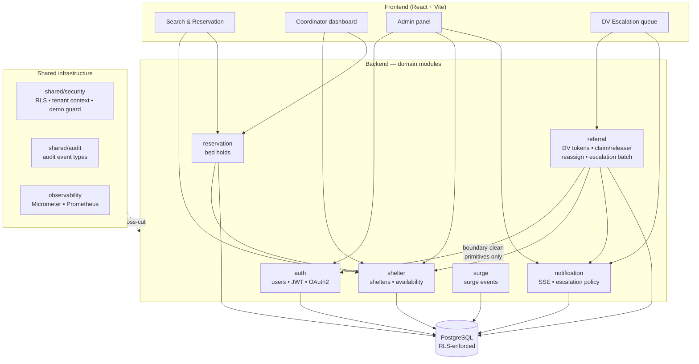
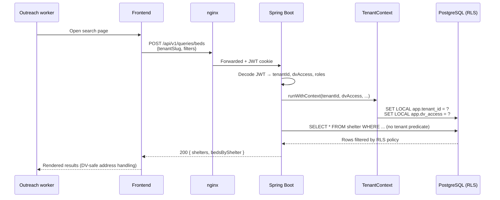
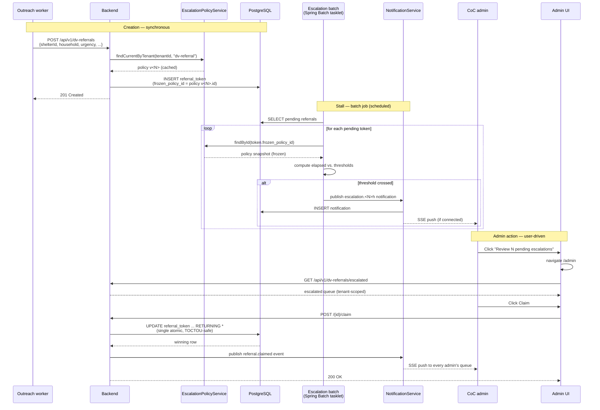
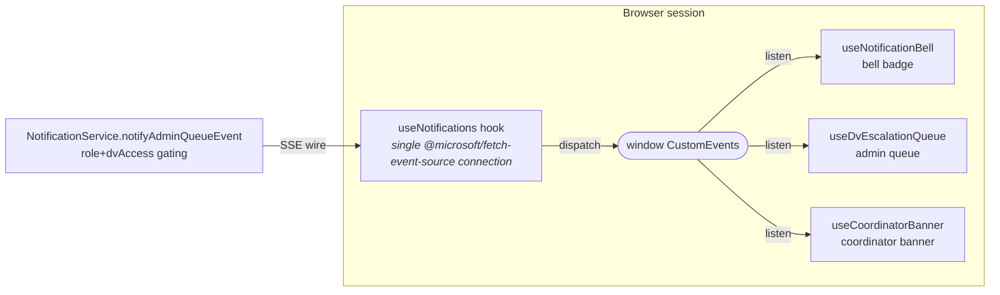

# FABT Architecture

> **How to read this doc.** This file is a **module-level companion** to `docs/architecture.drawio`. The `.drawio` file owns the zoomed-out system topology — Cloudflare, nginx, Spring Boot, Postgres, the observability stack — and is edited in [draw.io](https://app.diagrams.net). This file owns the module boundaries, the critical data flows, and the design decisions that explain *why* the code looks the way it does. Diagrams are Mermaid (GitHub renders them inline), so every change is a PR-reviewable text diff.
>
> **Two sections.**
>
> - **§1 Current Architecture** is the onboarding section. A new contributor should be able to read §1 top-to-bottom and understand what the system does, how the modules are shaped, and how a request flows through. Target reading time: ten minutes.
> - **§2 Design Decisions** is the archaeology section. Each OpenSpec change that lands on `main` gets a short entry linking to its archived spec + design doc. Append-only — entries are never removed, only added. A developer debugging "why was this done this way?" reads §2.
>
> If you are updating the system, you may need to update both sections. If you are *adding* a capability, you almost always need a new §2 entry.

---

## §1 Current Architecture

### §1.1 Module Boundaries

FABT's backend is a **modular monolith** — one Spring Boot JAR, fourteen Java packages under `org.fabt.*`, and a set of [ArchUnit](backend/src/test/java/org/fabt/ArchitectureTest.java) rules that fail CI if any module reaches into another module's internals. The diagram below shows the seven domain modules that carry business logic; ten supporting packages (`shared`, `observability`, `tenant`, `availability`, `analytics`, `dataimport`, `hmis`, `subscription`, `surge`, frontend types) are omitted for visual clarity but live alongside these.

**The boundary rule.** A module may call another module's **service layer**, but may not import another module's **repository, domain entity, or database column**. When the referral module needs to look up a user by id, it calls `UserService.existsByIdInCurrentTenant(...)` — not `UserRepository.findById(...)`. The odd-looking method surface of `UserService` is load-bearing, not cleanup-target. See `backend/src/test/java/org/fabt/ArchitectureTest.java` for the exact enforced rules.

### §1.2 Deployment Topology

The full topology — Cloudflare in front of nginx, nginx in front of Spring Boot, Spring Boot talking to PostgreSQL, Prometheus scraping the management port, Loki pulling backend logs, Grafana dashboards — is captured in `docs/architecture.drawio` (open in [draw.io](https://app.diagrams.net)). Summary for reference:

- **Public edge:** Cloudflare (TLS termination, WAF, DDoS absorption)
- **Reverse proxy:** host nginx → container nginx (serves frontend dist, proxies `/api/*` and `/events/*`)
- **Application:** Spring Boot 4.x, modular monolith, runs on `:8080` (app port) and `:9091` (management port — actuator, Prometheus scrape)
- **Database:** PostgreSQL 16 with Row-Level Security enabled on every tenant-scoped table
- **Observability stack (optional):** Prometheus + Grafana + Loki, `./dev-start.sh --observability`

Production management port (`:9091`) is bound to `127.0.0.1` and firewalled to the monitoring network only; it is **not** publicly exposed. See [runbook.md](runbook.md) for the full production security posture.

### §1.3 Data Flow — Bed Search

The hot path, executed thousands of times per day per tenant. Illustrates the tenant-context + RLS pattern that every read in FABT follows.

The `TenantContext.runWithContext` block sets PostgreSQL session variables that the RLS `USING` clauses read. No application-layer `WHERE tenant_id = ?` filter is needed — forgetting one would be impossible because RLS rejects the query.

### §1.4 Data Flow — DV Escalation (v0.35.0)

The flagship flow from the `coc-admin-escalation` change. A pending DV referral moves through the tenant's per-tenant escalation policy, reaches the CoC admin queue, and is claimed/acted on by an admin. The **frozen-at-creation** invariant means the escalation rules are set in stone the moment the referral is created — editing the tenant policy mid-flight does not change the rules for existing referrals.

**Key invariants:**

- **Atomic claim.** `tryClaim` is a single `UPDATE ... RETURNING *` — concurrent claims cannot both succeed without the `Override-Claim: true` header. Tested by `ClaimReleaseTest` with a `CountDownLatch`.
- **Frozen policy.** The batch job reads `token.frozen_policy_id`, not the current tenant policy. Exhaustively tested by `ReferralEscalationFrozenPolicyTest` — the auditor query is `SELECT thresholds FROM escalation_policy WHERE id = (SELECT frozen_policy_id FROM referral_token WHERE id = ?)`.
- **Chain-of-custody.** Every claim/release/reassign writes an audit event with the actor's user id, timestamp, and reason (if provided). Reassign to `SPECIFIC_USER` sets `escalation_chain_broken = true` and the batch job skips those rows — manual ownership breaks the auto-escalation chain.

### §1.5 SSE Fan-Out — One Connection Per Session

Live updates in the admin queue, the coordinator banner, and the bell notification panel all ride on **one** SSE connection per browser session. The connection is owned by the `useNotifications` hook and all other feature hooks subscribe via window `CustomEvents`. Adding a new live-updating view does **not** open a new SSE stream.

**Gating and debouncing.** `NotificationService.notifyAdminQueueEvent` routes the four admin-queue events (`referral.claimed`, `referral.released`, `referral.queue-changed`, `referral.policy-updated`) only to users with `COC_ADMIN` or `PLATFORM_ADMIN` role **AND** `dv_access=true`. The consuming hooks debounce REST refetches by 250ms so a burst of events collapses into one network round-trip. The admin queue also runs a 30-second catch-up refetch, gated by `document.visibilityState === 'visible'` — without that gating, 18 partner agencies × idle background tabs burned ~1080 REST calls per admin per hour for nothing.

---

## §2 Design Decisions

> Append-only. Each entry references the archived OpenSpec change for the full `design.md` (with the D-numbered decisions) and `spec.md` (with the requirements and scenarios). This section does not duplicate that content — it names each decision at one-line granularity and points at the source of truth.

### §2.1 Foundation (pre-Session-1, archived)

- **platform-foundation** — multi-tenant Spring Boot monolith with RLS-enforced Postgres. See `openspec/changes/archive/platform-foundation/`.
- **bed-availability** — population-type-aware availability snapshots, acceptingNewGuests flag, capacity invariants. See `openspec/changes/archive/bed-availability/`.
- **reservation-system** — bed holds with configurable TTL, confirmation/cancellation, auto-release. See `openspec/changes/archive/reservation-system/`.
- **dv-opaque-referral** — privacy-preserving DV referral token model, zero client PII, warm-handoff phone call, 24-hour purge. VAWA / FVPSA / HUD HMIS-informed design. See `openspec/changes/archive/dv-opaque-referral/` and `docs/DV-OPAQUE-REFERRAL.md`.
- **dv-address-redaction** — tenant-level `dv_address_visibility` policy gating who sees shelter addresses. See `openspec/changes/archive/dv-address-redaction/`.

### §2.2 Notifications and SSE

- **sse-notifications** — original Server-Sent Events push layer for notifications. See `openspec/changes/archive/sse-notifications/`.
- **sse-stability** — single-connection design (D20 below references this). Rate-limit tuning, reconnection backoff, header-based auth, connection replay via gap detection. See `openspec/changes/archive/sse-stability/`.
- **persistent-notifications** — DB-backed notification table replacing in-memory fan-out, enabling read/acted state, bell badge counts, and the coordinator CRITICAL banner. See `openspec/changes/archive/persistent-notifications/`.

### §2.3 Admin UI and Accessibility

- **admin-panel-extraction** — the 2,136-line monolith split into fifteen focused files under `frontend/src/pages/admin/tabs/`. Lazy-loaded per tab, W3C APG tabs keyboard pattern. See `openspec/changes/archive/admin-panel-extraction/`.
- **wcag-accessibility-audit** — WCAG 2.1 AA self-assessed conformance, 50 success criteria, VPAT 2.5. See `openspec/changes/archive/wcag-accessibility-audit/` and `docs/WCAG-ACR.md`.
- **dark-mode-color-system** — 30 semantic color tokens split across Radix and Carbon palettes, all component styles migrated off hard-coded hex. See `openspec/changes/archive/dark-mode-color-system/`.
- **typography-system** — numeric size tokens (`text.xs`..`text['2xl']`), `weight.*`, `font.mono` — every component imports from `theme/typography.ts`. See `openspec/changes/archive/typography-system/`.

### §2.4 Integration and Operations

- **hmis-bridge** — HUD HMIS push via per-vendor adapters, audit log, surge event triggers. See `openspec/changes/archive/hmis-bridge/`.
- **coc-analytics** — daily utilization snapshots, demand signals, executive summary, HIC/PIT export, SPM mapping. See `openspec/changes/archive/coc-analytics/` and `docs/coc-analytics-spm-mapping.md`.
- **oauth2-sso** — per-tenant OAuth2 provider config, dynamic loading, closed-registration model. See `openspec/changes/archive/oauth2-sso/`.
- **email-password-reset** — email-based password reset flow replacing the previous "contact your administrator" pattern. See `openspec/changes/archive/email-password-reset/`.
- **coordinator-shelter-assignment** — admin UI for assigning coordinators to shelters, required for DV coordinator notifications to route correctly. See `openspec/changes/archive/coordinator-shelter-assignment/`.

### §2.5 coc-admin-escalation (v0.35.0, Session 7)

The CoC admin queue for pending DV referrals. Per-tenant versioned escalation policy. Atomic claim with TOCTOU-safe `UPDATE ... RETURNING`. Soft-lock for 10 minutes, override header for stealing, SPECIFIC_USER reassign breaks the chain. Frozen-at-creation chain-of-custody invariant. Four SSE event types relayed through the single `useNotifications` connection.

**Key decisions (summary — full rationale in `openspec/changes/archive/coc-admin-escalation/design.md`):**

- **D4** — `escalation_policy` is append-only. Every PATCH inserts a new version; existing referrals keep their `frozen_policy_id` FK pointing at the version active at creation time. Preserves the answer to "what rules governed this referral?" without wall-clock replay.
- **D6** — `referral_token.claimed_by_admin_id` + `claim_expires_at` plus partial indexes for the auto-release scheduler and the admin queue endpoint. `ClaimReleaseTest` exercises the atomic UPDATE path with a `CountDownLatch` to prove TOCTOU safety.
- **D7** — Two Caffeine caches: `currentPolicyByTenant` for referral creation (TTL 5 min), `policyById` for batch-job frozen lookups (TTL 10 min). Programmatically invalidated on PATCH.
- **D14** — SPECIFIC_USER reassign sets `escalation_chain_broken = true`. COORDINATOR_GROUP or COC_ADMIN_GROUP reassign clears it and writes `chainResumed: true` in the audit row. Backend-enforced — frontend just displays the resulting state from SSE.
- **D20** — Admin queue hooks piggy-back on the existing `useNotifications` SSE connection via window `CustomEvents`, not a parallel stream. Per the archived `sse-stability` spec. One SSE connection per session, always.
- **ArchUnit crossings** — the referral module added boundary-clean primitives to `UserService` (`existsByIdInCurrentTenant`, `getRolesByUserId`, `findActiveUserIdsByRole`, `findDvCoordinatorIds`, `findDisplayNamesByIds`, `isAdminActor`) rather than importing `User` directly. `ArchitectureTest` enforces the rule.

**Deployment note.** CoC admins running the escalation queue must have `dv_access=true` on their user record. The dev seed was flipped in v0.35.0; real-tenant CoC admins must be granted via the admin Users tab. See [runbook.md](runbook.md) for the operator workflow.

Full scope: `openspec/changes/archive/coc-admin-escalation/` — proposal.md, design.md (D1–D20), spec.md (13 requirements / 62 scenarios), tasks.md.

---

## Appendix — Reading this diagram

Mermaid source in this file uses these conventions:

- **Rectangles** (`[Text]`) are service layers or components.
- **Cylinders** (`[(Text)]`) are databases.
- **Rounded rectangles** (`([Text])`) are event buses or queues.
- **Subgraphs** group related components.
- **Solid arrows** (`-->`) are synchronous runtime dependencies.
- **Dashed arrows** (`-.->`) are event-driven or cross-cutting dependencies.
- **Arrow labels** appear only where the relationship is not obvious from the node names.

Comments inside Mermaid blocks (`%%`) document the intent of the diagram so future editors can understand *why* a particular shape was chosen before they change it.
