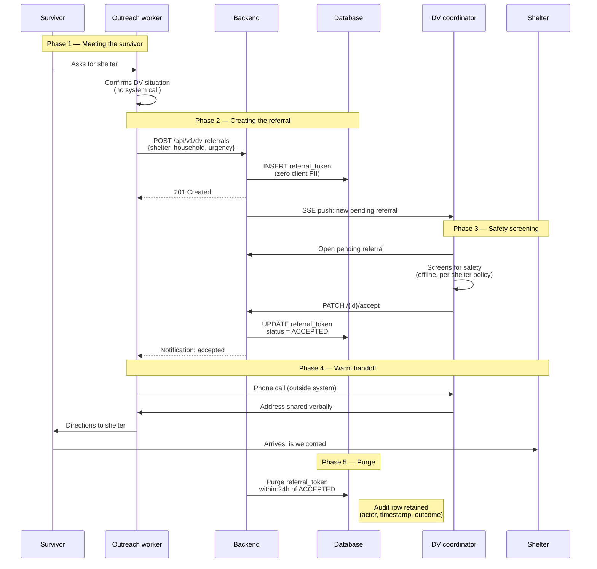

# DV Referral — End-to-End (Happy Path)

> This document walks through what happens, step by step, when a Domestic Violence outreach worker places a referral for a survivor to stay at a DV shelter. It covers the **happy path** — every party does their part, the bed is accepted, the survivor arrives, the record is purged. If the referral stalls and escalates to a CoC admin, the branch is documented in its companion file, [`dv-referral-escalation.md`](dv-referral-escalation.md).
>
> **Audience.** This document is written for people who **run the program**, not people who write the code:
>
> - **CoC admins and program managers** who are onboarding, training staff, or preparing for an audit
> - **Auditors** verifying that the system supports VAWA, FVPSA, and HUD HMIS requirements around DV survivor privacy
> - **Funders and board members** who want to understand exactly how the system serves survivors without storing client identity
> - **Trainers** writing curriculum for outreach workers and shelter coordinators
>
> If you are a developer and you need the technical story (modules, endpoints, database columns), read [`docs/FOR-DEVELOPERS.md`](../FOR-DEVELOPERS.md) first and come back to this file for the narrative.
>
> **Visuals.** This document uses Mermaid sequence diagrams for structure and links out to the [annotated DV Referral Demo Walkthrough](https://ccradle.github.io/findABed/demo/dvindex.html) on the demo site for screenshots. Screenshots change as the UI evolves; sequence diagrams and source-of-truth anchors do not.

---

## Why this flow looks different from regular bed search

A DV referral is **not** a normal bed search. A survivor of domestic violence is most at risk in the hours immediately after leaving. If a batterer learns which shelter the survivor is at — even just the shelter's address — the consequences can be lethal. Federal law takes this seriously. Four bodies of law shape the FABT referral flow:

- **VAWA** (Violence Against Women Act, 34 U.S.C. § 12291(b)(2)) prohibits programs funded under VAWA from disclosing "personally identifying information" of a victim, even to partners in the continuum of care, without a written, time-limited, informed release.
- **FVPSA** (Family Violence Prevention and Services Act) has parallel non-disclosure requirements for shelters receiving FVPSA funds.
- **HUD HMIS** (Homeless Management Information System) standards explicitly carve out DV shelters from the standard HMIS data collection — DV shelters must not contribute client-level data to the shared HMIS instance.
- **State-specific survivor-confidentiality laws** (varies by jurisdiction) layer on top.

The practical consequence for FABT: a DV referral **must** travel through the system carrying zero client identity. No name. No date of birth. No address. No phone number for the client. No case notes. The only identifying information stored is the **outreach worker's** callback number, which the DV coordinator uses to reach the worker for safety screening. The survivor is never directly contacted by the system.

FABT's full legal analysis, the exact database columns involved, and the VAWA compliance checklist are in [`DV-OPAQUE-REFERRAL.md`](../DV-OPAQUE-REFERRAL.md). This document assumes you have read that file or will read it before running the program.

---

## Actors

Four people participate in a DV referral. Only three of them touch the system.

| Actor | Role | Touches the system? |
|---|---|---|
| **Survivor** | The person seeking shelter. Never named in the system. Never contacted directly by the system. | **No.** |
| **DV outreach worker** | Field worker (usually mobile) who meets the survivor where they are. Submits the referral on the survivor's behalf. Holds the information about who the survivor is. | Yes — creates the referral, receives the coordinator's response, conducts the warm handoff phone call. |
| **DV shelter coordinator** | On-duty staff at a DV-designated shelter. Screens incoming referrals for safety. Accepts or rejects the referral. | Yes — reviews the referral, screens for safety, accepts or rejects. |
| **CoC admin (optional)** | Continuum-of-Care administrator. Monitors pending referrals across the region. Intervenes if a referral stalls past the escalation thresholds. | **Only on the stall path** (see [`dv-referral-escalation.md`](dv-referral-escalation.md)). |

The survivor is the most important actor and the least visible to the system. That is by design.

---

## The happy path, step by step

The happy path is what happens when everyone does their part on time. No stalls. No escalation. No admin intervention.

Each step is described below in narrative form. At the end of each step, a small table names the backing endpoint, the audit event type, and the database effect — so a developer reading this document or an auditor cross-referencing with the database can confirm exactly what happened.

### Step 1 — Meeting the survivor

The outreach worker meets the survivor in the field. This is the most important moment in the whole flow and the system is not involved in it. The worker confirms — through trained conversation, not a form — that the survivor is fleeing domestic violence and wants shelter tonight. The worker does not write the survivor's name down, does not take a photograph, does not collect documents. The worker holds the information about who the survivor is in their head. This is not a technology decision; it is a trauma-informed practice decision, and the technology is built to support it.

*Nothing is recorded in FABT during this step.*

### Step 2 — Creating the referral

When the worker is ready, they open FABT on their phone and search for DV shelters with available beds. The search results show DV-designated shelters, bed counts, and critically the **address is withheld** on every DV shelter card. The worker taps the shelter, taps "Request Referral," confirms household size and urgency, and submits.

FABT creates a record called a **referral token**. The token carries:

- Household size (e.g., "2 — adult + child")
- Population type (always `DV_SURVIVOR`)
- Urgency (e.g., `URGENT`)
- The worker's callback phone number
- The target shelter's id
- A policy snapshot — the escalation rules at this exact moment (see `dv-referral-escalation.md` for what this means)

The token does **not** carry:

- The survivor's name
- The survivor's date of birth, age, or age range beyond household structure
- The survivor's current address or location
- The survivor's phone number
- Any case notes, identifiers, or free text describing the survivor

The worker sees "Referral sent — the shelter will respond shortly" and the system tells the shelter coordinator via a real-time push notification.

| | |
|---|---|
| **Endpoint** | `POST /api/v1/dv-referrals` |
| **Auth** | Outreach worker with `dv_access=true` |
| **Audit event** | Implicit — the `referral_token` row itself is the record, with `created_at` and `created_by_user_id` |
| **Database effect** | One new `referral_token` row, status `PENDING`, with `frozen_policy_id` set |
| **Notification** | `referral.requested` push to the DV coordinator assigned to the shelter |

### Step 3 — Safety screening

The DV shelter coordinator sees a new pending referral appear in their dashboard, highlighted as ACTION_REQUIRED. They open it and see the five non-identifying fields. Before they can accept, they must **screen for safety**: is there a batterer already at the shelter? Does the population fit the shelter's program (women-only, families, LGBTQ+, youth)? Is the survivor's callback number reachable now?

The coordinator calls the outreach worker directly. This conversation happens outside FABT. It is an intentional part of the design: safety screening must be a human conversation between two trained workers, not a form field that can be bypassed. If any detail raises a concern, the coordinator rejects the referral and gives the worker a reason — again, on the phone, not in the system.

If the screening is clear, the coordinator clicks **Accept**. The referral transitions to `ACCEPTED`.

| | |
|---|---|
| **Endpoint** | `PATCH /api/v1/dv-referrals/{id}/accept` |
| **Auth** | Coordinator (role `COORDINATOR`) with `dv_access=true`, assigned to the referral's shelter |
| **Audit event** | `DV_REFERRAL_ACCEPTED` (coordinator) or `DV_REFERRAL_ADMIN_ACCEPTED` (CoC admin acting on behalf, if escalation path was taken) |
| **Database effect** | `referral_token.status = 'ACCEPTED'`, `responded_by_user_id` set, `responded_at` set |
| **Notification** | `referral.responded` push to the outreach worker |

If the coordinator rejects instead, the endpoint is `PATCH /.../reject` and the audit event is `DV_REFERRAL_REJECTED` (or the `ADMIN_` variant). A rejection is not a failure — it is the safety screen working. The outreach worker tries a different shelter.

### Step 4 — Warm handoff

Warm handoff is a trade-skill term that means **two trusted people on a phone call together, confirming the handoff of responsibility for a person**. In FABT's flow, warm handoff is a phone call between the outreach worker and the DV coordinator **after** the referral is accepted. During the call:

- The coordinator tells the worker the shelter's address **verbally**. FABT does not display the address on any screen visible to the outreach worker. The address is withheld precisely so this phone call must happen.
- The worker gives the survivor directions. If the survivor needs transportation, the worker arranges it — sometimes driving them directly, sometimes paying for a rideshare, sometimes connecting with a transportation partner.
- The coordinator prepares the shelter team to receive the survivor — what name they will use (often an alias), what staff member will greet them, what room will be prepared.

The warm handoff is **not recorded in FABT**. The system's job is to get the referral to the right coordinator, not to mediate the human conversation that actually places the survivor.

| | |
|---|---|
| **Endpoint** | None — happens entirely outside the system |
| **Audit event** | None |
| **Database effect** | None |

### Step 5 — Arrival

The survivor arrives at the shelter, is welcomed by the coordinator or designated staff, and begins intake. From FABT's perspective, the outreach worker's job is done and the coordinator's job has pivoted into normal shelter operations. The referral token now has no further purpose — its whole reason for existing was to get the survivor from the field to a safe bed.

| | |
|---|---|
| **Endpoint** | None — tracked in the shelter's own intake system, not FABT |
| **Audit event** | None in FABT |
| **Database effect** | The shelter's occupied bed count may be updated by the coordinator via a normal availability-update call (`PATCH /api/v1/shelters/{id}/availability`), but that is a separate flow, not tied to the referral token |

### Step 6 — Purge

Within 24 hours of the referral reaching a terminal state (`ACCEPTED`, `REJECTED`, or `EXPIRED`), the referral token row is **hard-deleted** from the database. Not soft-deleted, not archived, not moved to a cold-storage table — deleted. The row no longer exists.

What remains is an **audit record**: a separate row in the `audit_events` table capturing who the actor was, when they acted, and what the outcome was. The audit row does **not** carry any of the five referral fields; it only carries the action and the actor. This is how FABT answers the auditor question "who accepted this referral and when?" without also answering "who was the referral for?".

| | |
|---|---|
| **Endpoint** | Automatic — scheduled purge job |
| **Audit event** | Retained in `audit_events` — never deleted |
| **Database effect** | The `referral_token` row is deleted. No tombstone. |

---

## Privacy invariants

These are the rules that define the flow. They are enforced at multiple layers — the database schema, the service layer, the API, the UI, and the operator runbook — because any single enforcement layer can fail.

**1. Zero client PII in the referral token.** The `referral_token` table has no column for the survivor's name, date of birth, address, phone, or case notes. A developer cannot accidentally store those fields; the columns do not exist. This is enforced by the database schema and the Flyway migration history.

**2. Shelter address is never rendered to an outreach worker.** The shelter's street address is present in the `shelter` table, but the API endpoint that outreach workers use to search for shelters **redacts** the address for DV shelters. The redaction is enforced at the service layer by the `DvAddressRedactionHelper`. The outreach worker's UI never displays an address for a DV shelter — the word "withheld" appears in its place. The coordinator shares the address verbally during the warm handoff phone call.

**3. Warm handoff is a phone call, not a form.** FABT deliberately does not have a chat, messaging, or in-app call feature tied to referrals. The design forces coordinators and workers to pick up a phone. A human conversation is the most reliable safety check.

**4. Purge is hard-delete, 24 hours maximum.** The purge job runs continuously. The 24-hour window is the outer bound; most referrals are purged within minutes of reaching a terminal state. The audit row remains to answer chain-of-custody questions. The referral row does not.

**5. DV access is a per-user flag, not a group permission.** Every user who can see a DV referral has an `app_user.dv_access = true` flag on their row. This flag is used by the database's row-level security policies — a user without the flag cannot see any DV shelter address, cannot see any DV referral token, cannot see any DV-related notification. The flag is granted by a platform admin through the Users tab in the admin panel and is auditable.

**6. No HMIS push of DV data.** FABT's HMIS bridge (the optional component that pushes bed utilization data to a CoC's HMIS instance) aggregates DV shelters into a single anonymized bucket. Client-level DV data is never pushed. This matches the HUD HMIS carve-out for DV shelters.

---

## When the happy path stalls

Sometimes the coordinator does not respond quickly — the shelter may be in the middle of a crisis intake, the coordinator may be on break, the shelter may be short-staffed, a tropical storm may be inbound. When a pending referral has not been accepted or rejected within the tenant's configured thresholds (default 1 hour for the first notification, 2 hours for CRITICAL), the **escalation path** activates. A CoC admin sees the pending referral in their DV Escalations queue and can claim it, reassign it to another coordinator or admin group, or act on it directly.

The escalation path is documented in its own file: [`dv-referral-escalation.md`](dv-referral-escalation.md).

The escalation path does not replace the happy path — it is a branch that activates only when the happy path stalls. Every referral **starts** on the happy path. Every referral **may** cross onto the escalation branch if it stalls. A referral can return to the happy path after escalation (for example, the reassigned coordinator accepts it).

---

## Related documents

- [`DV-OPAQUE-REFERRAL.md`](../DV-OPAQUE-REFERRAL.md) — legal basis, architecture rationale, VAWA compliance checklist
- [`dv-referral-escalation.md`](dv-referral-escalation.md) — the stall path, CoC admin queue, claim/reassign actions
- [`FOR-DEVELOPERS.md`](../FOR-DEVELOPERS.md) — developer-facing technical documentation
- [`runbook.md`](../runbook.md) — operator runbook for granting DV access, investigating escalation alerts, managing policy
- [Annotated DV Referral Demo Walkthrough](https://ccradle.github.io/findABed/demo/dvindex.html) — screenshots of the full flow on the live demo site

## Source files (for developers who want to trace the code)

| Flow step | Backend file |
|---|---|
| Create referral | `backend/src/main/java/org/fabt/referral/service/ReferralTokenService.java` — `createToken(...)` |
| Safety screen / accept | Same file — `acceptToken(...)` |
| Address redaction | `backend/src/main/java/org/fabt/shelter/service/DvAddressRedactionHelper.java` |
| Purge | `backend/src/main/java/org/fabt/referral/batch/ReferralPurgeJobConfig.java` |
| Audit event types | `backend/src/main/java/org/fabt/shared/audit/AuditEventTypes.java` |

## Review history

This document should be reviewed by the following personas before any major revision, per the original `coc-admin-escalation` T-50 review requirement:

- **Devon Kessler** — training
- **Marcus Okafor** — CoC admin practitioner
- **Keisha Thompson** — dignity / person-centered language

Schedule one joint walkthrough covering both this file and `dv-referral-escalation.md`, rather than independent reviews — they are two halves of the same story.
