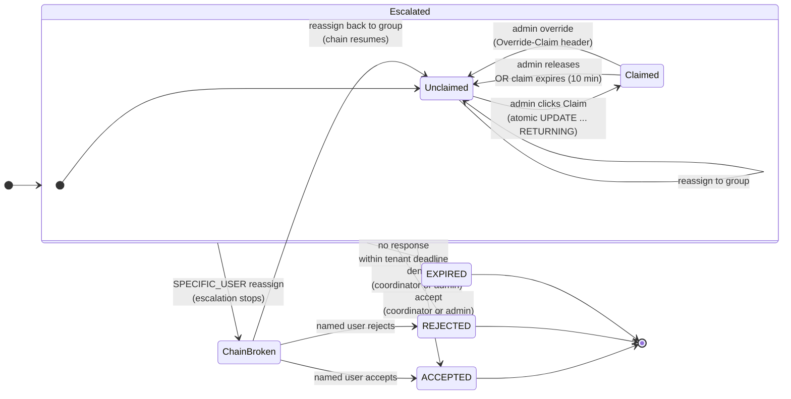
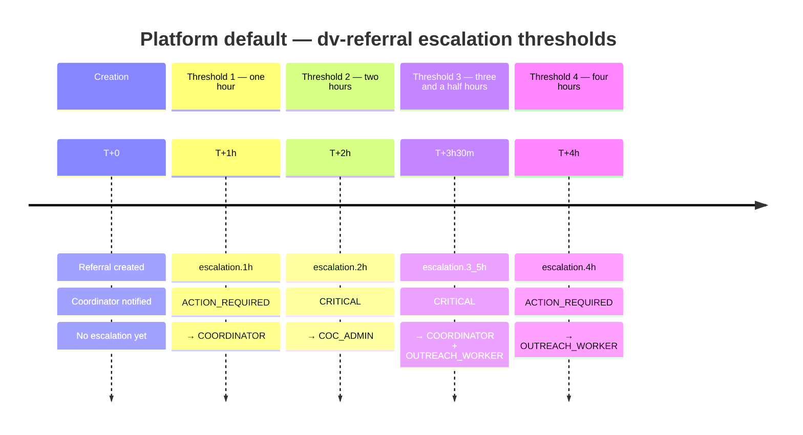
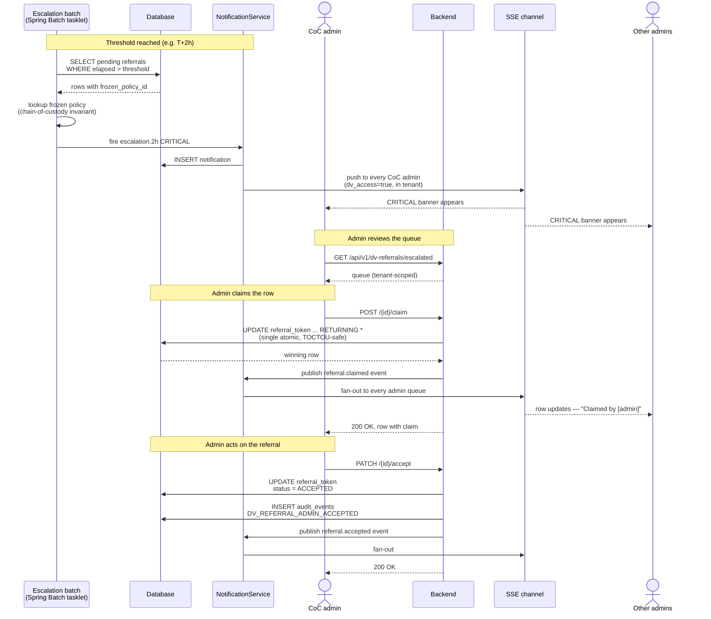

# DV Referral — Escalation (Stall Path)

> This document is the **companion** to [`dv-referral-end-to-end.md`](dv-referral-end-to-end.md). If you have not already read that file, read it first — the happy path establishes the actors, the legal context, the privacy invariants, and the vocabulary you will need to follow what happens when a referral stalls.
>
> **When this document applies.** A DV referral follows the happy path most of the time: outreach worker submits, coordinator screens, coordinator accepts, warm handoff, arrival, purge. But sometimes the coordinator doesn't respond in time. The shelter may be in the middle of a crisis intake, the coordinator may be on break, the shelter may be short-staffed, a tropical storm may be inbound. When a pending referral has not been accepted or rejected within the tenant's configured thresholds, the **escalation path** activates and a CoC admin steps in.
>
> **Audience.** Same as the parent doc: CoC admins, program managers, auditors, funders, trainers. Developers will find the technical story in [`../FOR-DEVELOPERS.md`](../FOR-DEVELOPERS.md).
>
> **Visuals.** This document uses three diagram types because the escalation story has three distinct questions:
>
> 1. **State diagram** — what state is the referral in, and what transitions are possible?
> 2. **Timeline** — when do the escalation thresholds fire?
> 3. **Sequence diagram** — exactly what happens on the wire when an admin claims or acts?
>
> Together they answer the business question (state diagram), the operational question (timeline), and the technical question (sequence diagram). Each one is a narrow, scannable artifact.

---

## When escalation activates

Every new DV referral starts on the happy path. The referral is created in `PENDING` status and the assigned DV coordinator is notified immediately. The outreach worker and the coordinator have full ownership of the referral for the first window — usually the first hour.

If the coordinator accepts or rejects within that window, the happy path carries the referral through to `ACCEPTED` or `REJECTED`. No admin involvement. No escalation.

If the coordinator has not responded by the first threshold, the system does **not** assume the referral is forgotten. It escalates — increasing the severity of the notification, adding recipients, and eventually surfacing the referral in the CoC admin's DV Escalations queue so a regional administrator can intervene. Intervention can take several shapes: the admin can reach out to a coordinator on the phone, reassign the referral to a different coordinator or coordinator group, or act on the referral directly as if they were the coordinator.

**Escalation is not a failure.** It is the system doing its job — ensuring that a pending DV referral never quietly times out while a survivor is waiting in the field.

---

## Referral state machine (escalation zoom-in)

The happy-path state diagram in the parent doc shows `PENDING → ESCALATED → ACCEPTED` as one of the branch transitions. This diagram zooms into the `ESCALATED` branch and shows what happens inside it. Claim state is a sub-state of `ESCALATED` because a claimed referral is still escalated — it has just been locked to a specific admin.



The most important part of this diagram is the `ChainBroken` sub-state on the right. When an admin reassigns a referral to a **specific named user** — for example "Sandra Kim, day-shift lead at Harbor House" — the system flags the referral's escalation chain as broken. The batch job that fires `escalation.1h`, `escalation.2h` and so on will **skip** this referral for as long as the chain is broken. The reasoning is human: a CoC admin has made a deliberate judgment call that Sandra is the right person to handle this, and the automated escalation should stop paging other people while Sandra has it. If Sandra can't take it after all, the admin can reassign back to the coordinator group and the chain resumes.

---

## Escalation timeline (tenant-configurable)

Every tenant has its own escalation policy. The platform default — which many small CoCs adopt unchanged — has four thresholds. Tenants can edit the thresholds, severities, or recipient lists through the Escalation Policy editor in the admin panel. The timeline below shows the **platform default**; a tenant with longer hospital-discharge windows or faith-volunteer schedules may stretch or compress this.



If the Mermaid timeline does not render for you, the same data in table form:

| Threshold | Elapsed time | Notification type | Severity | Who gets paged |
|---|---|---|---|---|
| 1 | 1 hour | `escalation.1h` | `ACTION_REQUIRED` | Coordinator |
| 2 | 2 hours | `escalation.2h` | **`CRITICAL`** | CoC admin |
| 3 | 3 hours 30 minutes | `escalation.3_5h` | **`CRITICAL`** | Coordinator + outreach worker |
| 4 | 4 hours | `escalation.4h` | `ACTION_REQUIRED` | Outreach worker |

The order of the thresholds is strictly monotonic — the Escalation Policy editor rejects a policy where threshold N+1 is earlier than threshold N. Severities and recipient lists are whitelisted (severities must be `INFO`, `ACTION_REQUIRED`, or `CRITICAL`; recipients must be valid role names). These rules live in the service layer, not the UI, so a future internal script that calls the policy endpoint directly still gets validated.

---

## What the CoC admin does

Once a referral reaches the CoC admin's DV Escalations queue (usually at `T+2h` for the platform default — the first `CRITICAL` notification), the admin has five possible actions. This section walks through each one in operator language; the sequence diagram at the end of this section shows the technical flow for reference.

### Action 1 — Claim

The admin clicks the inline Claim button on the row. The backend runs a single atomic database update that either succeeds (the admin becomes the claim holder for the next 10 minutes) or fails with a conflict error (someone else already claimed it). **There is no race condition.** Two admins clicking Claim within a few milliseconds of each other will result in exactly one success and one conflict — the database guarantees it.

Claiming is a soft-lock, not a hard commitment. The admin is telling the rest of the system "I am looking at this now, please don't page anyone else about it for the next 10 minutes." If the admin gets distracted and doesn't act within 10 minutes, the claim auto-releases and other admins can claim it again. If the admin finishes their work in 2 minutes, the claim can be released immediately.

Claiming does **not** accept or reject the referral. It is a pre-action state — "I am about to decide, don't interrupt me."

### Action 2 — Release

If the admin decides they are not the right person to act on the referral, they click Release inside the detail modal. The referral goes back to unclaimed and other admins can see it in the queue. Release is a voluntary un-claim; it does not reject the referral.

The admin might release because they realized the referral belongs to a different shelter's coordinator, because they need to answer a phone call and will come back to it later, or because they want to reassign it (see Action 4).

### Action 3 — Accept or deny

If the admin decides to act on the referral directly — effectively doing the coordinator's job because the coordinator is unavailable — they can accept or deny it through the detail modal. The accept/deny buttons are behind a confirmation dialog with specific verb text ("Approve placement at [Shelter Name]" rather than "Confirm") so an accidental click does not advance a referral. This UI pattern is shared with every other dangerous admin action in FABT.

Accepting from the escalation queue produces a `DV_REFERRAL_ADMIN_ACCEPTED` audit row, distinct from the normal `DV_REFERRAL_ACCEPTED` that a coordinator's accept produces. The distinction matters for auditors: "who actually accepted this referral?" should be answerable at a glance, not by correlating two tables.

### Action 4 — Reassign

Reassign sends the referral to a different group of people. There are three target types:

- **Coordinator group** — re-page the shelter's coordinators. Useful when the first coordinator didn't see the notification and the admin wants to nudge the whole team. The escalation chain continues normally.
- **CoC admin group** — re-page all CoC admins in the region as `CRITICAL`. Useful when the admin is going off-shift and wants another admin to pick it up. The escalation chain continues normally.
- **Specific named user** — send it to one human, such as Sandra Kim specifically. This is the action that **breaks the escalation chain** — the batch job stops firing `escalation.1h`/`2h`/etc for as long as the chain is broken. The admin is making a judgment call that automated escalation should stop because a named human has taken ownership.

The reassign action requires a **reason** in a text field. The UI displays a PII warning above the reason field: *"Do not include client names, addresses, or other identifying information. This text is recorded in the audit trail."* The backend stores the reason verbatim in the audit row but deliberately omits it from the broadcast notification payload — the reason is for the audit trail, not for the inbox of every person who gets paged.

### Action 5 — Open a detail modal without acting

The admin can click the "More" button on a row to open the detail modal without claiming. The modal shows every field of the referral — population type, urgency, elapsed time, who (if anyone) has claimed it, the assigned coordinator's name — without committing the admin to any action. This is the read-only path for "let me check what's on this before deciding."

---

## Sequence diagram — the technical story

For developers and auditors who need the wire-level story, here is the sequence of interactions for the most common escalation path (admin claims, then accepts). The narrative above is sufficient for operators; this diagram is the dev/audit companion.



The key technical invariants shown in this diagram, for developers following the code:

| Invariant | Where it is enforced |
|---|---|
| **Atomic claim** — single `UPDATE ... RETURNING *`, no race condition | `ReferralTokenRepository.tryClaim(...)` |
| **Frozen policy lookup** — batch reads `frozen_policy_id`, not current tenant policy | `ReferralEscalationJobConfig.escalationTasklet` |
| **Cross-tenant isolation** — repository query predicates on `tenant_id = ?` explicitly | `ReferralTokenRepository.findEscalatedQueueByTenant(...)` |
| **SSE relay gated on role + dvAccess** — only `COC_ADMIN`/`PLATFORM_ADMIN` with `dv_access=true` receive admin-queue events | `NotificationService.notifyAdminQueueEvent(...)` |
| **Admin accept vs coordinator accept distinction** — different audit types for the same state transition | `ReferralTokenService.respondToReferral(...)` |

The full code is exhaustively tested. See `ClaimReleaseTest` for the atomic claim under concurrency, `ReferralEscalationFrozenPolicyTest` for the chain-of-custody invariant, `ReassignTest` (11 tests) for the reassign targets and chain-broken semantics, and `EscalationPolicyEndpointTest` for the policy update path.

---

## Mid-flight policy changes — the frozen-at-creation invariant

This is the question that trips up every operator who tries to reason about how policy changes affect in-flight referrals. **Editing the tenant escalation policy does not change the rules for referrals that already exist.** The rules are frozen at the moment of creation.

Concretely: imagine it's 3:00 PM and you are a CoC admin. A survivor's referral was created at 2:00 PM with the platform default policy (threshold 2 fires `CRITICAL` at 4:00 PM). At 3:00 PM you realize your coordinators are all in a training session until 5:00 PM, and you want to push the `CRITICAL` threshold out to 6:00 PM for new referrals. You open the Escalation Policy editor, change threshold 2 from `PT2H` to `PT4H`, and save.

The change applies to **new referrals created after 3:00 PM**. It does **not** apply to the referral that was already in flight when you made the change. That referral will still fire its `CRITICAL` notification at 4:00 PM — the rules it was created under.

Why? Because auditors need to be able to answer "what rules governed referral X?" with a single row lookup. If policies changed the rules for in-flight referrals retroactively, the audit trail would have to replay policy-edit history against wall-clock time, which is fragile and unpleasant to verify. The frozen-at-creation invariant means the answer to the audit question is always one SQL query:

```sql
SELECT ep.thresholds
FROM escalation_policy ep
WHERE ep.id = (
  SELECT rt.frozen_policy_id FROM referral_token rt WHERE rt.id = '<referral-id>'
);
```

**The operational implication:** if you want to affect in-flight referrals, you cannot do it by editing the policy. You have to act on each referral directly — claim them, reassign them, accept them, or release them for another admin. Policy edits are for **shaping future referrals** only.

The load-bearing test for this invariant is `ReferralEscalationFrozenPolicyTest` in the backend. It deliberately changes the policy mid-test and asserts that the batch job ignores the new policy for referrals created earlier — if a future code change accidentally breaks the invariant, this test fails before the change can merge.

---

## Privacy invariants

The privacy invariants described in the parent doc (`dv-referral-end-to-end.md`) apply here, unchanged. Claiming, releasing, reassigning, accepting, and denying from the escalation queue do **not** introduce any new storage of client PII. The referral token continues to carry only household size, population type, urgency, the outreach worker's callback phone, and the target shelter id — nothing more. Every admin action adds one row to the audit log with the actor's id, the action, and the timestamp. The audit log never carries client identity.

One additional invariant specific to the escalation path:

**The reassign reason field is NOT in the SSE notification payload.** When an admin reassigns a referral with the reason text "Coordinator offline, routing to backup", the reason is written to the `audit_events` row but explicitly stripped from the `notification.payload` that gets broadcast over SSE to every paged recipient. This is intentional. The reason is for the audit trail so a program manager can review "why was this referral bounced around?" — it is not for the coordinator who receives the re-page, who doesn't need to know the operational backstory to act on the referral.

This invariant is asserted in `ReassignTest.coordinatorGroupReassignPagesShelterCoordinators` — the test specifically checks that the reason does **not** appear in the notification payload. If a future code change leaks the reason into the broadcast, the test fails.

---

## When the escalation path ends

An escalated referral leaves the escalation path one of four ways:

1. **Accepted** — a coordinator or admin clicks Accept. The referral transitions to `ACCEPTED`, the outreach worker is notified, the warm handoff proceeds, and the purge happens within 24 hours.
2. **Rejected** — a coordinator or admin clicks Deny. The referral transitions to `REJECTED`, the outreach worker is notified, and the purge happens within 24 hours. Rejection is not a failure — it is the safety screen working.
3. **Expired** — no one responds within the tenant's deadline. The referral transitions to `EXPIRED`, the outreach worker is notified, and the purge happens within 24 hours. Expiration is the escalation path's own failure mode, and it is rare — the whole purpose of the escalation chain is to prevent it.
4. **Returned to the happy path** — a coordinator sees the re-paged notification, handles the referral normally, and the escalation metadata (the claim, the chain-broken flag) becomes historical. The audit log still shows that the referral traveled through the escalation path, but the outcome was handled at the normal level.

From the Person's perspective (waiting in the field for the coordinator to respond), the escalation path is invisible — they do not know whether their referral went through the happy path or the stall path. They only see the outcome. The escalation system exists to ensure that the outcome arrives at all, not to tell the Person how it got there.

---

## Related documents

- [`dv-referral-end-to-end.md`](dv-referral-end-to-end.md) — parent doc, happy path, actor inventory, legal context, privacy invariants
- [`../DV-OPAQUE-REFERRAL.md`](../DV-OPAQUE-REFERRAL.md) — legal basis, VAWA compliance checklist
- [`../FOR-DEVELOPERS.md`](../FOR-DEVELOPERS.md) — developer-facing documentation including the full escalation section
- [`../runbook.md`](../runbook.md) — operator runbook for granting DV access, investigating escalation alerts, managing policy
- [`../architecture.md`](../architecture.md) — module-level architecture with the escalation sequence diagram and design decisions
- [Annotated DV Referral Demo Walkthrough](https://ccradle.github.io/findABed/demo/dvindex.html) — screenshots of the full flow on the demo site

## Source files

| Flow step | Backend file |
|---|---|
| Escalation batch tasklet | `backend/src/main/java/org/fabt/referral/batch/ReferralEscalationJobConfig.java` |
| Per-tenant escalation policy | `backend/src/main/java/org/fabt/notification/service/EscalationPolicyService.java` |
| Frozen policy lookup | Same service — `findById(policyId)` |
| Atomic claim / release | `backend/src/main/java/org/fabt/referral/repository/ReferralTokenRepository.java` — `tryClaim`, `tryRelease` |
| Reassign with chain-broken / chain-resumed | `backend/src/main/java/org/fabt/referral/service/ReferralTokenService.java` — `reassignToken` |
| SSE relay gating | `backend/src/main/java/org/fabt/notification/service/NotificationService.java` — `notifyAdminQueueEvent` |
| Audit event types | `backend/src/main/java/org/fabt/shared/audit/AuditEventTypes.java` |

## Review history

This document should be reviewed with its parent `dv-referral-end-to-end.md` as a single walkthrough before any major revision. The reviewers are:

- **Devon Kessler** — training
- **Marcus Okafor** — CoC admin practitioner
- **Keisha Thompson** — dignity / person-centered language

Schedule one joint session covering both files — they are two halves of the same story and should not be reviewed in isolation.
