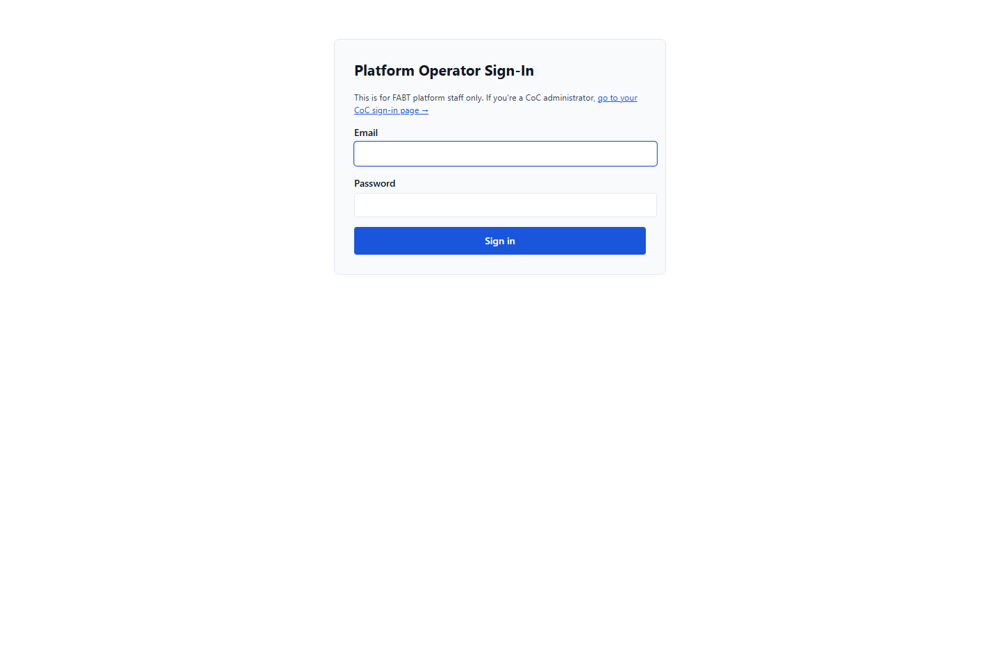
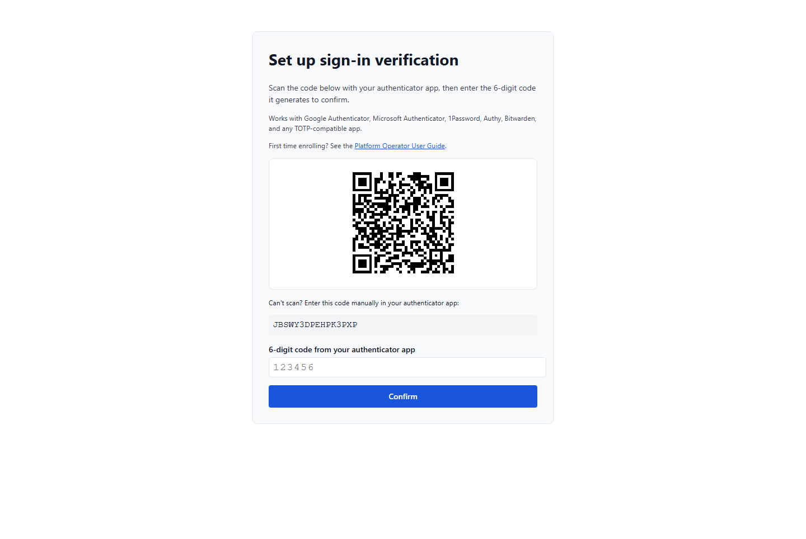
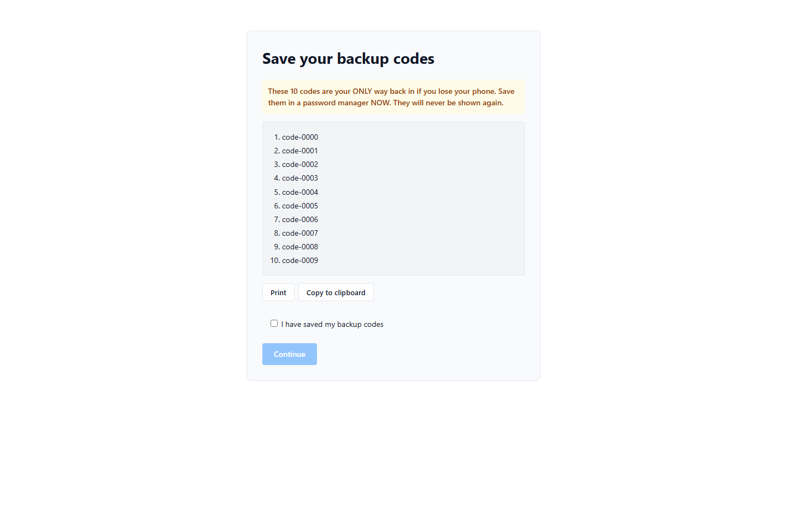
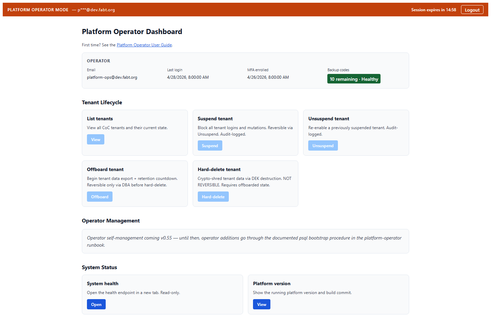
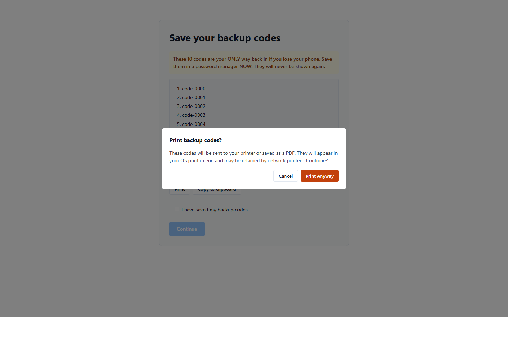

# Platform Operator User Guide

**Audience:** People holding a `platform_user` row in the FABT database.
That is a small group — typically one to three engineers per
deployment — with cross-tenant operational responsibility for the
running FABT instance. If you log into the application as a
shelter outreach worker, coordinator, or CoC admin, **this guide is
not for you** — you want [`FOR-COC-ADMINS.md`](../FOR-COC-ADMINS.md)
or [`FOR-COORDINATORS.md`](../FOR-COORDINATORS.md) instead.

**Scope:** Everything an operator needs to log in, read the
dashboard, recover from a lost phone, onboard a second operator,
and decide when to self-serve vs escalate. The guide assumes the
v0.54 platform-operator UI is deployed (see
[`oracle-update-notes-v0.54.0.md`](../oracle-update-notes-v0.54.0.md)).

> **What this guide does NOT cover:** the deploy procedure itself
> (that lives in the version-pinned oracle-update-notes), the backend
> implementation (`docs/architecture.md` + `docs/observability/`),
> or the original platform-admin role split (covered in
> [`oracle-update-notes-v0.53.0.md`](../oracle-update-notes-v0.53.0.md)).

---

## 1. First-time setup

The first time you sign in as a platform operator, the application
walks you through TOTP enrollment. You will need two things:

1. An authenticator app on your phone. Any standards-compliant
   TOTP / RFC 6238 application should work — common choices are
   Google Authenticator, Microsoft Authenticator, 1Password, Authy,
   and Bitwarden. The team's manual cross-authenticator QA matrix
   (when it lands) will be in
   [`platform-operator-mfa-compatibility.md`](./platform-operator-mfa-compatibility.md);
   that matrix is tracked as task §6.10 in the F11 OpenSpec change
   and is not yet committed.
2. A safe place to store ten one-shot backup codes that the app
   will display exactly once. A password manager note works; a
   sticky note on your monitor does not.

**Steps:**

1. Open the deployment-specific URL for `/platform/login` (in prod
   this is reached via the SSH tunnel pattern documented in the
   v0.54 update notes — your manager or the deploy engineer will
   share the tunnel command separately; for op-sec reasons the
   command is not committed to the repo).

   

2. Enter your operator email and password and submit. Because this
   is your first sign-in, the response routes you to
   `/platform/mfa-enroll`, which displays a QR code, the manual
   secret as a fallback, and a list of supported authenticators.

   

3. Open your authenticator app and scan the QR (or paste the
   manual secret). The app will display a 6-digit code that
   rotates every 30 seconds. Type the current code into the
   confirmation field and submit.

4. The next screen shows your **ten backup codes**. Save all ten
   somewhere persistent before clicking Continue. The browser will
   not show them again — the only ways to recover later are to
   regenerate (and re-enroll), or to use the lost-phone +
   lost-codes escalation path in section 6.

   

5. Once you have saved the codes and ticked the acknowledgement
   checkbox, click Continue. You land on the platform dashboard.

The enrollment endpoint is idempotent on the backend: if the
browser tab is closed mid-enrollment, you can re-open
`/platform/mfa-enroll` and the same secret + codes will be
re-displayed until you confirm. After confirmation, the codes are
stored only as salted hashes — neither this guide, nor an
engineer with database access, can recover the plaintext.

---

## 2. Daily login

Every subsequent sign-in is two short steps:

1. Open `/platform/login`. Enter email + password. Because MFA is
   already enrolled, the response routes you to
   `/platform/mfa-verify`.
2. Enter the current 6-digit TOTP code from your authenticator app
   (or, for the lost-phone case, click "Use backup code instead"
   and enter one of your unused 8-character backup codes).

After successful verify you land on the dashboard.

The post-MFA access token is valid for 15 minutes. The session
expires when the token does — there is no refresh-token flow. When
the countdown in the top banner reaches zero, the application
clears your session and routes you back to `/platform/login` with
a "Session expired" toast. Closing the browser tab also clears the
session (the token is held in `sessionStorage`, not
`localStorage`).

---

## 3. Reading the dashboard

The dashboard has three regions. From top to bottom:

**Banner (always visible while you are on `/platform/*`).** Shows
"PLATFORM OPERATOR MODE", your masked email (e.g.
`p***@dev.fabt.org` for `platform-ops@dev.fabt.org` — the masking
is defensive against shoulder-surfing and screenshot leakage), the
session countdown, and a Logout button. The countdown is grey for
most of the session, turns amber when 2 minutes or less remain,
and turns red when 30 seconds or less remain. The countdown text
is also announced by screen readers when it crosses into the
urgent window (≤2 min) so an assistive-tech user gets one warning
rather than a per-second narration.

**Operator metadata section.** Your email (full, not masked, since
you are reading your own dashboard), the timestamp of your last
login, the date you enrolled MFA, and a **backup-codes badge**
showing how many of your ten codes remain unused. The badge is
colour-coded — green when six or more remain, amber when three or
fewer remain, red when one remains — and carries a text label
("Healthy", "Low", "Critical") so the urgency is conveyed without
relying on colour. When you see "Critical", regenerate codes
within the same session if at all possible.

**Action cards grouped by category.** Three categories: Tenant
Lifecycle, Operator Management, System Status.

- **Tenant Lifecycle** — five cards (List, Suspend, Unsuspend,
  Offboard, Hard-delete). In v0.54 every card in this category is
  rendered **disabled with a tooltip** because the deployment
  flag `fabt.tenant.lifecycle.enabled` is `false` in production.
  This is by design (see `openspec/changes/platform-operator-ui/design.md`
  decision D3) — operators can see what the platform-operator
  surface will eventually expose, while the actual destructive
  endpoints stay gated until the Slice E follow-up wires the
  in-page result viewer + typed-confirmation flow.
- **Operator Management** — currently a placeholder card pointing
  at the documented psql bootstrap procedure for adding a second
  operator (see section 7).
- **System Status** — two enabled cards. **Open System Health**
  opens `/actuator/health` in a new tab (returns the standard
  Spring Boot Actuator JSON). **View Platform Version** opens
  `/api/v1/version` in a new tab (returns the running build
  version + commit SHA).

If you click an enabled card, the new tab does not carry your
platform JWT — both endpoints are `permitAll` by intent (anyone
who can reach the host can poll health/version). If you click a
disabled card, nothing happens — the button blocks the click at
the browser layer.

---

## 4. Performing destructive actions

> **v0.54 status:** destructive actions (Suspend / Unsuspend /
> Offboard / Hard-delete) ship in v0.54 as cards-on-the-dashboard
> only — the actual POST handlers and typed-confirmation modal
> are deferred to the Slice E follow-up. This section describes
> the flow operators will see when Slice E lands, so the
> documentation is forward-compatible. Until then, the cards are
> disabled and clicking them does nothing.

When the lifecycle flag is enabled and you click a destructive
card (e.g. **Suspend tenant**), the application opens a
confirmation modal:

The modal asks you to type the target tenant slug (e.g. `dev-coc`)
into a text field. The action button stays disabled until the
typed text matches the slug exactly. The Cancel button is
default-focused so accidentally pressing Enter does not fire the
action. The Slice E version will additionally require an
`X-Platform-Justification` text field (minimum 10 characters)
before the request POSTs — this is the
`JustificationValidationFilter` requirement that already gates the
backend `@PlatformAdminOnly` endpoints.

For the **Hard-delete tenant** action specifically, the modal copy
emphasises that the action is not reversible — the tenant data
encryption key is destroyed, and no DBA-led recovery is possible
once the request commits. Always Offboard first (which is
reversible until hard-delete fires) and confirm with the affected
CoC out of band before pressing Hard-delete.

---

## 5. Lost-phone recovery using backup codes

If your phone is lost, stolen, or wiped:

1. Sign in with email + password as normal. You reach
   `/platform/mfa-verify`.
2. Click **Use backup code instead**. The input switches to the
   backup-code mode (12-character text rather than 6-digit
   numeric).
3. Enter any one of the unused backup codes you saved during
   enrollment.
4. On success, you land on the dashboard. The backup code you
   just used is marked consumed in the database — it cannot be
   reused.

After landing on the dashboard, the **first thing to do** is
re-enroll MFA on a replacement device. There is no in-UI
"replace MFA device" button in v0.54 — the procedure is to ask a
fellow operator (or, for sole-operator cases, an engineer with DB
access) to clear your `mfa_enabled` flag, after which your next
login routes you back through `/platform/mfa-enroll` with a fresh
secret + ten new backup codes. Section 8 has the decision tree.

---

## 6. Lost-phone + lost-backup-codes recovery

If both your authenticator device AND your saved backup codes are
unrecoverable, you cannot self-serve in v0.54.

**For multi-operator deployments:** ask a fellow operator to run
the documented reset procedure (which clears your `mfa_enabled`
flag and re-issues an mfa-setup-scoped token via the platform-auth
service). They will share a one-time link or coordinate over a
trusted out-of-band channel.

**For sole-operator deployments:** recovery requires direct
database access on the deployment host. The procedure is
documented in the internal deploy runbook (NOT in this guide,
because it is dependency on the host access pattern which varies
by deployment posture). If you are in this position, contact the
engineer who set up your deployment.

> **Planned improvement (follow-up F45).** A future release will
> add a `mvn` reset tool similar to `HashPasswordCli` so a single
> operator with shell access on the deployment host can reset
> their own MFA without psql gymnastics. This is tracked in the
> v0.55 backlog.

---

## 7. Operator #2 onboarding

In v0.54 there is no in-UI "invite operator" flow — adding a
second platform operator is a curl-based bootstrap procedure
documented in
[`oracle-update-notes-v0.53.0.md` §5.10](../oracle-update-notes-v0.53.0.md).
The high-level sequence is:

1. The existing operator decides on the new operator's email
   address and runs a documented psql/curl bootstrap to insert a
   pending `platform_user` row with a temporary password hash.
2. The new operator receives the temporary password out of band
   and signs in at `/platform/login` for the first time. The
   first-login flow forces them through `/platform/mfa-enroll`.
3. After the new operator has confirmed their TOTP and saved
   their backup codes, the existing operator can run the audit
   query in the deploy runbook to confirm the row's
   `mfa_enabled = true` flipped — that confirms the onboarding
   completed.

The Slice E follow-up adds an in-UI invite + first-password-rotation
flow so the bootstrap can move out of psql. Until then, both the
sender and the receiver should treat the temporary password as a
short-lived secret (delete the chat message; rotate immediately at
first login).

---

## 8. When to escalate vs self-serve

| Symptom | Self-serve action | Escalate when… |
|---|---|---|
| Forgot TOTP code, phone is at hand | Wait 30s for the next code | The code keeps rejecting after 3 attempts — your device clock may be skewed (TOTP allows ±30s). Re-sync the OS clock, then retry. |
| Lost phone, have backup codes | Section 5 — use a backup code | You consumed all ten backup codes and still cannot enrol a replacement device — escalate to section 6. |
| Lost phone AND backup codes | Section 6 — coordinate with another operator | You are the sole operator AND lack host shell access — escalate to the engineer who deployed the instance. |
| Account locked after 5 failed MFA attempts | Wait 15 minutes; the lockout auto-clears via the `PlatformLockoutCronJob` Spring `@Scheduled` task (runs every 60s) | The lockout did not auto-clear after 20 minutes — confirm the scheduled task is alive via `/actuator/scheduledtasks` (look for `PlatformLockoutCronJob` in the response JSON) and check `backend.log` for entries on the `PlatformLockoutCronJob` logger before treating it as an incident. |
| Banner countdown reaches 0:00 unexpectedly | Sign in again with `/platform/login` | The session expires repeatedly within 1-2 minutes of login — your system clock may be wrong (the JWT expiry is enforced server-side AND client-side; clock skew flunks both). |
| Dashboard shows "Could not start MFA enrollment" | Sign out + sign back in (your scoped token may have expired during enrollment) | The error persists across multiple fresh logins — escalate; the backend's MFA-setup endpoint may be returning unexpected status. Capture the network-tab response and share with the on-call engineer. |
| Action card click does nothing | The card is flag-gated — see the tooltip when hovering | A safe-action card (System Health / Platform Version) opens a new tab that fails to load — escalate; the backing endpoint may be down (cross-check with the `FabtPlatformBackend5xx` Prometheus alert). |
| All 10 backup codes consumed, MFA still works | No action needed today, but note the badge will show "Critical" — request a backup-code regeneration from a fellow operator at your next convenience | The Critical badge has been showing for more than a week — this is a leading indicator that you will be locked out by your next lost-phone event; raise as a normal-priority operator-onboarding ticket. |

For anything that involves "I cannot get back into my account", err
on the side of escalating early — the cost of a temporarily
unavailable platform operator is far less than the cost of a
self-serve recovery attempt that locks the account further or
exposes credentials over the wrong channel.

---

## See also

- [`oracle-update-notes-v0.54.0.md`](../oracle-update-notes-v0.54.0.md)
  — operator-side deploy procedure, two-stage rollout, rollback recipe.
- [`oracle-update-notes-v0.53.0.md`](../oracle-update-notes-v0.53.0.md)
  — original platform-operator role split + bootstrap procedure for
  the first operator.
- [`observability/platform-admin-monitoring.md`](../observability/platform-admin-monitoring.md)
  — Prometheus metrics, alert rules, runbook anchors for paged
  alerts on the platform-operator surface.
- [`platform-operator-mfa-compatibility.md`](./platform-operator-mfa-compatibility.md)
  — authenticator-app support matrix (compiled from manual QA per
  task §6.10).
- [`runbook.md`](../runbook.md) — top-level operator runbook covering
  general FABT operations beyond the platform-operator surface.
